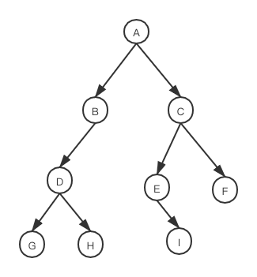

## 树的衍生

- 无序树:树中任意节点的子结点之间没有顺序关系，这种树称为无序树,也称为自由树

- 有序树:树中任意节点的子结点之间有顺序关系
- 二叉树:每个节点最多含有两个子树的树称为二叉树
- 完全二叉树:除了最后一层，其它各层节点数都达到最大
- 满二叉树:每一层上的结点数都是最大结点数
- 霍夫曼树:带权路径最短的二叉树，也叫最优二叉树

## 二叉树概念

- 树由一组以边连接的节点组成

- 在一个树最上面的节点称为根节点，如果一个节点下面连接多个节点，那么该节点称为父节点，他下面的节点被称为子节点，一个节点可以有 0 个、1 个或多个子节点，没有任何子节点的节点称为叶子节点
- 二叉树是一种特殊的树，子节点个数不超过两个
- 从一个节点走到另一个节点的这一组边为路径
- 以某种特定顺序访问书中的所有节点称为树的遍历
- 树分为几个层次，根节点是第 0 层，他的子节点是第一层，以此类推，我们定义树的层树就是树的深度
- 每个节点都有一个与之相关的值，该值有时被称为**键**
- 一个父节点的两个子节点分别称为左节点和右节点，**\*二叉查找树**是一种特殊的二叉树，相对较小的值保存在左节点，较大的值保存在右节点，这一特性使得查找效率很高

## 二叉树的查找方法

- 前序(深度优先)：根节点->左子树->右子树
- 中序(深度优先)：左子树->根节点->右子树
- 后序(深度优先)：左子树->右子树->根节点
- 层序(广度优先)：根节点->第一层->第二层

看下面的一个二叉树的图，写出前中后序的排列

<!--  -->


- 深度优先遍历
  - 前序 A BDGH CEIF
  - 中序 GDHB A EICF
  - 后序 GHDB IEFC A
- 广度优先遍历
  - 层序 A BC DEF GHI

## 二叉树的代码实现

```js
function Node(data, left, right) {
  this.data = data;
  this.left = left;
  this.right = right;
  this.show = show;
}
//显示
function show() {
  return this.data;
}
//定义二叉树
function BST() {
  this.insert = insert;
  this.inOrder = inOrder;
  this.getSmalllest = getSmalllest;
  this.getMax = getMax;
  this.find = find;
  this.remove = remove;
}
//插入
function insert(data) {
  var n = new Node(data, null, null);
  if (this.root == null) {
    this.root = n;
  } else {
    var current = this.root;
    var parent;
    while (true) {
      parent = current;
      if (data < current.data) {
        current = current.left;
        if (current == null) {
          parent.left = n;
          break;
        }
      } else {
        current = current.right;
        if (current == null) {
          parent.right = n;
          break;
        }
      }
    }
  }
}

//中序遍历
function inOrder(node) {
  if (node != null) {
    inOrder(node.left);
    console.log(node.data);
    inOrder(node.right);
  }
}

//最小值的查找
function getSmalllest(root) {
  var current = this.root || root;
  while (current.left != null) {
    current = current.left;
  }
  return current.data;
}

//最大值的查找
function getMax(root) {
  var current = this.root || root;
  while (current.right != null) {
    current = current.right;
  }
  return current.data;
}

//查找特定值
function find(data) {
  var current = this.root;
  while (current != null) {
    if (current.data == data) {
      return current;
    } else if (data < current.data) {
      current = current.left;
    } else {
      current = current.right;
    }
  }
  return null;
}

//删除
function remove(data) {
  removeNode(this.root, data);
}

function removeNode(node, data) {
  if (node == null) {
    return null;
  }
  if (data == node.data) {
    if (node.left == null && node.right == null) {
      return null;
    } else if ((node.left = null)) {
      return node.right;
    } else if (node.right == null) {
      return node.left;
    }
    var tempNode = getSmalllest(node.right);
    node.data = tempNode.data;
    node.right = removeNode(node.right, tempNode.data);
    return node;
  } else if (data < node.data) {
    node.left = removeNode(node.left, data);
    return node;
  } else {
    node.right = removeNode(node.right, data);
    return node;
  }
}

var nums = new BST();
nums.insert(23);
nums.insert(45);
nums.insert(16);
nums.insert(37);
nums.insert(3);
nums.insert(99);
nums.insert(22);

// nums.inOrder(nums.root)
// console.log('最小节点',nums.getSmalllest())
// console.log('最大节点',nums.getMax())

console.log('删除16', nums.remove(16));
console.log('遍历节点', nums.root);
nums.inOrder(nums.root);
```
