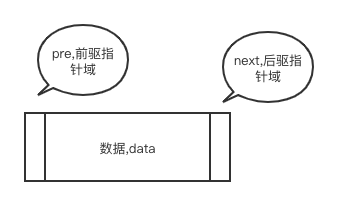
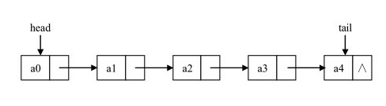
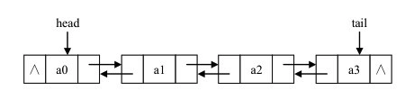

## 为什么要用链表？

- 数组不是说组织数据最佳结构
- javascript 的数组被实现成了对象，与其他语言数组相比，效率低了很多
- 如果你发现数组时间使用时很慢，就可以考虑用链表代替他，除了对数据的随机访问，链接几乎可以用子啊任何可以使用一维数组的地方
- 如果是想省空间的话可以使用链表

## 链表的概念？

- 链表是由一系列节点组成的集合,每个节点都使用一个对象的引用指向它的后继，指向另一个节点的引用叫链

  <!--  -->
  

- 链表元素靠相互之间的关系进行引用 A->B->C,B 并不是链表的第二个元素而是 B 跟在 A 后面，遍历链表就是跟着链接，从链接的首元素一直到尾元素，但是不包含**头节点**，头元素常常被称为链表的接入点（链表的尾元素指向一个 null 节点）

- 向单向链表插入一个节点，需要修改它前面的节点(前驱)使其指向新加入的节点，而新加入的节点则指向原来前驱指向的节点
- 从单向链表删除一个元素，需要将待删除的元素的前驱节点指向待删除元素的后继节点，同时删除元素指向 null

  <!--  -->
  

- 双向链表

  <!--  -->
  

## 链表的简单代码理解

```js
function ListNode(val) {
  this.val = val;
  this.next = null;
}

const node = new ListNode(1);
node.next = new ListNode(2);
const node3 = new ListNode(3);
node3.next = node.next;
node.next = node3;
console.log(node);
```

## 代码实现

1. 单向链表

```js
function Node(element) {
  this.element = element;
  this.next = null; //链表后继
}
function LList() {
  this.head = new Node('head'); //头结点
  this.find = find;
  this.insert = insert;
  this.display = display;
  this.findPrevious = findPrevious;
  this.remove = remove;
}

//找到节点
function find(item) {
  var currentNode = this.head;
  while (currentNode.element !== item) {
    currentNode = currentNode.next;
  }
  return currentNode;
}

//插入节点
function insert(newElement, item) {
  var newNode = new Node(newElement);
  var currNode = this.find(item);
  newNode.next = currNode.next;
  currNode.next = newNode;
}

//遍历节点
function display() {
  var currNode = this.head;
  while (currNode.next !== null) {
    console.log(currNode.next.element);
    currNode = currNode.next;
  }
}

//找到前驱
function findPrevious(item) {
  var currNode = this.head;
  while (currNode.next !== null && currNode.next.element !== item) {
    currNode = currNode.next;
  }
  return currNode;
}
function remove(item) {
  var preNode = this.findPrevious(item);
  var currNode = this.find(item);
  if (preNode.next != null) {
    preNode.next = currNode.next;
    currNode.next = null;
  }
}

var cities = new LList();
cities.insert('first', 'head');
cities.insert('second', 'first');
cities.insert('thrid', 'second');
cities.display();
console.log('=========');
cities.remove('second');
cities.display();
```

2. 双向链表

```js
/**
 * 双向链表
 */

function Node(element) {
  this.element = element;
  this.next = null;
  this.previous = null;
}

function LList() {
  this.head = new Node('head');
  this.find = find;
  this.insert = insert;
  this.display = display;
  this.remove = remove;
  this.findLast = findLast;
  this.dispReverse = dispReverse;
}
//查找
function find(item) {
  var currNode = this.head;
  console.log(currNode);
  while (currNode.element != item) {
    currNode = currNode.next;
  }
  return currNode;
}

//插入
function insert(newElement, item) {
  var newNode = new Node(newElement);
  var current = this.find(item);
  newNode.next = current.next;
  newNode.previous = current;
  current.next = newNode;
  if (!(newNode.next == null)) {
    newNode.next.previous = newNode;
  }
}
function display() {
  var currNode = this.head;
  while (currNode.next != null) {
    console.log(currNode.next.element);
    currNode = currNode.next;
  }
}

function remove(item) {
  var currNode = this.find(item);
  if (!(currNode.next === null)) {
    currNode.previous.next = currNode.next;
    currNode.next.previous = currNode.previous;
    currNode.previous = null;
    currNode.next = null;
  } else {
    currNode.previous.next = null;
    currNode.previous = null;
  }
}
//查找最后一个节点
function findLast() {
  var currNode = this.head;
  while (currNode.next !== null) {
    currNode = currNode.next;
  }
  return currNode;
}
//反序
function dispReverse() {
  var currNode = this.findLast();
  while (currNode.previous !== null) {
    console.log(currNode.element);
    currNode = currNode.previous;
  }
}
var cities = new LList();
cities.insert('first', 'head');
cities.insert('second', 'first');
cities.insert('thrid', 'second');
cities.display();
console.log('=====');
cities.remove('second');
cities.display();
console.log('=====');

cities.dispReverse();
```

## 链表和数组的优势

对于数组 `for`循环的速度快于`forEach`和`map`
链表的**插入/删除**效率较高，而**访问**效率较低；数组的**访问**效率较高，而**插入**效率较低
