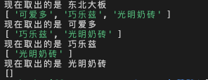

## 队列的概念

队列就像银行排队办理业务的人群，排在最前面的第一个办理业务，新来的排在后面，知道轮到他们为止，

**用途**

- 消息队列、视频弹幕
- 维护打印机任务

**总结**

- 队列就是**先进先出**的数据结构
- 队列只能在队尾插入元素，在队首删除元素
- 插入新元素叫入队，删除操作叫出队
- 有一些特殊的情况，在删除的时候不必要遵守先进先出的约定，这种叫做优先队列的数据结构

## 队列的简单代码实现

```js
var queue = [];
queue.push('东北大板');
queue.push('可爱多');
queue.push('巧乐兹');
queue.push('光明奶砖');

let i = 0;
while (queue.length) {
  console.log('现在取出的是', queue[0]);
  queue.shift();
  console.log(queue);
}
```

出现的结果如下图：



## 队列的实现(javascript)

```js
function Queue() {
  this.dataStore = []; //数据源
  this.enqueue = enqueue; //队尾增加一个
  this.dequeue = dequeue; //删除队首
  this.front = front; //读取队首
  this.back = back; //读取队尾
  this.toString = toString; //显示队列所有元素
  this.isEmpty = isEmpty; //判断队列是否为空
}
//入队
function enqueue(value) {
  this.dataStore.push(value);
}
//出队
function dequeue() {
  return this.dataStore.shift();
}
//队首
function front() {
  return this.dataStore[0];
}
//队尾
function back() {
  return this.dataStore[this.dataStore.length - 1];
}
// 是否为空队列
function isEmpty() {
  if (this.dataStore.length === 0) {
    return true;
  } else {
    return false;
  }
}
// 查看整个队列
function toString() {
  let str = '';
  for (let i = 0; i < this.dataStore.length; i++) {
    str += this.dataStore[i] + '\n';
  }
  return str;
}

// let queue=new Queue();
// queue.enqueue('小王')
// queue.enqueue('小名')
// queue.enqueue('小叫')
// console.log(queue.toString())
// queue.dequeue()
// console.log(queue.toString())
// queue.dequeue()
// console.log(queue.toString())
```

## 循环队列

循环队列是一种线性数据结构，其操作表现基于 FIFO（先进先出）原则并且队尾被连接在队首之后以形成一个循环。它也被称为“环形缓冲器”

循环队列的一个好处是我们可以利用这个队列之前用过的空间。在一个普通队列里，一旦一个队列满了，我们就不能插入下一个元素，即使在队列前面仍有空间。但是使用循环队列，我们能使用这些空间去存储新的值

```js
class MyCircularQueue {
  constructor(k) {
    this.list = Array(k); // 创建一个长度为k的空数组
    this.front = 0; // 保存头部指针位置
    this.real = 0; // 保存尾部指针位置
    this.max = k; // 保存该数组最大长度，也就是k
  }
  Front() {
    //取队首的元素
    if (this.isEmpty()) {
      return -1;
    }
    return this.list[this.front];
  }
  Rear() {
    //去队尾的元素 如果是满队的情况 就取最大值的最后一位，否则就取当前所有元素最大的一位
    if (this.isEmpty()) {
      return -1;
    }
    let val = this.real - 1 >= 0 ? this.real - 1 : this.max - 1;
    return this.list[val];
  }
  enQueue(value) {
    //入栈
    if (!this.isFull()) {
      this.list[this.real] = value;
      this.real = (this.real + 1) % this.max;
      return true;
    } else {
      return false;
    }
  }
  deQueue() {
    //出栈
    if (!this.isEmpty()) {
      this.list[this.front] = '';
      this.front = (this.front + 1) % this.max;
      return true;
    } else {
      return false;
    }
  }
  isEmpty() {
    //是否为空 判断条件是首尾指针相等，并且头部指针所指的元素为空
    if (this.real === this.front && !this.list[this.front]) {
      return true;
    } else {
      return false;
    }
  }
  isFull() {
    //判断是否是满栈 判断条件是首尾指针相等，并且头部指针所指的元素不为空
    if (this.real === this.front && !!this.list[this.front]) {
      return true;
    } else {
      return false;
    }
  }
}
```
