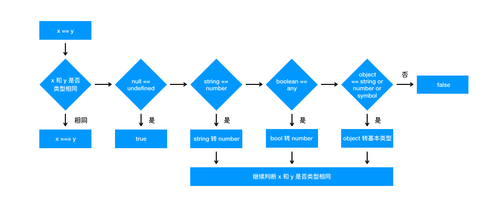

## 1、基本数据类型有哪些？基本数据类型和引用数据类型的区别？

- 基本数据类型：`Number`、`String`、`Boolean`、`undefined`、`null`、`Symbol`
- 两者之间的区别：基本数据类型是存在`栈`中的简单的数据段，数据大小确定，内存空间大小可以分配，是直接按值存放的，所以可以直接按值访问。引用类型是同时存在`栈`和`堆`中的对象，变量保存的是在栈内存中的一个指针，该指针指向堆内存，也就是说变量是存在栈中的一个地址，地址是该引用数据在堆中的地址。通过这个地址可以找到保存在堆内存中的对象

```js
var a = { key: 1 };
var b = a;
b.key = 2;
console.log(a.key); //2，因为a和b都指向同一个地址
```

## 2、判断是否是数组的几种方法？

- `Array.isArray`

```js
var a = [1, 2];
console.log(Array.isArray(a)); //true
```

- `instanceof Array` 运算符用于检验构造函数的`prototype`属性是否出现在对象的原型链中的任何位置，返回一个布尔值

```js
var a = [1, 2];
d instanceof Array;
```

- `constructor` 实例的构造函数属性`constructor`指向实例本身，那么通过`constructor`属性也可以判断是否为一个数组

```js
let a = [1, 3, 4];
a.constructor === Array; //true
```

- `Object.prototype.String.call()`

```js
//检验是否为数组
let a = [1, 2, 3];
Object.prototype.toString.call(a) === '[object Array]'; //true
//检验是否是函数
let b = function() {};
Object.prototype.toString.call(b) === '[object Function]'; //true
//检验是否是数字
let c = 1;
Object.prototype.toString.call(c) === '[object Number]'; //true
//检验是否为对象
let d = {};
Object.prototype.toString.call(d) === '[object Object]'; //true
```

## 3、typeof 是否能正确判断类型？instanceof 能正确判断对象的原理是什么？

`typeof` 对于原始类型来说，除了 `null` 都可以显示正确的类型

```js
typeof 1; // 'number'
typeof '1'; // 'string'
typeof undefined; // 'undefined'
typeof true; // 'boolean'
typeof Symbol(); // 'symbol'
```

`typeof` 对于对象来说，除了函数都会显示 `object`，所以说 `typeof` 并不能准确判断变量到底是什么类型

```js
typeof []; // 'object'
typeof {}; // 'object'
typeof console.log; // 'function'
```

## 3、ES6 常用的一些方法？

## 4、对闭包的看法？为什么要用闭包？说一下闭包的原理和应用场景

1. 什么是闭包？
   函数内部返回结果是一个内部函数，并被外部变量所引用，如果内部函数持有被指向函数作用域的变量，就行了闭包

可以在内部函数访问外部函数作用域，使用闭包，一是可以读取函数中的变量，二是可以将函数中的变量存在内存中，保护变量不会被污染，而正因为闭包会把函数中的变量值存储在内存中，会对内存有消耗，所以不能滥用闭包，而则会造成网页性能，造成内存泄漏，当不需要使用闭包时，药剂师释放内存可将内层函数对象的变量赋值成 null

2. 闭包原理

函数执行分为两个阶段(预编译和执行阶段)

- 在预编译阶段，如果发现内部函数使用了外部函数的变量，则会在内存中创建一个“闭包”对象并保存对应变量值，如果已经存在“闭包”，则字需要增加对应属性值就行，
- 执行完后，函数执行上下文会被销毁，函数对闭包对象的引用也会被销毁，但其内部函数还吃用该闭包的引用，所以内部函数可以继续使用“外部函数”中的变量
  利用了函数租用玉莲的特性，一个函数内部定义的函数讲话饱含外部函数的活动对象添加到他的作用域链中，函数执行完毕，其执行作用域链销毁，但因内部的函数作用域连仍然在引用这个活动对象，所以其活动对象不会被销毁，知道内部函数被烧毁后才被销毁，

3. 优点

- 可以从内部函数范文外部函数的作用域中的变量，且访问到的变量长期驻扎在内存中，可供之后使用
- 避免污染全局
- 把变量存在独立的作用域中，作为私有成员存在

4. 缺点

- 对内存的消耗有负面影响，因内部函数保存了对外部变量的引用，导致无法被垃圾回收，增大内存使用量，所以使用不当会导致内存泄漏
- 对处理速度有负面影响，闭包的层级决定了引用的外部变量在查找时经过的作用域链长度
- 可以获取到意外的值

5. 应用场景

- 模块封装，在各模块规范出现之前，都使用这样的方式防止变量污染全局

```js
var foo = (function() {
  var a = 0;
  function inner() {}
  inner.prototype.bar = function bar() {
    return a;
  };
  return inner;
})();
```

- 在循环中创建闭包，防止取到意外的值
  下面的代码，无论哪个元素触发时间都是弹出 4，因为函数执行引用的 i 是同一个，而在 i 循环结束后就是 3

```js
for (var i = 0; i < 4; i++) {
  document.getElementByTd('id' + i).onFocus = function() {
    console.log(i);
  };
}
//用闭包解决
for (var i = 0; i < 4; i++) {
  document.getElementByTd('id' + i).onFocus = function(i) {
    return function() {
      console.log(i);
    };
  };
}
//闭包实现按钮点击加1
var add1 = function() {
  let index = 1;
  return function inner() {
    index += 1;
    console.log(index);
  };
};
let add = add1();
```

## 5、下面代码结果是什么？怎么修改成我们想要的值？

```js
for (var i = 1; i <= 5; i++) {
  setTimeout(function timer() {
    console.log(i);
  }, i * 1000);
}
//结果是 66666
//怎么得到结果是 1 2 3 4 5呢
//第一种 闭包
for (var i = 1; i <= 5; i++) {
  (function(j) {
    setTimeout(function timer() {
      console.log(j);
    }, j * 1000);
  })(i);
}
//第二种是 把var改成let
for (let i = 1; i <= 5; i++) {
  setTimeout(function timer() {
    console.log(i);
  }, i * 1000);
}

//第三种是 使用setTimeout的第三个参数
for (var i = 1; i <= 5; i++) {
  setTimeout(
    function timer(j) {
      console.log(j);
    },
    i * 1000,
    i,
  );
}
```

## 5、防抖和节流的原理与实现？

### 防抖的原理

- 原理

  所谓防抖，就是指触发事件后在 n 秒内函数只能执行一次，如果在 n 秒内又触发了事件，则会重新计算函数执行时间

- 适用场景

  - 按钮提交场景：防止按钮多次提交，只执行最后一次的提交
  - 搜索框联想场景： 只发送最后一次输入

**非立即执行版**

非立即执行版的意思是触发事件后函数不会立即执行，而是在 n 秒后执行，如果在 n 秒内又触发了事件，则会重新计算函数执行时间

```js
function debounce(func, wait) {
  let timeout;
  return function() {
    const context = this;
    let args = arguments;
    if (timeout) clearTimeout(timeout);

    timeout = setTimeout(() => {
      func.apply(context, args);
    }, wait);
  };
}
```

**立即执行版**

立即执行版的意思是触发事件后函数会立即执行，然后 n 秒内不触发事件才能继续执行函数的效果

```js
function debounce(func, wait) {
  let timeout;
  return function() {
    const context = this;
    let args = arguments;
    if (timeout) clearTimeout(timeout);

    let callNow = !timeout;
    timeout = setTimeout(() => {
      timeout = null;
    }, wait);

    if (callNow) func.apply(context, args);
  };
}
```

**双剑合璧版**

```js
/**
 * @desc 函数防抖
 * @param {*} func 函数
 * @param {*} wait 延迟执行毫秒数
 * @param {*} immediate  是否立即执行
 */
function debounce(func, wait, immediate) {
  let timeout;
  return function() {
    const context = this;
    let args = arguments;
    if (timeout) clearTimeout(timeout);

    if (immediate) {
      let callNow = !timeout;
      timeout = setTimeout(() => {
        timeout = null;
      }, wait);
      if (callNow) func.apply(context, args);
    } else {
      timeout = setTimeout(() => {
        func.apply(context, args);
      }, wait);
    }
  };
}
```

### 节流的原理

- 原理

就是指连续触发事件但是在 n 秒中只执行一次函数，节流会稀释函数的执行频率

- 适用场景

  - 拖拽场景：固定时间内执行一次，防止超高频次位置发生变动
  - 缩放场景：监控浏览器的 resize

**时间戳版**

当触发事件的时候，我们取当前的时间戳然后减去之前的时间戳(第一次设置 0)，如果大于设置的周期，就执行函数，然后更新 prev 为当前的时间戳，如果小于就不执行

```js
function throttle(func, wait) {
  let prev = 0;
  return function() {
    let now = Date.now();
    let context = this;
    let args = arguments;
    if (now - prev > wait) {
      func.apply(context, args);
      prev = now;
    }
  };
}
```

**定时器版**

当触发事件的时候,我们设置了一个定时器，再触发事件的时候，如果定时器存在就不执行，直到事件执行清空定时器，这样就可以设置下一个定时器

```js
function throttle(func, wait) {
  let timeout;
  return function() {
    let context = this;
    let args = arguments;
    if (!timeout) {
      timeout = setTimeout(() => {
        time = null;
        func.apply(context, args);
      }, wait);
    }
  };
}
```

**双剑合璧版**

```js
/**
 * #desc 节流双剑合璧版
 * @param {*} func
 * @param {*} wait
 * @param {*} type type=1表示时间戳，type=2表示定时器
 */
function throttle(func, wait, type) {
  if (type === 1) {
    let previous = 0;
  } else if (type === 2) {
    let timeout;
  }
  return function() {
    let context = this;
    let args = arguments;
    switch (type) {
      case 1:
        let now = Date.now();
        if (now - prev > wait) {
          func.apply(context, args);
          prev = now;
        }
        break;
      case 2:
        if (!timeout) {
          timeout = setTimeout(() => {
            time = null;
            func.apply(context, args);
          }, wait);
        }
        break;
    }
  };
}
```

## 6、介绍箭头函数的 this?

- 函数体内的 this 对象，就是定义时所在的对象，而不是使用时所在的对象
- 箭头函数不能用作构造函数，因为箭头函数里面没有 this
- 箭头函数也没有 arguments,该对象在函数体内不存在。如果要用，可以用 Rest 参数代替
- 箭头函数中所使用的 this 都是来自函数作用域链
- 不可以使用 yield 命令，因此箭头函数不能用作 Generator 函数

## 7、js 的数组的方法

1. some
   此方法为参数传递的函数测试数组。如果有一个元素与测试元素匹配，则返回 true，否则返回 false

```js
const arr = ['a', 'b', 'c', 'd'];
console.log(arr.some(test => test === 'd')); //true
```

2. reduce
   此方法接收一个函数作为累加器。它为数组中的每个元素依次执行回调函数，不包括数组中被删除或者从未被赋值的元素。函数应用于累加器，数组中的每个值最后只返回一个值
   > reduce() 方法接受四个参数：初始值（上一次回调的返回值），当前元素值，当前索引，原数组

```js
const arr1 = [1, 2, 3, 4, 5, 6];
console.log(arr1.reduce((total, value) => total + value)); //21
```

3. every
   此方法是对数组中**每项**运行给定函数，如果数组的每个元素都与测试匹配，则返回 true，反之则返回 false

```js
const arr2 = ['a', 'b', 'c', 'd'];
console.log(arr.every(test => test === 'd'));
```

3. map
   **该方法返回一个新数组**，数组中的元素为原始数组元素调用函数处理后的值。它按照原始数组元素顺序依次处理元素

```js
const arr3 = [1, 2, 3, 4, 5, 6];
console.log(arr3.map(value => value * value)); //1,4,9,16,25,36
```

> map() 不会对空数组进行检测；map() 不会改变原始数组

5. flat
   **此方法创建一个新数组**，其中包含子数组上的 holden 元素，并将其平整到新数组中。请注意，此方法只能进行一个级别的深度

```js
const arr4 = [
  [1, 2],
  [3, 4],
];
console.log(arr4.flat()); //[1,2,3,4]
```

6. filter
   该方法接收一个函数作为参数。**并返回一个新数组**，该数组包含该数组的所有元素，作为参数传递的过滤函数对其返回 true

```js
const arr5 = [1, 2, 3, 4, 5];
console.log(arr5.filter(item => item > 3)); //[4,5]
```

> filter（）方法是对数据中的元素进行过滤，也就是说是不能修改原数组中的数据，只能读取原数组中的数据，callback 需要返回布尔值；为 true 的时候，对应的元素留下来；为 false 的时候，对应的元素过滤掉

7. forEach
   此方法用于调用数组的每个元素。并将元素传递给回调函数

```js
arr5.forEach(item => {
  console.log(item);
});
```

> forEach() 对于空数组是不会执行回调函数的

8. findIndex
   返回传入一个测试条件（函数）符合条件的数组第一个元素位置。它为数组中的每个元素都调用一次函数执行，当数组中的元素在测试条件时返回 true 时, findIndex() 返回符合条件的元素的索引位置，之后的值不会再调用执行函数。如果没有符合条件的元素返回 -1
   > findIndex() 对于空数组，函数是不会执行的， findIndex() 并没有改变数组的原始值。
9. find
   返回通过测试（函数内判断）的数组的第一个元素的值。find() 方法为数组中的每个元素都调用一次函数执行：当数组中的元素在测试条件时回 true 时, find() 返回符合条件的元素，之后的值不会再调用执行函数。如果没有符合条件的元素返回 undefined

```js
const arr6 = [
  { id: 1, name: 'john' },
  { id: 2, name: 'Ali' },
  { id: 3, name: 'Mass' },
];
console.log(arr6.find(element => element.id === 4)); //{id: 3, name: "Mass"}
```

10. sort
    此方法接收一个函数作为参数。它对数组的元素进行排序并返回它。也可以使用含有参数的 sort()方法进行排序

```js
const arr7 = [5, 4, 3, 2, 1];
console.log(arr7.sort((a, b) => a - b)); //[1,2,3,4,5]
console.log(arr7.sort((a, b) => b - a)); //[5,4,3,2,1]
```

11. concat
    此方法用于连接两个或多个数组/值，它不会改变现有的数组。而仅仅**返回被连接数组的一个新数组**
12. fill
    此方法的作用是使用一个固定值来替换数组中的元素。该固定值可以是字母、数字、字符串、数组等等。它还有两个可选参数，表示填充起来的开始位置（默认为 0）与结束位置（默认为 array.length）

```js
//0是替换元素 1是开始位置，3是结束位置 【1,2,3)
const arr7 = [5, 4, 3, 2, 1];
console.log(arr7.fill(0, 1, 3));
```

> fill() 方法用于将一个固定值替换数组的元素

13. includes
    此方法用于判断字符串是否包含指定的子字符串。如果找到匹配的字符串则返回 true，否则返回 false

```js
const arr8 = [1, 2, 3, 4, 5];
arr8.includes(3); //true
```

> includes() 方法区分大小写

14. reverse
    此方法用于颠倒数组中元素的顺序。第一个元素成为最后一个，最后一个元素将成为第一个
15. flatMap
    该方法将函数应用于数组的每个元素，然后将结果压缩为一个**新数组**。它在一个函数中结合了 flat（）和 map（）

```js
const arr9 = [[1], [2], [3], [4], [5]];
arr9.flatMap(arr => arr * 10); //[10,20,30,40,50]
```

> 会生成新数组的方法
> map,filter,flat,concat,flatMap

## 8、js 中 Object 的方法有哪些？

1. startWidth
   返回布尔值，表示是否找到了参数字符串。
2. endsWith
   返回布尔值，表示参数字符串是否在源字符串的尾部
3. includes
   返回布尔值，表示是否找到了参数字符串。
4. repeat
   repeat 方法返回一个新字符串，表示将原字符串重复 n 次
5. padStart
   用于头部补全,如果某个字符串不够指定长度，会在头部补全
6. padEnd
   用于尾部补全

## 9、for、for in、 for of、forEach 有什么区别？

- for 循环实际上是可以使用 break 和 continue 去终止循环的，但是 forEach 不行
- 一般来说，for 多数时候都可以使用，当然一般我们需要知道循环次数；而 forEach 更适合于集合对象的遍历和操作
- for 循环在最开始执行循环的时候，会建立一个循环变量 i，之后每次循环都是操作这个变量，也就是说它是对一个循环变量在重复的赋值，因此 i 在最后只会存储一个值；而 forEach()虽然变量名没变，但是实际上每次循环都会创建一个独立不同的变量，而存储的数值自然也是不同的数值，因此相互之间不会影响
- `for...in`可以直接遍历对象，
- `for...of`不能直接遍历对象，遍历数组

```js
<ul>
    <li>1</li>
    <li>2</li>
    <li>3</li>
  </ul>
  <script>
    var eles=document.querySelectorAll('li')
    console.log(eles)
    for(var i=0;i<eles.length;i++){
      eles[i].onclick=function(){
        console.log(i) //结果是每次点击都是3
      }
    }
    eles.forEach((item,index)=>{
      item.onclick=function(){
        console.log(index) //结果是0 1 2
      }
    })
  </script>
```

## 10、let 和 const 的区别？

- let 声明的变量不会提升，var 声明的会提升
  ```js
  {
    let a = 1;
    var b = 2;
  }
  console.log(a); //a is not defined
  console.log(b);
  console.log(window);
  ```
- 在非严格模式下：var 声明的变量是挂在 window 上面的，let 不是挂在 window
- let 不允许在相同作用域内，重复声明同一个变量

## 11、什么是浅拷贝？如何实现浅拷贝？什么是深拷贝？如何实现深拷贝？

## 12、如何获取一个 DOM 元素的绝对宽高，绝对位置？

原生 JS 提供了一个`getBoundingClientRect()`方法，用于获取左，上，右和下分别相对浏览器视窗的位置。

```js
document.getElementById('main').getBoundingClientRect();
```

## 13、数组去重的各种方法?

```js
//var arr=[1,2,3,4,3,3,6,5]

// 1、Es6 Set去重
Array.from(new Set(arr));

// 2、for去重 时间复杂度O(n)  也可以使用map存储
function duplicate(arr) {
  let result = [];
  for (let i = 0; i < arr.length; i++) {
    if (result.indexOf(arr[i]) == -1) {
      result.push(arr[i]);
    }
  }
  return result;
}
```

## 14、js 内置对象有哪些？

JS 内置对象分为**数据封装类对象**和**其他对象**

- 数据封装类对象：`String`，`Boolean`，`Number`，`Array`，`Object`;

- 其他对象：`Function`，`Arguments`，`Math`，`Date`，`RegExp`，`Error`

`window`对象是一个虚拟的对象，你可以把它看作是你所使用的浏览器的窗口

## 15、Promise 和 async 分别解决了什么问题？

- `Promise`解决了回调地狱的问题，`Promise`构造函数是同步执行的，`then`是异步执行的
- `async`是异步的终极解决方案

## 16、if([]==0),[1,2]=='1.2',if([]),[]==0,具体是怎么对比的？

1. `if`的判断原理
   `if`的判断原理和`Boolean()`这个函数有关的，所以`if(***)` 就相当于`Boolean(***)`

   **Boolean 的判断规则：**

   - 数字类型：`NAN`、`0`的结果为`false,`其他情况为`true`
   - 字符串类型：空字符串是`false`,其他情况为`true`
   - Boolean 类型：`false`为`false`,`true`为`true`
   - 对象类型`undefined`、`null`为`false`,其他为`true`

<!--  -->


## 17、call、apply、bind 的区别？

- `call`和`apply`都是立即执行，`call`的参数是一个一个的传，`apply`的参数是一个数组
- `bind`绑定`this`之后返回一个新数组

## 18、EventLoop 浏览器机制和 node 机制？

- 在浏览器中
  分为**宏任务**和**微任务**，宏任务有：`script代码`,`setTimeout`，`setInterval`
  微任务有：`promise.then`
  执行顺序：`宏任务`->`微任务队列`->`循环`
- node 环境中
  执行顺序：`宏任务`->`process.nextTick队列`->`微任务队列`->`setTimeout`->`setImemediate`

## 19、map、reducer 和 filter 等高阶函数

## 20、object.create 和 object.assign

- `Object.create`
  `Object.create(arg, pro)`创建的对象的原型取决于`arg`，`arg`为`null`，新对象是空对象，没有原型，不继承任何对象；`arg`为指定对象，新对象的原型指向指定对象，继承指定对象
