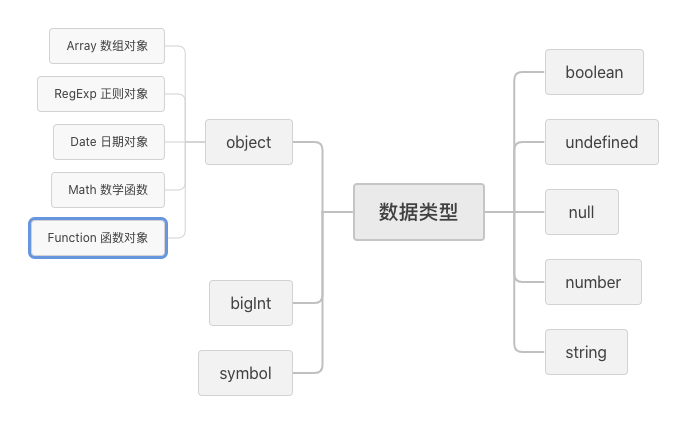
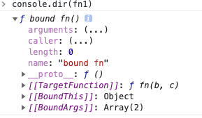

## 基本数据类型

### 1、基本数据类型有哪些？基本数据类型和引用数据类型的区别？



- 基本数据类型：`Number`、`String`、`Boolean`、`undefined`、`null`、`Symbol`、`bigInt`
- 两者之间的区别：基本数据类型是存在`栈`中的简单的数据段，数据大小确定，内存空间大小可以分配，是直接按值存放的，所以可以直接按值访问。引用类型是同时存在`栈`和`堆`中的对象，变量保存的是在栈内存中的一个指针，该指针指向堆内存，也就是说变量是存在栈中的一个地址，地址是该引用数据在堆中的地址。通过这个地址可以找到保存在堆内存中的对象

  ```js
  var a = { key: 1 };
  var b = a;
  b.key = 2;
  console.log(a.key); //2，因为a和b都指向同一个地址
  ```

  **symbol 和 bigint 讲一讲应用场景？**

- `symbol` : `Symbol` 是一种在 ES6 中新添加的数据类型，本质上是一种唯一标识符，可用作对象的唯一属性名，这样其他人就不会改写或覆盖你设置的属性值

  **特性**

  - 唯一性：即使是用同一个变量生成的值也不相等

  ```js
  let id1 = Symbol('id');
  let id2 = Symbol('id');
  console.log(id1 == id2); //false
  ```

  - 隐藏性：`for···in`，`object.keys()` 不能访问,但是也有能够访问的方法：`Object.getOwnPropertySymbols`

- `BigInt`: BigInt 数据类型提供了一种方法来表示大于 2^53-1 的整数。BigInt 可以表示任意大的整数

  Number 类型只能安全的支持-9007199254740991(-(2^53-1)) 和 9007199254740991(2^53-1)之间的整数，任何超过这个范围的数值都会失去精度；而 BigInt 可以解决这个问题

  ```js
  console.log(9007199254740999); //9007199254741000
  console.log(9007199254740993 === 9007199254740992); //true
  ```

  **如何使用**

  - 在整数的末尾追加 n `console.log(9007199254740999n)//9007199254740999`
  - 调用`BigInt()`构造函数 `var bigInt = BigInt("9007199254740999");`

  **注意事项**

  - BigInt 除了不能使用一元加号运算符外，其他的运算符都可以使用

  ```js
  console.log(+1n); // Uncaught TypeError: Cannot convert a BigInt value to a number
  console.log(-1n); //ok
  ```

  - BigInt 和 Number 之间不能进行混合操作

  ```js
  `console.log(1n+5)
  ```

### 2、判断数据类型的几种方法？instanceof 能正确判断对象的原理是什么?

**typeof 判断**

`typeof` 对于原始类型来说，除了 `null` 都可以显示正确的类型

```js
typeof 1; // number
typeof NaN; //number
typeof '1'; // string
typeof undefined; // undefined
typeof true; // boolean
typeof Symbol(); // symbol
typeof bigInt; //bigint
```

`typeof` 对于复杂类型来说，除了`function`都会显示 `object`，所以说 `typeof` 并不能准确判断变量到底是什么类型

```js
typeof []; // 'object'
typeof {}; // 'object'
typeof console.log; // 'function'
```

如果我们想判断一个对象的正确类型，这时候可以考虑使用`instanceof`，因为内部机制是通过**原型链**来判断的

```js
const Person = function() {};
const p1 = new Person();
p1 instanceof Person; // true

var str = 'hello world';
str instanceof String; // false

var str1 = new String('hello world');
str1 instanceof String; // true
```

对于原始类型来说，你想直接通过 `instanceof` 来判断类型是不行的，当然我们还是有办法让 `instanceof` 判断原始类型的

```js
class PrimitiveString {
  static [Symbol.hasInstance](x) {
    return typeof x === 'string';
  }
}
console.log('hello world' instanceof PrimitiveString); // true
```

你可能不知道`Symbol.hasInstance`是什么东西，其实就是一个能让我们自定义`instanceof`行为的东西，以上代码等同于`typeof 'hello world' === 'string'`，所以结果自然是`true`了。这其实也侧面反映了一个问题，`instanceof`也不是百分之百可信的。

**Object.prototype.toString.call**

`toString`是`object`的原型方法，调用该方法可以统一返回格式为`[object xxx]`的字符串，其中`xxx`就是对象的类型，对于对象，直接调用`toString`就能返回`[object object]`

**判断数组的几种方法**

- `Array.isArray` (属于 ES6)

  ```js
  var a = [1, 2];
  console.log(Array.isArray(a)); //true
  ```

- `Array.prototype.isPrototypeOf()`
- `Object.getPrototypeOf(a) === Array.prototype`

- `instanceof Array` 运算符用于检验构造函数的`prototype`属性是否出现在对象的原型链中的任何位置，返回一个布尔值，`instanceof` 只能用来判断对象类型，原始类型不可以

  ```js
  var a = [1, 2];
  d instanceof Array;
  ```

- `constructor` 实例的构造函数属性`constructor`指向实例本身，那么通过`constructor`属性也可以判断是否为一个数组

  ```js
  let a = [1, 3, 4];
  a.constructor === Array; //true
  ```

- `Object.prototype.toString.call()`,这种方法对于所有基本的数据类型都能进行判断，即使是 `null` 和 `undefined`

  ```js
  //检验是否为数组
  let a = [1, 2, 3];
  Object.prototype.toString.call(a) === '[object Array]'; //true
  //检验是否是函数
  let b = function() {};
  Object.prototype.toString.call(b) === '[object Function]'; //true
  //检验是否是数字
  let c = 1;
  Object.prototype.toString.call(c) === '[object Number]'; //true
  //检验是否为对象
  let d = {};
  Object.prototype.toString.call(d) === '[object Object]'; //true

  Object.prototype.toString.call(null); // "[object Null]

  Object.prototype.toString.call(undefined); // "[object Undefined]"
  ```

### 3、数组的方法

1. `some`
   此方法为参数传递的函数测试数组。如果有一个元素与测试元素匹配，则返回 true，否则返回 false

   ```js
   const arr = ['a', 'b', 'c', 'd'];
   console.log(arr.some(test => test === 'd')); //true
   ```

2. `reduce`
   此方法接收一个函数作为累加器。它为数组中的每个元素依次执行回调函数，不包括数组中被删除或者从未被赋值的元素。函数应用于累加器，数组中的每个值最后只返回一个值

   > reduce() 方法接受四个参数：初始值（上一次回调的返回值），当前元素值，当前索引，原数组

   ```js
   const arr1 = [1, 2, 3, 4, 5, 6];
   console.log(arr1.reduce((total, value) => total + value)); //21
   ```

3. `every`
   此方法是对数组中**每项**运行给定函数，如果数组的每个元素都与测试匹配，则返回 true，反之则返回 false

   ```js
   const arr2 = ['a', 'b', 'c', 'd'];
   console.log(arr2.every(test => test === 'd'));
   ```

4. `map`
   **该方法返回一个新数组**，数组中的元素为原始数组元素调用函数处理后的值。它按照原始数组元素顺序依次处理元素

   ```js
   const arr3 = [1, 2, 3, 4, 5, 6];
   console.log(arr3.map(value => value * value)); //1,4,9,16,25,36
   ```

   > map() 不会对空数组进行检测；map() 不会改变原始数组

5. `flat`
   **此方法创建一个新数组**，其中包含子数组上的 holden 元素，并将其平整到新数组中。请注意，此方法只能进行一个级别的深度

   ```js
   const arr4 = [
     [1, 2],
     [3, 4],
   ];
   console.log(arr4.flat()); //[1,2,3,4]
   ```

6. `filter`
   该方法接收一个函数作为参数。**并返回一个新数组**，该数组包含该数组的所有元素，作为参数传递的过滤函数对其返回 true

   ```js
   const arr5 = [1, 2, 3, 4, 5];
   console.log(arr5.filter(item => item > 3)); //[4,5]
   ```

   > filter（）方法是对数据中的元素进行过滤，也就是说是不能修改原数组中的数据，只能读取原数组中的数据，callback 需要返回布尔值；为 true 的时候，对应的元素留下来；为 false 的时候，对应的元素过滤掉

7. `forEach`
   此方法用于调用数组的每个元素。并将元素传递给回调函数

   ```js
   arr5.forEach(item => {
     console.log(item);
   });
   ```

   > forEach() 对于空数组是不会执行回调函数的

8. `findIndex`
   返回传入一个测试条件（函数）符合条件的数组第一个元素位置。它为数组中的每个元素都调用一次函数执行，当数组中的元素在测试条件时返回 true 时, findIndex() 返回符合条件的元素的索引位置，之后的值不会再调用执行函数。如果没有符合条件的元素返回 -1
   > findIndex() 对于空数组，函数是不会执行的， findIndex() 并没有改变数组的原始值。
9. `find`
   返回通过测试（函数内判断）的数组的第一个元素的值。find() 方法为数组中的每个元素都调用一次函数执行：当数组中的元素在测试条件时回 true 时, find() 返回符合条件的元素，之后的值不会再调用执行函数。如果没有符合条件的元素返回 undefined

   ```js
   const arr6 = [
     { id: 1, name: 'john' },
     { id: 2, name: 'Ali' },
     { id: 3, name: 'Mass' },
   ];
   console.log(arr6.find(element => element.id === 4)); //{id: 3, name: "Mass"}
   ```

10. `sort`
    此方法接收一个函数作为参数。它对数组的元素进行排序并返回它。也可以使用含有参数的 sort()方法进行排序

    ```js
    const arr7 = [5, 4, 3, 2, 1];
    console.log(arr7.sort((a, b) => a - b)); //[1,2,3,4,5]
    console.log(arr7.sort((a, b) => b - a)); //[5,4,3,2,1]
    ```

11. `concat`
    此方法用于连接两个或多个数组/值，它不会改变现有的数组。而仅仅**返回被连接数组的一个新数组**
12. `fill`
    此方法的作用是使用一个固定值来替换数组中的元素。该固定值可以是字母、数字、字符串、数组等等。它还有两个可选参数，表示填充起来的开始位置（默认为 0）与结束位置（默认为 array.length）

    ```js
    //0是替换元素 1是开始位置，3是结束位置 【1,2,3)
    const arr7 = [5, 4, 3, 2, 1];
    console.log(arr7.fill(0, 1, 3));
    ```

    > fill() 方法用于将一个固定值替换数组的元素

13. `includes`
    此方法用于判断字符串是否包含指定的子字符串。如果找到匹配的字符串则返回 true，否则返回 false

    ```js
    const arr8 = [1, 2, 3, 4, 5];
    arr8.includes(3); //true
    ```

    > includes() 方法区分大小写

14. `reverse`
    此方法用于颠倒数组中元素的顺序。第一个元素成为最后一个，最后一个元素将成为第一个
15. `flatMap`
    该方法将函数应用于数组的每个元素，然后将结果压缩为一个**新数组**。它在一个函数中结合了 flat（）和 map（）

    ```js
    const arr9 = [[1], [2], [3], [4], [5]];
    arr9.flatMap(arr => arr * 10); //[10,20,30,40,50]
    ```

16. `Array.of`
    用于将参数依次转化为数组中的一项，然后返回这个新数组

    ```js
    Array.of(8.0, 5); // [8, 5]
    ```

17. `Array.from`
    基于其他对象创建新数组，准确来说就是从一个类似数组的可迭代对象中创建一个新的数组实例，Array.from 就能把它变成一个数组（注意：是返回新的数组，不改变原对象）

    ```js
    Array.from('abc'); // ["a", "b", "c"]
    Array.from(new Set(['abc', 'def'])); // ["abc", "def"]
    Array.from(
      new Map([
        [1, 'ab'],
        [2, 'de'],
      ]),
    );
    ```

18. `copyWithin`从数组的指定位置拷贝元素到数组的另一个指定位置中

    ```js
    var array = [1, 2, 3, 4, 5];
    var array2 = array.copyWithin(0, 3);
    console.log(array === array2, array2); // true [4, 5, 3, 4, 5]
    ```

19. `fill`

    ```js
    var array = [1, 2, 3, 4, 5];
    var array2 = array.fill(10, 0, 3);
    console.log(array === array2, array2); //true [10,10,10,4,5]
    ```

    > 会生成新数组的方法 `map`、`filter`、`flat`、`concat`、`flatMap`

20. `at`更方便地提取数组下标 value

    ```js
    //`.`或者`[]`方式
    const array1 = res.data?.priceList || [];
    //获取最后一项价格
    const lastItemIndex = array1.length - 1;
    console.log(array1[lastItemIndex]);

    //at方式
    const array1 = res.data?.priceList || [];
    //获取最后一项价格
    console.log(array1.at(-1));
    ```

21. `Array.group` 可以对数组进行分组，不需要自己写判断逻辑，目前浏览器还不支持

### 4、Object 的方法有哪些？

1. `startWidth` 返回布尔值，表示是否找到了参数字符串。
2. `endsWith` 返回布尔值，表示参数字符串是否在源字符串的尾部
3. `includes` 返回布尔值，表示是否找到了参数字符串。
4. `repeat` 方法返回一个新字符串，表示将原字符串重复 n 次
5. `padStart` 用于头部补全,如果某个字符串不够指定长度，会在头部补全
6. `padEnd` 用于尾部补全

### 5、let/const 和 var 的区别？什么是暂时性死区？

- let 声明的变量不会提升，var 声明的会提升
  ```js
  {
    let a = 1;
    var b = 2;
  }
  console.log(a); //a is not defined
  console.log(b);
  console.log(window);
  ```
- 在非严格模式下：var 声明的变量是挂在 window 上面的，let 不是挂在 window
- let 不允许在相同作用域内，重复声明同一个变量
- const 声明一个只读的常量,一旦声明，常量的值就不能改变。const 声明的变量不得改变值，这意味着，const 一旦声明变量，就必须立即初始化，不能留到以后赋值，但是对于引用类型来说，只要不改变栈内存的地址，里面的值是可以任意改变的。

**暂时性死区**

在代码块内，使用 let/const 命令声明变量之前，该变量都是不可用的。这在语法上，称为“暂时性死区”（temporal dead zone，简称 TDZ）。

### 6、数组去重的各种方法?

```js
//var arr=[1,2,3,4,3,3,6,5]

// 1、Es6 Set去重
Array.from(new Set(arr));

// 2、for去重 时间复杂度O(n)  也可以使用map存储
function duplicate(arr) {
  let result = [];
  for (let i = 0; i < arr.length; i++) {
    if (result.indexOf(arr[i]) == -1) {
      result.push(arr[i]);
    }
  }
  return result;
}

//3、for+set
let set = new Set();
arr.forEach(item => set.add(item));
let a = Array.from(set);
console.log(a);

//4、两重for循环 时间复杂度0(n2)
for (var i = 0; i < arr.length; i++) {
  for (var j = i + 1; j < arr.length; j++) {
    if (arr[i] === arr[j]) {
      arr.splice(j, 1);
      j--;
    }
  }
}

//5. reduce去重
let arr = [1, 2, 3, 4, 4, 1];
let newArr = arr.reduce((prev, cur) => {
  if (!prev.includes(cur)) {
    return prev.concat(cur);
  } else {
    return prev;
  }
}, []);
```

### 7、js 内置对象有哪些？

JS 内置对象分为**数据封装类对象**和**其他对象**

- 数据封装类对象：`String`，`Boolean`，`Number`，`Array`，`Object`;

- 其他对象：`Function`，`Arguments`，`Math`，`Date`，`RegExp`，`Error`

`window`对象是一个虚拟的对象，你可以把它看作是你所使用的浏览器的窗口

### 8、Object 对象内置方法

- `Object.create`

  `Object.create(arg, pro)`创建的对象的原型取决于`arg`，`arg`为`null`，新对象是空对象，没有原型，不继承任何对象；`arg`为指定对象，新对象的原型指向指定对象，继承指定对象

- `Object.keys()`主要用于遍历对象自有的可枚举属性，不包括继承自原型的属性和不可枚举的属性。
- `Reflect.ownKeys()`返回**所有自有**属性`key`，不管是否可枚举，但不包括继承自原型的属性
- `Object.getOwnPropertyNames()`用于返回对象的自有属性，包括可枚举和不可枚举的
- `Object.defineProperty(obj, prop, descriptor)`方法会直接在一个对象上定义一个新属性，或者修改一个对象的现有属性，并返回此对象

### 9、数组和类数组的区别？

所谓 `类数组对象`，即格式与数组结构类似，拥有 `length` 属性，可以通过索引来访问或设置里面的元素，但是不能使用数组的方法，就可以归类为类数组对象。

区别：类数组对象的本质是对象，数组的方法不能使用，基本的类型判断也和数组有区别

常见的类数组对象有：`arguments`、`NodeList`

将类数组转化为数组的方法：`Array.from()`、`Array.prototype.slice.call()`、`扩展运算符（…）`

### 10、Set、WeakSet、Map、WeakMap 的区别？

- `Set`
  - 成员唯一、无序且不重复
  - [value, value]，键值与键名是一致的（或者说只有键值，没有键名）
  - 可以遍历，方法有：add、delete、has
- `WeakSet`
  - 成员都是对象
  - 成员都是弱引用，可以被垃圾回收机制回收，可以用来保存 DOM 节点，不容易造成内存泄漏
  - 不能遍历，方法有 add、delete、has
- `Map`
  - 本质上是键值对的集合，类似集合
  - 可以遍历，方法很多可以跟各种数据格式转换
- `WeakMap`
  - 只接受对象作为键名（null 除外），不接受其他类型的值作为键名
  - 键名是弱引用，键值可以是任意的，键名所指向的对象可以被垃圾回收，此时键名是无效的
  - 不能遍历，方法有 `get`、`set`、`has`、`delete`

### 11、Map 和对象的区别

- 普通对象可以直接使用字面量进行初始化，而 `Map` 需要 `Map()` 构造函数进行初始化
- 普通对象只接受字符串和符号作为键值，其他类型将被强制转换为字符串类型，而 `Map` 可以接受任何类型的键值（包括函数、对象或任何原语）
- 虽然现在普通对象的键进行了排序，但情况并非总是如此，而且排序很复杂。例如，如果对象中有键需要转换为字符串，则不保留对象键的原始顺序，虽然 `Map` 以简单的方式排序，但他始终与我们插入的顺序相同
- 我们可以使用 `for...of` 语句或 `Map.prototype.forEach` 直接迭代 `Map` 的属性，而普通对象不能直接迭代。
- 普通对象支持 `JSON` 序列化，但 `Map` 默认无法获取正确数据。
- `Map` 对象在涉及频繁删除和添加键值对的场景中表现更好，而普通对象没有优化

## 闭包

### 1、对闭包的看法？为什么要用闭包？说一下闭包的原理和应用场景

1. 什么是闭包？
   函数内部返回结果是一个内部函数，并被外部变量所引用，如果内部函数持有被指向函数作用域的变量，就行成了闭包

   可以在内部函数访问外部函数作用域，使用闭包，一是可以读取函数中的变量，二是可以将函数中的变量存在内存中，保护变量不会被污染，而正因为闭包会把函数中的变量值存储在内存中，会对内存有消耗，所以不能滥用闭包，而则会造成网页性能，造成内存泄漏，当不需要使用闭包时，要及时释放内存可将内层函数对象的变量赋值成 `null`

2. 闭包原理

   函数执行分为两个阶段(预编译和执行阶段)

   - `在预编译阶段`，如果发现内部函数使用了外部函数的变量，则会在内存中创建一个“闭包”对象并保存对应变量值，如果已经存在“闭包”，则字需要增加对应属性值就行，
   - `执行完后`，函数执行上下文会被销毁，函数对闭包对象的引用也会被销毁，但其内部函数还使用该闭包的引用，所以内部函数可以继续使用“外部函数”中的变量

   利用了函数作用域链的特性，一个函数内部定义的函数讲话包含外部函数的活动对象添加到他的作用域链中，函数执行完毕，其执行作用域链销毁，但因内部的函数作用域连仍然在引用这个活动对象，所以其活动对象不会被销毁，直到内部函数被销毁后才被销毁，

3. 优点

   - 可以从内部函数访问外部函数的作用域中的变量，且访问到的变量长期驻扎在内存中，可供之后使用
   - 避免污染全局
   - 把变量存在独立的作用域中，作为私有成员存在

4. 缺点

   - 对内存的消耗有负面影响，因内部函数保存了对外部变量的引用，导致无法被垃圾回收，增大内存使用量，所以使用不当会导致内存泄漏
   - 对处理速度有负面影响，闭包的层级决定了引用的外部变量在查找时经过的作用域链长度
   - 可以获取到意外的值

5. 应用场景

   - 模块封装，在各模块规范出现之前，都使用这样的方式防止变量污染全局

```js
var foo = (function() {
  var a = 0;
  function inner() {}
  inner.prototype.bar = function bar() {
    return a;
  };
  return inner;
})();
```

- 在循环中创建闭包，防止取到意外的值
  下面的代码，无论哪个元素触发时间都是弹出 4，因为函数执行引用的 i 是同一个，而在 i 循环结束后就是 3

  ```js
  for (var i = 0; i < 4; i++) {
    document.getElementByTd('id' + i).onFocus = function() {
      console.log(i);
    };
  }
  //用闭包解决
  for (var i = 0; i < 4; i++) {
    document.getElementByTd('id' + i).onFocus = function(i) {
      return function() {
        console.log(i);
      };
    };
  }
  //闭包实现按钮点击加1
  var add1 = function() {
    let index = 1;
    return function inner() {
      index += 1;
      console.log(index);
    };
  };
  let add = add1();
  ```

### 2、下面代码结果是什么？怎么修改成我们想要的值？

```js
for (var i = 1; i <= 5; i++) {
  setTimeout(function timer() {
    console.log(i);
  }, i * 1000);
}
//结果是 66666
//怎么得到结果是 1 2 3 4 5呢
//第一种 闭包
for (var i = 1; i <= 5; i++) {
  (function(j) {
    setTimeout(function timer() {
      console.log(j);
    }, j * 1000);
  })(i);
}
//第二种是 把var改成let
for (let i = 1; i <= 5; i++) {
  setTimeout(function timer() {
    console.log(i);
  }, i * 1000);
}

//第三种是 使用setTimeout的第三个参数
for (var i = 1; i <= 5; i++) {
  setTimeout(
    function timer(j) {
      console.log(j);
    },
    i * 1000,
    i,
  );
}

// 如果期望代码的输出变成 0 -> 1 -> 2 -> 3 -> 4 -> 5，则该怎么改呢？

var promise = Promise.resolve();
const output = i => {
  promise = promise.then(() => {
    return new Promise(resolve => {
      window.setTimeout(() => {
        console.log(i);
        resolve();
      }, 1000);
    });
  });
};
for (var i = 0; i < 5; i++) {
  output(i);
}
```

## this、作用域

- 由`new`调用：绑定到新创建的对象
- 由`call`或`apply`、`bind`调用：绑定到指定的对象
- 由上下文对象调用：绑定到上下文对象
- 默认：全局对象

### 1、请写出下面如下代码的结果？

```js
function test(person) {
  //函数传参是传递对象指针的副本
  person.age = 26; //这一行代码修改的是传过来的person
  person = {
    //这一行是创建了一个新的对象的地址
    name: 'yyy',
    age: 30,
  };

  return person;
}
const p1 = {
  name: 'yck',
  age: 25,
};
const p2 = test(p1);
console.log(p1); // -> {name: "yck", age: 26}
console.log(p2); // -> {name: "yyy", age: 30}
```

### 2、写出输出结果？

```js
var myObject = {
  foo: 'bar',
  func: function() {
    var self = this;
    console.log(this.foo); //bar
    console.log(self.foo); //bar
    (function() {
      console.log(this.foo); //undefined
      console.log(self.foo); //bar
    })();
  },
};
myObject.func();
```

因为是`myObject.func()`所以`func`函数里面的`this`指向`myObject`,所以第一行`console.log(this.foo)`的 this 执行`myObject`，

因为`self=this`，所以第二行的`console.log(self.foo)`里面的 self 指向的也是`myObject`，

但是下面一行`console.log(this.foo)`是在一个闭包里面，所以这个`this`指向 `window`

`console.log(self.foo)`里面的`self`指向的是上面获取的`self`,所以指向的是`myObject`

### 5、写出下面代码结果？

```js
var a = { n: 1 };
var b = a;
a.x = a = { n: 2 };
console.log(a); //{n:2}
console.log(b); //{n:1,x:{n:2}}
```

根据 v8 引擎来解释，`a`是存储在`栈`里面,`{n:1}`是存储在`堆`里面，所以`b=a`导致`a`和`b`同时指向`{n:1}`,因为点的运算优先等于的运算，所以`a.x`先执行即现在 a 和 b 都是`{n:1,x:undefined}`,又因为等于运算是从右到左执行的，所以`a={n:2}`

再执行`a.x=a`,这里要注意，因为`a.x`之前已经先执行了,所以`a.x`已经是`{n:1,x:undefined}`这个地址了，但是里面的 x 指向了新的地址,所以最终`a.x`可以看成是`{n:1,x:undefined}.x={n:2}`

### 6、写出下面代码的执行结果，并说明为什么？(变量提升)

```js
function out() {
  console.log(1);
}
(function() {
  if (false) {
    function out() {
      console.log(2);
    }
  }
  console.log(typeof out); //undefined
  out(); //out is not a function
})();
```

直接在函数体内定义的函数声明，整个都会提前，但是在块中定义的函数声明，只会提升其声明部分，不分配实际的内存空间,所以`out`被提升的只有函数变量名称，并未实际赋值

- 变量提升
  - 全局作用域中的声明的变量会提升到至全局最顶层
  - 函数内声明的变量只会提升到函数作用域顶层
- 函数提升

  - 函数表达式不会声明提升
  - 函数声明会覆盖变量声明，如果存在函数名和变量名是相同的，都会被提升，但是函数的优先级更高，所以变量的值会被覆盖掉

  ```js
  //赋值的情况
  var company = '123';
  function company() {
    console.log('456');
  }
  console.log(typeof company); //string

  //未赋值的情况
  var company;
  function company() {
    console.log('456');
  }
  console.log(typeof company); //function
  ```

### 7、请写出下面代码的结果？

```js
function fn() {
  console.log(this.length);
}
var yideng = {
  length: 5,
  method: function() {
    'use strict';
    fn();
    arguments[0]();
  },
};
const result = yideng.method.bind(null);
result(fn, 1);
```

结果是`0 2`,

`fn()`执行的时候不依赖任何对象，所以`fn()`中的`this`指向的是`window`,`arguments[0]()`函数执行里面的`this`指向的`argument`对象,所以`arguments[0]()`的结果是 2

### 8、请写出下面代码的结果？

```js
function bar() {
  console.log(myName);
}
function foo() {
  var myName = '内部变量';
  bar();
}
var myName = '外部变量';
foo(); //外部变量
```

为什么不是`内部变量`呢？，因为函数在定义的时候里面的变量已经存在了

### 9、请问变量 a 会被 GC 回收吗，为什么？

```js
function test() {
  var a = 'yideng';
  return function() {
    eval('');
  };
}
test()();
```

变量 a 不会被回收，因为里面有`eval()`，`eval()`函数可计算某个字符串，并执行其中的的 `JavaScript` 代码，所以 js 引擎不知道`eval`里面会执行什么程序会不会用到这个变量 a，所以变量`a`不会被回收

### 10、写出下面代码的结果？

```js
function foo() {
  a = 5;
  console.log(window.a); //undefined
  console.log(a); //5
  var a = 10;
  console.log(a); //s10
}
foo();

//等价于

function foo() {
  var a;
  a = 5;
  console.log(window.a); //undefined
  console.log(a); //5
  a = 10;
  console.log(a); //s10
}
foo();
```

因为`a`变量在全局里面没有声明，函数里面的变量属于函数作用域，所以`window.a`是`undefined`，下面的变量 a 就根据作用域的顺序来取就行了

### 11、写出下面代码的结果？

```js
var name = 'a';
function outter() {
  var name = 'b';
  function inner() {
    console.log(name); // b
    console.log(this.name); // a
  }
  inner();
}
outter();
```

按照作用域的顺序，`inner`执行的时候没有依赖于任何对象，所以它的`this`是`window`,`name`直接向上查找找到函数作用于里面有`name`，所以`console.log(name)=='b'`, `console.log(this.name)`取的是`window`里面的`name`

## 原型和原型链

### 1、原型和原型链代码面试题，输出下面代码的值？

```js
Object.prototype.a = 'a';
Function.prototype.a = 'a1';
function Person(){};
var yideng = new Person();

console.log(Person.a);
console.log(yideng.a);
console.log(1..a)
console.log(1.a)
console.log(yideng.__proto__.__proto__.constructor.constructor.constructor)
```

## 其他

### 1、防抖和节流的原理与实现？

#### 防抖的原理

- 原理

  所谓防抖，就是指触发事件后在 n 秒内函数只能执行一次，如果在 n 秒内又触发了事件，则会重新计算函数执行时间

- 适用场景

  - 按钮提交场景：防止按钮多次提交，只执行最后一次的提交
  - 搜索框联想场景： 只发送最后一次输入

**非立即执行版**

非立即执行版的意思是触发事件后函数不会立即执行，而是在 n 秒后执行，如果在 n 秒内又触发了事件，则会重新计算函数执行时间

```js
function debounce(func, wait) {
  let timeout;
  return function() {
    const context = this;
    let args = arguments;
    if (timeout) clearTimeout(timeout);

    timeout = setTimeout(() => {
      func.apply(context, args);
    }, wait);
  };
}
```

**立即执行版**

立即执行版的意思是触发事件后函数会立即执行，然后 n 秒内不触发事件才能继续执行函数的效果

```js
function debounce(func, wait) {
  let timeout;
  return function() {
    const context = this;
    let args = arguments;
    if (timeout) clearTimeout(timeout);

    let callNow = !timeout;
    timeout = setTimeout(() => {
      timeout = null;
    }, wait);

    if (callNow) func.apply(context, args);
  };
}
```

**双剑合璧版**

```js
/**
 * @desc 函数防抖
 * @param {*} func 函数
 * @param {*} wait 延迟执行毫秒数
 * @param {*} immediate  是否立即执行
 */
function debounce(func, wait, immediate) {
  let timeout;
  return function() {
    const context = this;
    let args = arguments;
    if (timeout) clearTimeout(timeout);

    if (immediate) {
      let callNow = !timeout;
      timeout = setTimeout(() => {
        timeout = null;
      }, wait);
      if (callNow) func.apply(context, args);
    } else {
      timeout = setTimeout(() => {
        func.apply(context, args);
      }, wait);
    }
  };
}
```

#### 节流的原理

- 原理

就是指连续触发事件但是在 n 秒中只执行一次函数，节流会稀释函数的执行频率

- 适用场景

  - 拖拽场景：固定时间内执行一次，防止超高频次位置发生变动
  - 缩放场景：监控浏览器的 resize

**时间戳版**

当触发事件的时候，我们取当前的时间戳然后减去之前的时间戳(第一次设置 0)，如果大于设置的周期，就执行函数，然后更新 prev 为当前的时间戳，如果小于就不执行

```js
function throttle(func, wait) {
  let prev = 0;
  return function() {
    let now = Date.now();
    let context = this;
    let args = arguments;
    if (now - prev > wait) {
      func.apply(context, args);
      prev = now;
    }
  };
}
```

**定时器版**

当触发事件的时候,我们设置了一个定时器，再触发事件的时候，如果定时器存在就不执行，直到事件执行清空定时器，这样就可以设置下一个定时器

```js
function throttle(func, wait) {
  let timeout;
  return function() {
    let context = this;
    let args = arguments;
    if (!timeout) {
      timeout = setTimeout(() => {
        time = null;
        func.apply(context, args);
      }, wait);
    }
  };
}
```

**双剑合璧版**

```js
/**
 * #desc 节流双剑合璧版
 * @param {*} func
 * @param {*} wait
 * @param {*} type type=1表示时间戳，type=2表示定时器
 */
function throttle(func, wait, type) {
  if (type === 1) {
    let previous = 0;
  } else if (type === 2) {
    let timeout;
  }
  return function() {
    let context = this;
    let args = arguments;
    switch (type) {
      case 1:
        let now = Date.now();
        if (now - prev > wait) {
          func.apply(context, args);
          prev = now;
        }
        break;
      case 2:
        if (!timeout) {
          timeout = setTimeout(() => {
            time = null;
            func.apply(context, args);
          }, wait);
        }
        break;
    }
  };
}
```

### 2、介绍箭头函数的 this?

- 函数体内的 this 对象，就是定义时所在的对象，而不是使用时所在的对象
- 箭头函数不能用作构造函数，因为箭头函数里面没有 this
- 箭头函数也没有 arguments,该对象在函数体内不存在。如果要用，可以用 Rest 参数代替
- 箭头函数中所使用的 this 都是来自函数作用域链
- 不可以使用 yield 命令，因此箭头函数不能用作 Generator 函数

### 3、for、for in、 for of、forEach 有什么区别？

- `for` 循环实际上是可以使用 `break` 和 `continue` 去终止循环的，但是 `forEach` 不行

  一般来说，for 多数时候都可以使用，当然一般我们需要知道循环次数；而 `forEach` 更适合于集合对象的遍历和操作

  for 循环在最开始执行循环的时候，会建立一个循环变量 i，之后每次循环都是操作这个变量，也就是说它是对一个循环变量在重复的赋值，因此 i 在最后只会存储一个值；而 forEach()虽然变量名没变，但是实际上每次循环都会创建一个独立不同的变量，而存储的数值自然也是不同的数值，因此相互之间不会影响

- `for...in`可以直接遍历对象和数组(数组遍历的是下标)，可枚举属性，包括自有属性、继承自原型的属性，**for in 特别适合遍历对象**
- `for...of`不能直接遍历对象，可以遍历数组，可以和 `break`、`continue`、和 `return` 配合使用

```html
<body>
  <ul>
    <li>1</li>
    <li>2</li>
    <li>3</li>
  </ul>
  <script type="text/javascript">
    var eles = document.querySelectorAll('li');
    console.log(eles);
    for (var i = 0; i < eles.length; i++) {
      eles[i].onclick = function() {
        console.log(i); //结果是每次点击都是3
      };
    }
    eles.forEach((item, index) => {
      item.onclick = function() {
        console.log(index); //结果是0 1 2
      };
    });
  </script>
</body>
```

### 4、什么是浅拷贝？如何实现浅拷贝？什么是深拷贝？如何实现深拷贝？

- 浅拷贝

  只复制指向某个对象的指针，而不复制对象本身，新旧对象还是共享同一块内存

  **赋值和浅拷贝的区别**

  当我们把一个对象赋值给一个新的变量时，赋的其实是该对象的在栈中的地址，而不是堆中的数据。也就是两个对象指向的是同一个存储空间，无论哪个对象发生改变，其实都是改变的存储空间的内容，因此，两个对象是联动的

  浅拷贝是按位拷贝对象，**它会创建一个新对象**，这个对象有着原始对象属性值的一份精确拷贝。如果属性是基本类型，拷贝的就是基本类型的值；如果属性是内存地址（引用类型），拷贝的就是内存地址 ，因此如果其中一个对象改变了这个地址，就会影响到另一个对象。即默认拷贝构造函数只是对对象进行浅拷贝复制(逐个成员依次拷贝)，**即只复制对象空间而不复制资源**

  下面看一个浅拷贝和赋值的例子：

  ```js
  // 对象赋值
  var obj1 = {
    name: 'zhangsan',
    age: '18',
    language: [1, [2, 3], [4, 5]],
  };
  var obj2 = obj1;
  obj2.name = 'lisi';
  obj2.language[1] = ['二', '三'];
  console.log('obj1', obj1); //{name:'lisi','age' :  '18','language' : [1,["二","三"],[4,5]],}
  console.log('obj2', obj2); //{name:'lisi','age' :  '18','language' : [1,["二","三"],[4,5]],}
  ```

  ```js
  // 浅拷贝
  var obj1 = {
    name: 'zhangsan',
    age: '18',
    language: [1, [2, 3], [4, 5]],
  };
  var obj3 = shallowCopy(obj1);
  obj3.name = 'lisi';
  obj3.language[1] = ['二', '三'];
  function shallowCopy(src) {
    var dst = {};
    for (var prop in src) {
      if (src.hasOwnProperty(prop)) {
        dst[prop] = src[prop];
      }
    }
    return dst;
  }
  console.log('obj1', obj1); //{name:'zhangsan','age' :  '18','language' : [1,["二","三"],[4,5]],}
  console.log('obj3', obj3); //{name:'lisi','age' :  '18','language' : [1,["二","三"],[4,5]],}
  ```

  **浅拷贝实现方式**

  - `Object.assign()`
    `Object.assign()` 进行的是浅拷贝，拷贝的是对象的属性的引用，而不是对象本身，拷贝对象只有一层数据结构的时候是深拷贝
  - `Array.prototype.concat()`、`Array.prototype.slice()`
    如果改变的是基本类型的则不会改变原数组，如果是引用类型就会改变原数组

- 深拷贝

  但深拷贝会另外创造一个一模一样的对象，新对象跟原对象不共享内存，修改新对象不会改到原对象

  **深拷贝实现方式**

  - `JSON.parse(JSON.stringify())`
    这种方法虽然可以实现数组或对象深拷贝，但不能处理函数。会忽略 `undefined` 、 `symbol`、不能序列化函数、不能解决循环引用的对象

  - 手写递归方法

    ```js
    //简单版
    function deepClone(obj) {
      function isObject(o) {
        return (typeof o === 'object' || typeof o === 'function') && o !== null;
      }

      if (!isObject(obj)) {
        throw new Error('非对象');
      }

      let isArray = Array.isArray(obj);
      let newObj = isArray ? [...obj] : { ...obj };
      Reflect.ownKeys(newObj).forEach(key => {
        newObj[key] = isObject(obj[key]) ? deepClone(obj[key]) : obj[key];
      });

      return newObj;
    }

    let obj = {
      a: [1, 2, 3],
      b: {
        c: 2,
        d: 3,
      },
    };
    let newObj = deepClone(obj);
    newObj.b.c = 1;
    console.log(obj.b.c); // 2
    ```

  - 函数库`lodash`
    该函数库也有提供 `_.cloneDeep` 用来做深拷贝

赋值、浅拷贝、深拷贝的区别？

---

|        | 和原数据是否指向同一对象 | 第一层数据为基本数据类型 | 原数据中包含子对象       |
| ------ | ------------------------ | ------------------------ | ------------------------ |
| 赋值   | 是                       | 改变会使原数据一同改变   | 改变会使原数据一同改变   |
| 浅拷贝 | 否                       | 改变不会使原数据一同改变 | 改变会使原数据一同改变   |
| 深拷贝 | 否                       | 改变不会使原数据一同改变 | 改变不会使原数据一同改变 |

---

### 5、如何获取一个 DOM 元素的绝对宽高，绝对位置？

原生 JS 提供了一个`getBoundingClientRect()`方法，用于获取左，上，右和下分别相对浏览器视窗的位置。

```js
document.getElementById('main').getBoundingClientRect();
```

### 6、Promise 和 async 分别解决了什么问题？

- `Promise`解决了回调地狱的问题，`Promise`构造函数是同步执行的，`then`是异步执行的
- `async`是异步的终极解决方案

### 7、call、apply、bind 的区别？

- 三者都可以改变函数的 `this` 对象指向
- `call`和`apply`都是立即执行，`call`的参数是一个一个的传，`apply`的参数是一个数组
- `bind`绑定`this`之后返回一个新数组,不管我们给函数 `bind` 几次，函数中的 `this` 永远由`第一次 bind`决定

  ```js
  let o = {
    a: 1,
  };
  function fn(b, c) {
    console.log(this.a + b + c);
  }
  let fn1 = fn.bind(o, 2, 3);
  fn1();
  console.dir(fn1);
  ```

  

  可以看到`fn1`并不是普通函数，而是绑定函数，所以当执行绑定函数时，`this`指向与形参在`bind`方法执行时已经确定了，无法再次改变

- `bind` 是返回绑定 this 之后的函数，便于稍后调用；apply 、call 则是立即执行

### 8、map、reducer 和 filter 等高阶函数

### 9、请求头部 content-type 的几种类型

之前一直分不清楚`post`请求里`Content-Type`方式，如`application/x-www-form-urlencoded`、`multipart/form-data`。

下面会介绍`Content-Type`有哪几种、插件 Postman 和 RESTClient 使用示例。文末还会介绍在 PHP 中 CURL 里需要注意的细节。

Http Header 里的 Content-Type 一般有这三种：

1. `application/x-www-form-urlencoded`：数据被编码为名称/值对。这是标准的编码格式。
2. `multipart/form-data`： 数据被编码为一条消息，页上的每个控件对应消息中的一个部分。
3. `text/plain`： 数据以纯文本形式(text/json/xml/html)进行编码，其中不含任何控件或格式字符。postman 软件里标的是 RAW。

`form`的`enctype`属性为编码方式，常用有两种：application/x-www-form-urlencoded 和 multipart/form-data，默认为 application/x-www-form-urlencoded。

当`action`为`get`时候，浏览器用 `x-www-form-urlencoded`的编码方式把 `form` 数据转换成一个字串（name1=value1&name2=value2...），然后把这个字串追加到 `url` 后面，用?分割，加载这个新的 `url。`

当`action`为`post`时候，浏览器把 form 数据封装到 http `body` 中，然后发送到 `server`。 如果没有 `type=file` 的控件，用默认的 `application/x-www-form-urlencoded` 就可以了。 但是如果有 `type=file` 的话，就要用到 `multipart/form-data` 了。

当`action`为`post`且`Content-Type`类型是`multipart/form-data`，浏览器会把整个表单以控件为单位分割，并为每个部分加上 Content-Disposition(form-data 或者 file),Content-Type(默认为 text/plain),name(控件 name)等信息，并加上分割符(boundary)

[参考该网站](https://www.cnblogs.com/52fhy/p/5436673.html)

### 10、从 200K 个数据中选择 10k 个不重复的数据，考虑性能问题？

```js
let data = [
  1,
  2,
  3,
  4,
  5,
  67,
  6,
  8,
  5,
  5,
  4,
  9,
  4,
  14,
  3,
  4,
  5,
  5,
  3,
  4,
  0,
  6,
  7,
  789,
  8,
  87,
  7,
  6,
  6,
  78,
  8,
  8,
  7,
];
let arr = new Set();
let i = 0;
while (i < 10) {
  arr.add(data[i]);
  i++;
}
console.log(Array.from(arr));
```

### 11、JS 保留小数: 去尾法 进一法 四舍五入法

```js
/**
 * money 原始金额
 * precision：精度设置 1是精确到分 2是精确到元
 * precision_type 1是四舍五入 2是去尾法 3是进一法
 */
// 去尾法  Math.floor(45.9853 * Math.pow(10, 0)) / Math.pow(10, 0)
// 进一法  Math.ceil(45.9853 * Math.pow(10, 2)) / Math.pow(10,2)
// 四舍五入 Math.round(45.9853 * Math.pow(10, 2)) / Math.pow(10, 2)
function moneySwitch(money, precision, precision_type) {
  let obj = { 1: 'round', 2: 'floor', 3: 'ceil' };
  let obj1 = { '1': 2, '2': 0 };
  let result =
    Math[obj[precision_type]](money * Math.pow(10, obj1[precision])) /
    Math.pow(10, obj1[precision]);
  return result;
}
console.log(moneySwitch(45.9853, 1, 2)); //45.98
console.log(moneySwitch(45.9853, 1, 3)); //45.99
console.log(moneySwitch(45.9853, 2, 2)); //45
console.log(moneySwitch(45.9853, 2, 3)); //46
```

### 12、mouseover 和 mouseenter 的区别是什么？

`mouseover`会冒泡，

`mouseenter`不会冒泡 。

就是当设定了多个`div`的嵌套时；即建立了父子关系，当父`div`与子`div`共同加入了`onclick`事件时，当触发了子`div`的`onclick`事件后，子`div`进行相应的`js`操作。但是父`div`的`onclick`事件同样会被触发。这就造成了事件的多层并发，导致了页面混乱。这就是冒泡事件

### 13、Promise 的几种类型

- `Promise.all`
  `Promise.all`可以将多个`Promise`实例包装成一个新的 Promise 实例。同时，成功和失败的返回值是不同的，成功的时候返回的是一个结果数组，而失败的时候则返回最先被 reject 失败状态的值

  具体代码如下：

  ```js
  let p1 = new Promise((resolve, reject) => {
    resolve('成功了');
  });

  let p2 = new Promise((resolve, reject) => {
    resolve('success');
  });

  let p3 = Promse.reject('失败');

  Promise.all([p1, p2])
    .then(result => {
      console.log(result); //['成功了', 'success']
    })
    .catch(error => {
      console.log(error);
    });

  Promise.all([p1, p3, p2])
    .then(result => {
      console.log(result);
    })
    .catch(error => {
      console.log(error); // 失败了，打出 '失败'
    });
  ```

  `Promse.all`在处理多个异步处理时非常有用，比如说一个页面上需要等两个或多个 ajax 的数据回来以后才正常显示，在此之前只显示 loading 图标

  **特别注意**：Promise.all 获得的成功结果的数组里面的数据顺序和 Promise.all 接收到的数组顺序是一致的，即 p1 的结果在前，即便 p1 的结果获取的比 p2 要晚。这带来了一个绝大的好处：在前端开发请求数据的过程中，偶尔会遇到发送多个请求并根据请求顺序获取和使用数据的场景，使用 Promise.all 毫无疑问可以解决这个问题

- `Promise.race`

  `Promse.race`就是赛跑的意思，意思就是说，Promise.race([p1, p2, p3])里面哪个结果获得的快，就返回那个结果，不管结果本身是成功状态还是失败状态
