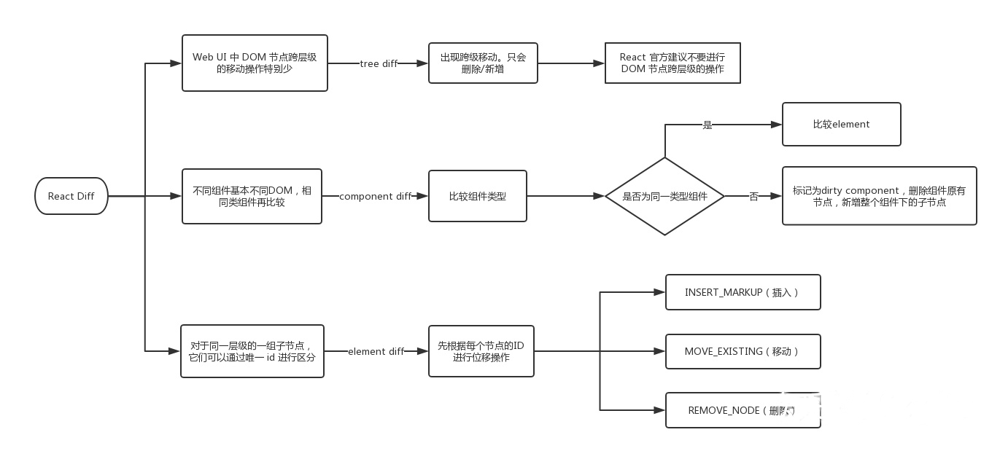

## 1、react 组件的通信方式

- 父组件向子组件传值

  父组件给子组件传值是通过 `props` 来传值的

  ```js
  //父组件
  const Parent = () => {
    return <Child name="你好" />;
  };
  //子组件child
  const Child = props => {
    return <p>{props.name}</p>;
  };
  ```

- 子组件向父组件传值

  子组件给父组件传值是通过 `props+callback` 回调来实现的

  ```js
  class Parent extends Component {
    constructor(props) {
      super(props);
      this.state = {
        msg: '我是父组件',
      };
    }
    callback = msg => {
      console.log(msg);
      this.setState({ msg });
    };
    render() {
      let { msg } = this.state;
      return (
        <div>
          {msg}
          <Child callback={this.callback} />
        </div>
      );
    }
  }
  //子组件child
  const Child = props => {
    const cb = msg => {
      return () => {
        //不写这一句 会造成立即执行函数变成死循环
        props.callback(msg);
      };
    };
    return <button onclick={cb('这是一个点击事件')}>{props.name}</button>;
  };
  ```

- 跨级组件通信
  父组件向更深层次的子组件传值，
  - 第一种是使用 `props`,利用中间层层传递的方式，但是这样不好维护，一旦一个层级断开了就会出现问题，找问题也不好定位
  - 第二种是使用 `context`,`context` 相当于一个大容器，我们可以把要通信的内容放进去，这样不管嵌套多深，都可以随意取用，对跨越多层的可以用 context
- 非嵌套关系组件通信
  非嵌套关系组件，就是没有包含任何关系的组件，包括兄弟组件以及不在同一个父组件的非兄弟组件
  - 可以使用自定义事件通信(`emmit`)
  - 可以使用 `redux` 进行全局状态管理
  - 如果是兄弟组件通信，可以找到这两个兄弟组件的父组件通过父子组件之间的通信方式进行传递

## 2、说一下 react-fiber

背景：

> react 进行组件渲染时，从 setState 开始到渲染整个过程是同步的，如果需要渲染的组件比较庞大，js 就会占据主线程时间较长，会导致页面响应的性能变差，使得 react 在动画、手势等应用中效果比较差。
>
> 页面卡顿：Stack reconciler 的工作流程很想函数的调用过程。父组件里面调用子组件，可以类比为函数的递归，对于特别庞大的 DOM 树来说，reconciliation 过程会很长，超过 16ms，在这期间，主线程都是被 js 占用的，因此任何交互、布局、渲染都会停止，给用户的感觉就是页面被卡住了

实现原理：

> 旧版 React 采用递归的方式进行渲染，使用的是 js 引擎自身的函数调用栈，他会一直执行到栈空为止，而 Fiber 实现了自己的组件调用栈，他以链表的形式遍历组件树，可以灵活的暂停、继续和丢弃执行的任务，实现方式是使用了浏览器的 requestldleCallback 这一 api。Fiber 其实指的是一种数据结构，他可以用一个纯 js 对象来表示：

```js
const fiber = {
  stateNode, //节点实例
  child, //子节点
  sibling, //兄弟节点
  return, //父节点
};
```

- react 内部运转分三层
  - `virtual dom`层，描述页面长什么样
  - `Reconciler`层，负责调用组件生命周期方法，运用 diff 算法
  - `Renderer`层，根据不同的平台，渲染出对应的页面，比较常见的是 ReactDOM 和 ReactNative
- 为了实现不卡顿，就需要一个调度器(`Scheduler`) 来进行任务的分配，优先级高的任务（比如键盘输入）可以打断优先级低的任务（如`diff`）的执行，从而更快的生效，任务的优先级有六种：
  - `synchronous`，与之前的`Stack Reconciler`操作一样，同步执行
  - `task` ,在`next tick`之前执行
  - `animation`，下一帧之前执行
  - `high`,在不久的将来立即执行
  - `low`,稍微迟些也没关系
  - `offscreen`，下一次`render`时或`scroll`时才执行
- `Fiber Reconciler(react)`执行阶段
  - 阶段一，生成 Fiber 树，得出需要更新的节点信息，这一步是一个渐进的过程，可以被打断
  - 阶段二，将需要更新的节点一次批量更新，这个过程不能被打断
- `Fiber`树：`Fiver Reconciler`在阶段一进行`diff`计算的时候，会基于`Virtual DOM`树生成一颗`Fiber`树，它的本质是链表
- 从 `Stack Reconciler`到`FiberReconciler`，源码层面其实就是干了一件递归循环的事情

## 3、react 项目中有哪些细节可以优化？实际开发过程中都做过哪些优化

主要是涉及到开发过程中、上线之后的首屏、运行过程中的优化

- 首屏优化一般涉及到的指标有 `FP、FCP、FMP`，要有一个良好的体验是尽可能的把 FCP 提前，需要做一些工程化的处理，去优化资源的加载方式以及分包策略，资源的减少是最有效的加快首屏打开的方式
- 对于 `CSR` 的应用，FCP 的过程一般是首先加载 js 和 css,js 在本地执行完成，然后加载数据回来做内容渲染，所以 `CSR` 可以考虑骨架屏和预渲染(部分结构渲染)、`suspence` 与 `lazy` 做懒加载动态组件的方式
- 不管对于 `CSR` 或者 `SSR`、都建议配合使用 `Service worker` 来控制资源的调配及骨架屏秒开的体验
- react 项目上线之后，首先保障的是可用性，所以通过 `React.Profiler` 分子组件的渲染次数及耗时的任务，但是 Profile 记录的是 commit 阶段的数据，所以对于 react 调和阶段就需要结合 performanceAPI 一起分析
- 由于 React 父组件 props 改变之后，所有与 props 相关子组件在没有添加条件控制的情况下也会触发 render 渲染，这是没有必要的，可以结合 react 的 `PureComponent` 以及 React.memo 等浅比较处理，这中间涉及到不可变数据的处理，当然也可以结合 `shouldComponentUpdate` 做深比较处理
- 所以运行状态的优化，都减少不必要的 render,`React.useMemo` 和 `React.useCallback` 也可以做很多优化的地方
- 保障应用的可用性，可以使用 `componentDidCatch` 处理

**实际开发过程中的优化点**

1. 保证数据的不可变性
2. 使用唯一的键值迭代
3. 使用 `webworker` 做密集型的任务处理
4. 不在 `render` 中处理数据
5. 不必要的标签,使用 `React.Fragments`

## 4. 在不使用 vue、react 的前提下写代码解决一下问题

1. 一个 list 页面上，含有 1000 个条目的待办列表，现在其中 100 项在同一时间达到了过期时间，需要在对应项的 text-node 里面添加"已过期"的文字，需要尽可能的减少 dom 重绘次数以提升性能
2. 尝试使用 vue 或 react 解决上述问题

**原生实现**
`createdocumentfragment()`方法创建了一虚拟的节点对象，节点对象包含所有属性和方法。
当你想提取文档的一部分，改变，增加，或删除某些内容及插入到文档末尾可以使用 createDocumentFragment() 方法。
你也可以使用文档的文档对象来执行这些变化，但要防止文件结构被破坏，createDocumentFragment() 方法可以更安全改变文档的结构及节点

```html
<body>
  <button id="expire1">过期设置（暴力法）</button>
  <button id="expire2">过期设置（innerHtml)</button>
  <ul id="wrap"></ul>
  <script type="text/javascript">
    //生成大量dom
    let start = new Date().getTime();
    let $ul = document.getElementById('wrap');
    let el = document.createDocumentFragment(); //关键是这一句

    let allKeys = [];
    for (let i = 0; i < 1000; i++) {
      let li = document.createElement('li');
      li.dataset.key = i;
      li.innerHTML = i;
      el.appendChild(li);
      allKeys.push(i);
    }
    // $ul.appendChild(el)

    //生成过期项
    function getExpireKeys() {
      let keys = [];
      while (keys.length < 100) {
        let randomKey = Math.floor(Math.random() * 1000);
        if (keys.indexOf(randomKey) === -1) {
          keys.push(randomKey);
        } else {
          continue;
        }
      }
      return keys;
    }

    //暴力法
    document.getElementById('expire1').onclick = function() {
      let expireKeys = getExpireKeys();
      let children = $ul.children;
      let start = Date.now();
      for (let i = 0; i < expireKeys.length; i++) {
        const element = document.querySelector(
          `li[data-key="${expireKeys[i]}"]`,
        );
        element.innerHTML = element.innerHTML + '已过期';
      }
    };
    //模板字符串（有问题 显示不出来）
    document.getElementById('expire2').onclick = function() {
      let expireKeys = getExpireKeys();
      const item = [];
      for (let i = 0; i < allKeys.length; i++) {
        $ul.append(
          `<li>${allKeys[i]} ${
            expireKeys.indexOf(allKeys[i]) !== -1 ? '已过期' : ''
          }</li>`,
        );
        // item.push(`<li>${allKeys[i]} ${expireKeys.indexOf(allKeys[i])!==-1?'已过期':''}</li>`)
      }
      // $ul.append(item[0])
      console.log($ul);
    };

    //react的方式
    class APP1 extends Component {
      constructor(props) {
        super(props);
        this.state = {
          allKeys: [],
          expireKeys: [],
        };
      }
      componentDidMount() {
        let allKeys = [];
        for (let i = 0; i < 1000; i++) {
          allKeys.push(i);
        }
        this.setState({ allKeys, expireKeys: this.getExpireKeys() });
      }
      getExpireKeys() {
        let keys = [];
        while (keys.length < 100) {
          let randomKey = Math.floor(Math.random() * 1000);
          if (keys.indexOf(randomKey) === -1) {
            keys.push(randomKey);
          } else {
            continue;
          }
        }
        return keys;
      }
      render() {
        let { allKeys, expireKeys } = this.state;
        return (
          <div>
            <ul>
              {allKeys.map(item => {
                return (
                  <li key={item}>
                    {item}
                    {expireKeys.indexOf(item) === -1 ? '' : '已过期'}
                  </li>
                );
              })}
            </ul>
          </div>
        );
      }
    }
  </script>
</body>
```

## 5、说说虚拟 DOM?

**虚拟 DOM 是什么？**

本质上来说：虚拟 `DOM` 是一个 javascript 对象，通过对象的方式来表示 DOM 结构，将页面的状态抽象为 js 对象的形式，配合不同想渲染工具，是跨平台渲染成为可能。通过事务处理机制，将多次 DOM 修改的结果一次性更新到页面上，从而**有效的减少页面渲染的次数，减少修改 DOM 重绘和重排次数，提高渲染性能**

**为什么要用虚拟 DOM？**

- 保证性能下限，在不进行手动优化的情况下，提供过得去的性能

为什么要使用虚拟 DOM?是因为快吗？，实际上不一定是快。首次渲染大量 DOM，由于多了一层虚拟 DOM 的计算，比 innerHtml 插入的慢，但是在真实 DOM 操作的时候进行针对性的优化时，还是更快的

- 跨平台

对于跨平台技术来说，重要的意义在于：

虚拟 DOM 是 DOM 在内存中的一个轻量级的表达方式，是一种同意约定，可以通过不同的渲染引擎生成不同平台的的 UI

虚拟 DOM 的可移植性非常好，这意味着可以渲染到 DOM 以外的任何端，可以做很多事情

> 注意
> 虚拟 DOM 真正的价值从来都不是性能，而是不管数据怎么变化都可以用最小的代价来更新 DOM，而且掩盖了底层的 DOM 操作，让你用声明式的方式来描述你的目的，从来让来待更容易维护

## 6、哪些方法会触发 react 重新渲染？

1. `setSate()`方法的调用
   通常情况下，setState 触发会触发 render,但是 setState 触发一定会重新渲染吗？答案是不一定，当`setState(null)`的时候不会触发 render 重新渲染

2. 父组件重新渲染了,即使子组件的 props 没有改变，子组件也会重新 render

**重新渲染做了什么**

- 会对比新旧 Vnode 进行对比，也就是我们所说的 DOMdiff
- 对新旧两棵树进行一个深度优先遍历，这样每一个节点都会有一个标记，在遍历的时候，每遍历一个节点，就会对比这个节点树，如果有差异就放到这个对象里面
- 遍历差异对象，根据差异的类型，根据对应规则更新 VNode

react 的处理 render 的基本思想就是每一次有变动就会重新渲染整个应用，在 Virtual DOM 没有出现之前，最简单的方法就是调用 innerHtml 直接替换里面的内容，Virtual DOM 厉害的地方并不是说他比直接操作 DOM 快，而是说不管数据怎么变，都会尽量以最小的代价去更新 DOM。react 将 render 函数返回的虚拟 DOM 树与老的比较从而确定 DOM 要不要更新，应该怎么更新，当 DOM 树很大的时候，遍历两颗树进行对比差异还是很耗性能的，特别是顶层的 setState 有一个微小改变的时候，就会默认去遍历整棵树，尽管 react 使用高度优化的 Diff 算法，但其实还是很耗性能的

**总结**

虽然 react 基于虚拟 Dom 和 diff 算法实现了对 DOM 最小粒度的更新，但是遇到复杂的场景，性能问题还是一大难题。
所以下面是可以优化的点：

- `shouldComponentUpdate`和`PureComponent`
  PureComponent 通过减少父组件的更新来触发子组件的更新，利用了浅对比的手法

  `shouldComponentUpdate`是决组件是否重新渲染

- 利用高阶组件
  在函数组件中没有`shouldComponentUpdate`生命周期，可以使用高阶组件来达到这个效果

- `React.useMemo`
  用来缓存组件的渲染，避免不必要的更新，其实也就是一个高阶组件，与 PureComponent 类似，但是 React.useMemo 只用于函数组件
- 合理拆分组件
  以更轻，更小的粒度来纵向拆分组件

## 7、setState 是异步还是同步？

`setState` 默认是异步的，因为异步就可以把一个同步代码中的多个 setState 合并成一个组件更新，而不是 setState 执行一次就更新一次，优化了性能

`setState` 在 setTimeout、原生事件里面是同步的

## 8、react 的优缺点？

- 优点

  - react 速度快
  - 跨浏览器兼容
  - 模块化
  - 单向数据流
  - 同构的 javascript
    单页面应用最大的缺陷就是对 SEO 不友好，所以 react 有了解决方案，react 可以在服务端预渲染再发送到客户端，可以从预渲染的静态内容中恢复一样的记录到动态应用中，

    搜索引擎爬虫程序依赖的是服务端响应而不是 javascript 的执行，预渲染有助于搜索引擎的优化

- 缺点

  - 只是 view 层
    react 本身只是一个 view 层，不是完整的 mvc 框架，大型项目需要加上 reactRouter、redux 才行
  - 状态不同步
    函数的运行时独立的，每个函数都有一份独立的作用域，**函数的变量是保存在运行时的作用域里面**，当我们有异步操作的时候京吹遇到异步回调的变量引用是之前的，也就是旧的没有更新过的(可以理解为闭包)

    ```js
    import React, { useState } from 'react';

    const App1 = () => {
      const [counter, setCounter] = useState(0);
      const add1 = () => {
        setTimeout(() => {
          console.log(counter);
        }, 3000);
      };
      return (
        <div>
          <p>{counter}</p>
          <button onClick={() => setCounter(counter + 1)}>点击加1</button>
          <button onClick={add1}>点击</button>
        </div>
      );
    };

    export default App1;
    ```

    上面的代码，当点击第二个按钮之后立马点击第一个按钮，虽然执行加一的操作，但是 3 秒后打印的还是 0，为什么呢？为什么不是 1 呢？这是因为第一个函数执行的是 counter 是 0，`add1`执行的时候 counter 是 0，虽然是 3 秒后执行的，但是初始的值已经保存在这个闭包里面了，

    这个问题 class component 不会先，因为 class component 的属性和方法都存在不变的`instance`上取值，所以不存在引用是旧的问题

    **解决方法**

    解决这个 hooks 的问题就是参照类的 instance,用 useRef 返回的 immutable RefObject(current 属性是可变的)来保存 state

    ```js
    import React, { useState, useRef, useEffect } from 'react';

    const App1 = () => {
      const [counter, setCounter] = useState(0);
      const counterRef = useRef(counter);
      const add1 = () => {
        setTimeout(() => {
          console.log(counterRef.current);
        }, 3000);
      };
      useEffect(() => {
        counterRef.current = counter;
      });
      return (
        <div>
          <p>{counter}</p>
          <button onClick={() => setCounter(counter + 1)}>点击加1</button>
          <button onClick={add1}>点击</button>
        </div>
      );
    };

    export default App1;
    ```

  **hooks 常见问题**

  1. 不要在`useEffect`里面写太多的依赖，可以划分成多个单一的`useEffect`
  2. 重视`eslint-plugin-react-hooks`的警告
  3. 复杂业务使用`Component`代替`hooks`

## 9、高阶组件和普通组件有什么区别？适用什么场景？

> 高阶组件(HOC)是 React 中复用组件逻辑的一种高级技巧，HOC 自身不是 React API 的一部分，它是一种基于 React 的组合特性而形成的设计模式

高阶组件就是一个函数，他是接受一个组件作为参数，返回一个新的组件，他只是一种组件的设计模式，这种设计模式是由 react 自身的组合性质必然产生的，我们将他们称为纯组件，因为他们接受任何动态提供的子组件，但是他们不会修改和复制其输入组件的任何行为

```js
//HOC
function withSubscription(WrappedComponent, selectData) {
  return class extends React.Component {
    constructor(props) {
      super(props);
      this.state = {
        data: selectData,
      };
    }
    //一些逻辑处理
    render() {
      //使用新数据渲染包装的组件
      return <WrappedComponent data={this.state.data} {...this.props} />;
    }
  };
}

//使用
const BlogSubscription = withSubscription(BlogPost, (DataSource, props) =>
  DataSource.getBlogPost(props.id),
);
```

**HOC 优缺点：**

- 优点：逻辑复用，不影响被包裹组件的内部逻辑
- 缺点：hoc 传递给被包裹组件的 props 容易和被包裹后的组件重名，进而被覆盖

**具体小例子**

1. 权限控制
   利用高阶组件的条件渲染特性可以多页面进行权限控制，权限控制一般分为两个维度：页面级别和页面元素级别

```js
function withAdminAuth(WrappedComponent) {
  return class extends React.Component {
    stat = {
      isAdmin: false,
    };
    async UNSAFE_componentWillMount() {
      const currentRole = await getCurrentUserRole();
      this.setState({
        isAdmin: currentRole === 'Admin',
      });
    }
    render() {
      if (this.state.isAdmin) {
        return <WrappedComponent {...this.props} />;
      } else {
        return <div>你没有权限查看该页面</div>;
      }
    }
  };
}

//使用
class PageA extends React.Component {
  constructor(props) {
    super(props);
  }
  UNSAFE_componentWillMount() {}
  render() {}
}
export default withAdminAuth(PageA);
```

2. 组件渲染性能追踪
3. 页面复用

## 10、如何在 RN 上做 Android 和 ios 的适配

1. 布局
   RN 里面是不需要写单位的，默认是像素点 dp,但是设计师一般用 px,所以需要换算，**换算公式为：px\*screenWidth/uiwidth**,uiwidth 为设计师的 ui 设计基准宽度，比如 640，750，1024，screenWidth 为设备逻辑分辨率，比如 iphone6 就是 375
2. 图片
   为了适配不同分辨率的屏幕，需要准备 1x、2x、3x 三种大小的尺寸，假如有一个 btn.png、btn@2x.png、btn@3x.png 在代码种不要指定倍图，需要使用`<Image src={require('btn.png')}/>`
3. 组件分为 ios、android、和两端都适用的，不同的平台使用不同的组件

## 11、单向数据流有什么好处？

单向数据流使得数据流动方向可以追踪，流动单一，追查问题的时候更快捷

view 发出 action 之后不是修改原来的 state,而是返回了一个新的，可以保存 state 的历史记录，可以复现场景，易测试

## 12、React.Component 和 React.PureComponent 的区别？

对于基本类型，浅拷贝只是检查值是否相同

对于引用类型，浅拷贝只是检查引用值是否相等，这意味着修改了一个对象里面的某一个位置的值，那么更新前后的对象仍然相等

**总结**

- `React.Component`需要自己实现`shouldComponentUpdate()`
- `React.PureComponent`通过 props 和 state 的浅对比来实现`shouldComponentUpdate()`
- 如果组件定义了`shouldComponentUpdate`，无论组件是否是`PureComponent`都会执行`shouldComponentUpdate`结果来判断是否执行`update`,如果组件没有实现`shouldComponentUpdate`，则会判断组件是否是`PureComponent`，如果是的话，则会新旧 props、state 进行比较，一旦心就不一致就会触发更新
- `React.PureComponent`优缺点：
  - 优点：不需要开发者自己实现`shouldComponentUpdate`
  - 缺点：可能会因为深层的数据不一致而产生错误的否定判断，从而不更新

## 12、简单说一下 react 和 vue 的异同？

1. 相似之处

- 都将注意力集中保持在核心库，其他功能如路由，全局状态管理则交给相关的库
- 都有自己的构建工具，能得到一个最佳的项目模板
- 都是用了虚拟 DOM 提高重绘性能
- 都有 props 允许组件数据传递
- 都鼓励拆分组件成一个个功能明确的小组件

2. 不同之处

- **数据流** vue 默认是双向绑定，react 是单向数据流
- **虚拟 DOM**
  vue 宣称可以更快的计算出虚拟 DOM 的差异，这是由于他在渲染过程中，会跟踪每个组件的依赖关系，不需要重新渲染整个 DOM 树

  react 则不是，只要有状态改变，全部的子组件都会重新渲染，当然这是可以通过`shouldComponentUpdate`和`PureComponent`来控制

- **组件化**
  vue 是类似 html 的模板，写起来和 H5 差不多，

  react 是 jsx 的写法

  具体来说，vue 引用组件`import`之后还需要在`componets`注册,但是 react 是可以直接引用的

- **监听原理不同**
  vue 通过`getter/setter`以及一些函数的劫持，能精确知道数据变化，不需要特别的优化就能达到很好的性能

  react 默认是通过比较引用的方式进行的，如果不优化就会导致大量的不必要的 VDOM 渲染，造成性能不好

- **高阶组件**
  `react` 可以使用高阶组件来扩展，`vue` 则是通过 `mixins` 来扩展
- **构建工具**

  react => create-react-app

  vue => vue-cli

- **跨平台**

  React => React Native

  Vue => weex

## 13、react key 是干嘛用的，主要解决什么问题

`key`主要是`react`追踪哪些列表中元素被修改、被添加或者被移除的辅助标志

在`react diff`算法中，react 会借助元素的 key 值来判断元素是新建创建还是被移动而来的元素，减少不必要的渲染

>

1. key 值一定要和具体的元素一一对应
2. 尽量不要用数组的 index 来作为唯一的 key 值
3. 永远不要在 render 的时候用随机数或者其他操作给元素加上不稳定的 key,这样会造成性能开销比不加 key 的情况下更糟糕

## 14、函数组件和类组件的区别？

作为组件而言，类组件与函数组件在使用与呈现上没有任何不同，性能上在现代浏览器中也不会有明显差异

1. 函数组件是无状态组件，相比类组件无法使用许多特性，例如生命周期钩子、状态 state 等，随着 hooks 出现，类组件也同样可以实现相应的功能

2. 函数组件中没有 this。所以你再也不需要考虑 this。

3. 函数组件的性能比类组件的性能要高，因为类组件使用的时候要实例化，而函数组件直接执行函数取返回结果即可

## 15、容器组件和展示组件分别是什么？

- 展示组件
  - 关注页面的展示效果（外观）
  - 内部可以包含展示组件和容器组件，通常会包含一些自己的 DOM 标记和样式(style)
  - 通常允许通过`this.props.children`方式来包含其他组件。
  - 对应用程序的其他部分没有依赖关系，例如 Flux 操作或 store。
  - 不用关心数据是怎么加载和变动的。
  - 只能通过`props`的方式接收数据和进行回调`(callback)`操作。
  - 很少拥有自己的状态，即使有也是用于展示`UI`状态的。
  - 会被写成函数式组件除非该组件需要自己的状态，生命周期或者做一些性能优化
- 容器组件
  - 关注应用的是如何工作的
  - 内部可以包含容器组件和展示组件，但通常没有任何自己的 DOM 标记，除了一些包装 divs，并且从不具有任何样式。
  - 提供数据和行为给其他的展示组件或容器组件。
  - 调用 Flux 操作并将它们作为回调函数提供给展示组件。
  - 往往是有状态的，因为它们倾向于作为数据源
  - 通常使用高阶组件生成，例如`React Redux的connect()`，`Relay的createContainer()`或`Flux Utils的Container.create()`，而不是手工编写。

示例：

```js
  //展示组件
  class TodoList extends React.Component{
      constructor(props){
        super(props);
      }
      render(){
        const {todos} = this.props;
        return (<div>
          <ul>
              {todos.map((item,index)=>{
                  return <li key={item.id}>{item.name}</li>
              })}
          </ul>
        </div>)
      }

  //容器组件
  class TodoListContainer extends React.Component{
      constructor(props){
        super(props);
        this.state = {
            todos:[]
        }
        this.fetchData = this.fetchData.bind(this);
      }
      componentDidMount(){
        this.fetchData();
      }
      fetchData(){
        fetch('/api/todos').then(data =>{
          this.setState({
            todos:data
          })
        })
      }
      render(){
        return (<div>
            <TodoList todos={this.state.todos} />
        </div>)
      }
  }
```

## 16、受控组件和非受控组件？

- 受控组件

  - `HTML`中的表单元素是可输入的，也就是有自己的可变状态
  - 而`React`中可变状态通常保存在`state`中，并且只能通过`setState()` 方法来修改
  - `React`将`state`与表单元素值`value`绑定在一起，有`state`的值来控制表单元素的值
  - 受控组件：值受到`react`控制的表单元素

  ```js
  <input type="text" value={this.state.txt} onChange={this.inputChange} />
  ```

- 非受控组件
  - 调用 `React.createRef()` 方法创建 ref 对象
  - 将创建好的 `ref` 对象添加到文本框中
  - 通过`ref`对象获取到文本框的值
  - 非受控组件： 表单组件没有`value prop`就可以称为非受控组件
  ```js
  class App extends React.Component {
    constructor() {
      super();
      //创建 ref
      this.txtRef = React.createRef();
    }
    // 获取文本框的值
    getTxt = () => {
      console.log(this.txtRef.current.value);
    };
    render() {
      return (
        <div>
          <input type="text" ref={this.txtRef} />
          <button onClick={this.getTxt}>获取值</button>
        </div>
      );
    }
  }
  ```

## 17、简述 react 的 diff 算法

React 通过引入`Virtual DOM`的概念，极大的避免无效的 DOM 操作，使我们的页面的构建效率得到了极大的提升，但是如何高效的通过对比新旧`Virtual DOM`来找到真正的 DOM 变化之处同样也决定着页面的性能。

**React DOM-diff 的策略**



- `web ui`中`DOM`节点跨层级的移动操作特别少，可以忽略不计

- 拥有相同类的两个组件将会生成相似的树形结构，拥有不同类的两个组件将会生成不同的树形结构
- 对于同一层级的一组子节点，他们可以通过唯一 `id` 进行区分

基于以上三个前提策略，`React`分别对`tree diff`、`component diff`以及`element diff`进行算法优化

1. `tree diff`
   基于策略 1，react 对树的算法金项链简洁明了的优化，对树进行分层比较，两棵树只会对同一层次的节点进行比较，当发现节点以及不逊在，则该节点及其子节点后会被完全删除，不会进行进一步的比较，这样只需要对树进行一次遍历，便能完成整个 DOM 树的比较
2. `component diff`

- 如果是同一类型的组件，按照原策略继续比较 `virtual DOM tree`，如果不是则将该组件下的所有子节点都替换
- 对于同类的组件，有可能其`virtual DOM`没有任何变化，如果能够确切的知道这点那可以节省大量的 diff 运算事件，因此`react`运行用户通过`shouldComponentUpdate()`来判断该组件是否需要进行`diff`

3. `element diff`
   通过唯一的`key`值进行增删改

## 18、MVVM 是什么？

`MVVM`是 `Model-View-ViewModel`的缩写，即模型-视图-视图模型。`MVVM` 是一种设计思想。

模型`（Model）`： 数据保存—存放着各种数据，有的是固定写死的，大多数是从后端返回的数据
视图 `（View）`：用户界面，也就是 DOM
视图模型`（View-Model）`:连接`View`和`Model`的桥梁，当数据变化时，`ViewModel`够监听到数据的变化（通过`Data Bindings`），自动更新视图，而当用户操作视图，`ViewModel`也能监听到视图的变化（通过`DOM Listeners`），然后通知数据做改动，这就实现了数据的双向绑定

**MVVM 和 MVC 区别？**

都是一种设计思想
`MVC` 后台用的多，`MVC`是`Model-View-Controller`的简写，即模型-视图-控制器。
`MVC`的目的就是将`M`和`V`的代码分离
`MVC`是单向通信，也就是`View`和`Model`，必须通过`Controller`来承上启下
`MVVM`实现了`View`和`Model`的自动同步，当`Model`的属性改变时，不用再自己手动操作`DOM`元素，提高了页面渲染性能

## 19、如何避免组件的重新渲染？memo/useMemo/useCallback、PureComponent？

1. `useMemo` 和 `React.mome` 的区别？

   `react hooks`提供的两个 API，用于缓存数据，优化性能

   - `React.mome`

     使用 `React.mome` 来缓存组件，防止父组件 state 的改变影响子组件重新渲染

   - `useMemo`

     用来缓存数据，当组件内部某一个渲染的数据，需要通过计算而来，这个计算是依赖与特定的`state、props`数据，我们就用`useMemo`来缓存这个数据，以至于我们在修改她们没有依赖的数据源的情况下，多次调用这个计算函数，浪费计算资源

     也可以把`useMemo`替换成`useCallback`,使用`useCallback`就不用写`return`函数了

     ```js
     import React, { useState, useMemo } from 'react';
     import './style.css';

     //父组件的state改变的时候 子组件也会随着重新render,使用React.memo可以缓存组件
     const ChildComponent = React.memo(() => {
       console.log('这是子组件');
       return <div>这是子组件</div>;
     });

     export default function App() {
       const [count, setCount] = useState(0);
       const [val, setVal] = useState('');
       //不使用useMemo的话，每次创建出来的是一个新的函数
       //使用useMemo的话每次函数对象只创建一次，所以当count改变的时候，Child不会render
       const sumFunction = useMemo(() => {
         console.log('compute');
         let sum = 0;
         for (let i = 0; i < count * 10; i++) {
           sum += i;
         }
         return sum;
       }, [count]);
       //等价于
       // useCallback同理，当count改变时，代码执行到这里时，会再次创建一个新的sumFunction函数，所以Child组件也会再次render
       const sumFunction = useCallback(() => {
         console.log('compute');
         let sum = 0;
         for (let i = 0; i < count * 10; i++) {
           sum += i;
         }
         return sum;
       }, [count]);
       return (
         <div>
           <div>
             {count}-{val}-{sumFunction}
           </div>
           <button onClick={() => setCount(count + 1)}>点击+1</button>
           <p>
             <input value={val} onChange={e => setVal(e.target.value)} />
           </p>
           <ChildComponent />
         </div>
       );
     }
     ```

   2. `useMemo` 和 `useCallback` 的区别及使用场景

      **共同作用：**

   `useMemo` 和 `useCallback` 接收的参数都是一样,第一个参数为回调 第二个参数为要依赖的数据

   **两者区别：**

   - `useMemo` 返回结果是 `return` 回来的值, 主要用于缓存计算结果的值 ，应用场景如： 需要计算的状态（防止计算函数执行多次）
   - `useCallback` 返回结果是函数, 主要用于缓存函数的引用，应用场景如: 需要缓存的函数，因为函数式组件每次任何一个 `state` 的变化整个组件都会被重新刷新，一些函数是没有必要被重新刷新的，此时就应该缓存起来，提高性能，和减少资源浪费

   **使用场景**

   - `useMemo`
     上述代码中维护了两个`state`，可以看到`sumFunction`的计算仅仅跟`count`有关，但是现在无论是`count`还是`val`变化，都会导致`sumFunction`重新计算，所以这里我们希望`val`修改的时候，不需要再次计算，这种情况下我们可以使用`useMemo`
   - `useCallback`
     有一个父组件，其中包含子组件，子组件接收一个函数作为`props`；通常而言，如果父组件更新了，子组件也会执行更新；但是大多数场景下，更新是没有必要的，我们可以借助`useCallback`来返回函数，然后把这个函数作为`props`传递给子组件；这样，子组件就能避免不必要的更新

   3. `PureComponent`

   `React.PureComponent` 与 `React.Component` 几乎完全相同，但`React.PureComponent` 通过 props 和 state 的浅对比来实现 `shouldComponentUpate()`，如果定义了 `shouldComponentUpdate()`，无论组件是否是 `PureComponent`，它都会执行`shouldComponentUpdate`结果来判断是否 `update`。如果组件未实现 `shouldComponentUpdate()` ，则会判断该组件是否是 `PureComponent`，如果是的话，会对新旧`props、state` 进行 `shallowEqual` 比较，一旦新旧不一致，会触发 `update`

   **优点**

   不需要开发者自己实现`shouldComponentUpdate`，就可以进行简单的判断来提升性能

   **缺点**

   可能会因深层的数据不一致而产生错误的否定判断，从而`shouldComponentUpdate`结果返回`false`，界面得不到更新

## 20、react 中的 refs 是干嘛用的？

`Refs` 提供了一种访问在`render`方法中创建的 `DOM` 节点或者 `React` 元素的方法。在典型的数据流中，`props` 是父子组件交互的唯一方式，想要修改子组件，需要使用新的`props`重新渲染它。凡事有例外，某些情况下咱们需要在典型数据流外，强制修改子代，这个时候可以使用 `Refs`

## 21、在构造函数调用 super 并将 props 作为参数传入的作用是啥？

在调用 `super()` 方法之前，子类构造函数无法使用`this`引用，ES6 子类也是如此。将 `props` 参数传递给 `super()`调用的主要原因是在子构造函数中能够通过`this.props`来获取传入的 `props`
