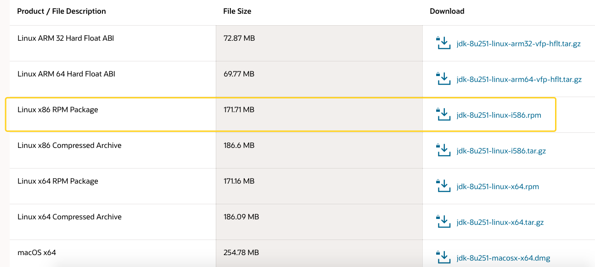

# java 环境安装

## yum 在线下载安装

```bash
# 查找java相关的列表
yum -y list java*
# 安装jdk
yum install java-1.8.0-openjdk.x86_64
# 安装完之后验证
java -version
# 通过yum安装的默认路径为：/usr/lib/jvm

# 将jdk的安装路径加入到JAVA_HOME
cat /etc/profile
# 编辑profile文件
vi /etc/profile
# 在profile文件里面加入下面的代码（路径根据自己设置的来）
export JAVA_HOME=/usr/lib/jvm/java-1.8.0-openjdk-1.8.0.322.b06-1.el7_9.x86_64/jre/bin/java
export PATH=$JAVA_HOME/bin:$PATH
export CLASSPATH=.:$JAVA_HOME/lib/dt.jar:$JAVA_HOME/lib/tools.jar

# 让profile文件生效
source /etc/profile

# 查看JAVA_HOME变量
echo $JAVA_HOME
```

## 离线 java 环境

> 注意：不要用 yum 命令下载安装，因为安装的版本不一样

1.  MacOs 安装 JDK

直接下载 dmg 安装(注意版本不是 1.8，而是 14.0.1)

2. Linux 安装 JDK

先从[java 官网](https://www.oracle.com/java/technologies/javase/javase-jdk8-downloads.html)下载 jdk 文件，因为这个文件不能用 wget 直接在服务器端下载，所以我选择从本机电脑上下载之后上传到服务器安装
Linux 系统选择 rmp 后缀的文件夹下载

<!--  -->


使用 sftp 上传到服务器（还有其他两种方式 ftp,scp）,参考<router-link to='/myblog/node/loginserver'>远程传输文件到服务器</router-link>

3. 安装 jdk

```bash
[root@localhost]# rpm -ivh 文件名
```

检查 java 环境是否安装好

```bash
[root@localhost]# java -version
```

出现如下结果就是安装完成！

```javascript
java version "14.0.1" 2020-04-14
Java(TM) SE Runtime Environment (build 14.0.1+7)
Java HotSpot(TM) 64-Bit Server VM (build 14.0.1+7, mixed mode, sharing)
```
