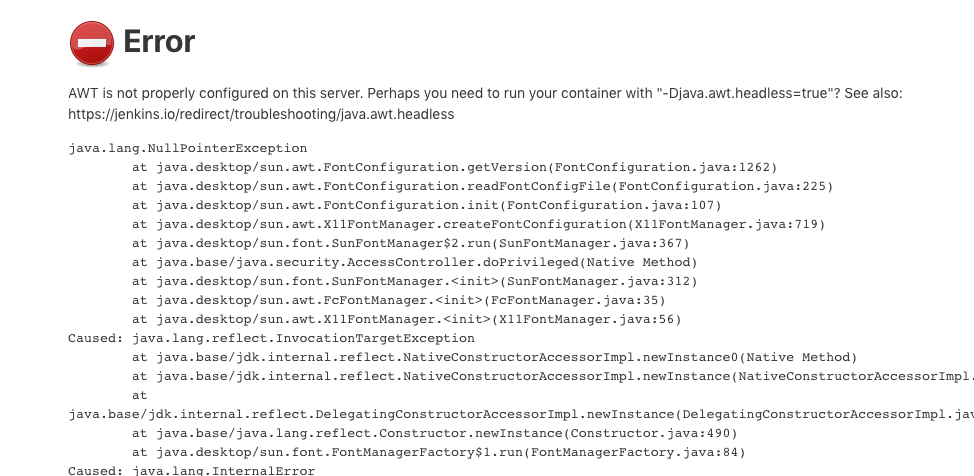
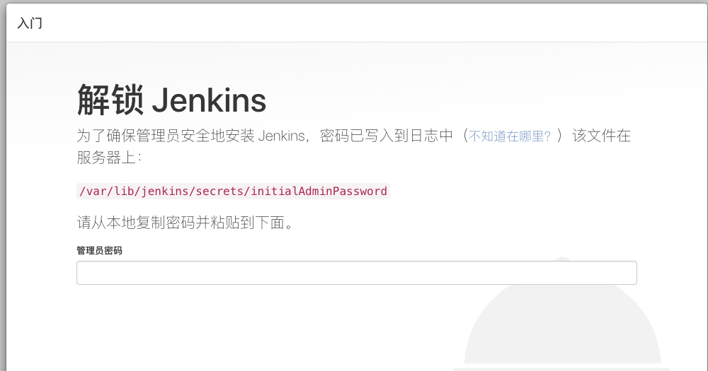
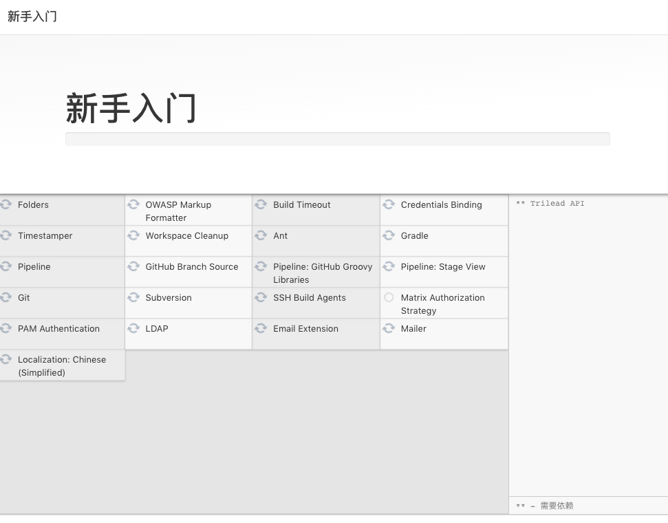
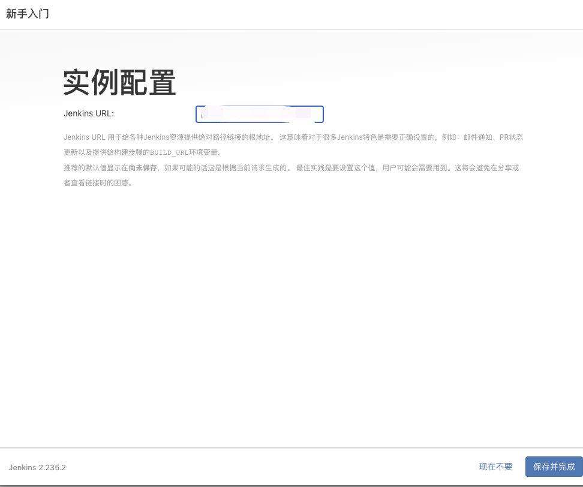
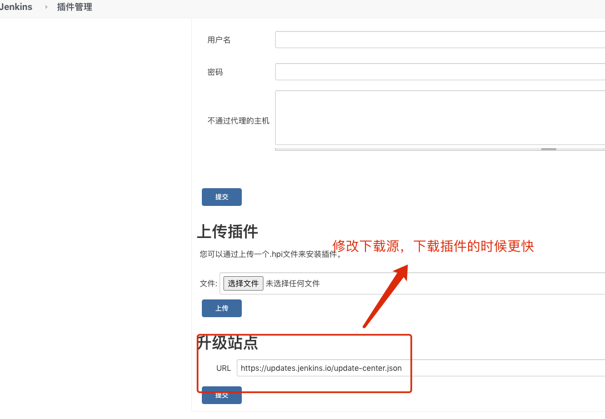

## jenkins 是什么

`Jenkins` 是一个开源的、提供友好操作界面的持续集成(CI)工具，起源于 Hudson（Hudson 是商用的），主要用于持续、自动的构建/测试软件项目、监控外部任务的运行(这个比较抽象，暂且写上，不做解释)Jenkins 用 Java 语言编写，可在 Tomcat 等流行的 servlet 容器中运行,也可独立运行。通常与版本管理工具(SCM)、构建工具结合使用。常用的版本控制工具有 SVN、GIT，构建工具有 Maven、Ant、Gradle
,国内用 `jenkins` 用的多，[官网链接](https://www.jenkins.io/)。

`Jenkins` 在 CI 中大量使用，以允许代码自动构建，部署和测试为目的，减少开发时间的浪费。让我们考虑以下情况：先构建应用程序的完整源代码，然后将其部署在测试服务器上进行测试。这是开发软件的理想方法，但是在实践中，这是不实际的。开发人员将不得不暂停工作，直到获得测试结果为止，这可能需要几个小时。整个过程是手动的，因此可能会出现人为错误，这可能会浪费时间，所以我们可以使用 jenkins 来达到自动化的目的，多个开发人员提交代码之后，只需要在 jenkins 上面构建一下就能实现部署，减少了时间的浪费

<Alert type="warning"> **下载的时候下载长期支持版本**(不要使用 war 的方法安装 jenkins),jenkins 安装之后自动集成服务，所以如果是 Mac 上安装的话需要取消开机自启，毕竟还是挺消耗内存的。</Alert>

## 安装 jenkins 的前置条件

1. 选择 `centos` 系统安装
2. 256 MB 内存，建议大于 512 MB
3. 10 GB 的硬盘空间（用于 Jenkins 和 Docker 镜像）
4. Java 8+ ( JRE 或者 JDK 都可以)，[安装教程](/myblog/cicd/java)

## 在线安装 jenkins

1. 查看[jenkins 官网](https://pkg.jenkins.io/redhat-stable/),按照上面的步骤安装 jenkins 和 java openjdk

## 离线安装 jenkins

2. 把下载的文件传到服务器上，然后解压，具体实现方法参考[上传文件到服务器](/myblog/linux/loginserver)、
3. 在 linux 上安装文件

```bash
#安装jenkins  opt是放软件的地方，所以放到这个目录下面
[root@localhost opt]# rpm -ivh jenkins-2.235.2-1.1.noarch.rpm
```

## 需要注意的地方

使用 root 账号登录 linux 系统

```bash
# 管理员账户下进入opt文件夹 查找Jenkins配置文件地址
[root@localhost opt]# find / -name jenkins
/var/lib/jenkins
/var/log/jenkins
/var/cache/jenkins
/usr/lib/jenkins
/etc/sysconfig/jenkins
/etc/rc.d/init.d/jenkins
/etc/logrotate.d/jenkins

[root@localhost opt]# vim /etc/sysconfig/jenkins
#下面两个参数也可以不改
# 修改JENKINS_USER ="root"  防止权限问题
# 修改 JENKINS_PORT = "8088"  防止端口冲突

#保存退出
:wq
```

## 启动服务

使用命令 `service jenkins` 进行启动管理

可能的名称参数: {start|stop|status|try-restart|restart|force-reload|reload|probe}

```bash
[root@localhost opt]# service jenkins start

#出现下面的文字就是启动成功
Starting jenkins (via systemctl):                          [  OK  ]
```

**注意**

如果出现无法访问的问题，有可能是 jdk 版本过高导致的，

查看 jdk 版本与 jenkins 对应的[版本](https://pkg.jenkins.io/redhat-stable/),

如果同一环境 JDK 版本过高就删除 14 安装 11 的版本

## 报错

在浏览器上输入`服务器IP:8088`，打开看到了报错

<!--  -->


**解决方法：**

```bash
# CentOS 7
yum install fontconfig
```

刷新网页，等待登录页面出来,然后根据提示拿到密码

<!--  -->


执行`cat /var/lib/jenkins/secrets/initialAdminPassword`

插件安装，选推荐就完事了，后边可以卸载在更改

> 这里如果遇到过慢的问题，查看[过慢解决方案](myblog/engineering/jenkins.html#插件过慢的解决方法)

耐心等待插件安装

<!--  -->


创建登录用户，需要记住自己设置的账户和密码，下一步设置实例，默认不改动，之后可以修改的

<!--  -->


这样就设置完成了，可以开始使用了。

## 更换插件下载源

管理 kenkins > 系统配置 > 管理插件 #高级->升级站点 替换掉源[代码](/myblog/engineering/jenkins.html#插件过慢的解决方法)

<!--  -->

默认连接 [https://updates.jenkins.io/update-center.json](https://updates.jenkins.io/update-center.json)

改成

清华源：[https://mirrors.tuna.tsinghua.edu.cn/jenkins/updates/update-center.json](https://mirrors.tuna.tsinghua.edu.cn/jenkins/updates/update-center.json)

## 准备关机

Jenkins 在任务处理的时候是一个事物，如果停止了可能会出现一些问题。防止在关闭服务器的时候，必须等任务结束才能执行这个操作，并且关机之后不会创建新的任务

保证数据安全性的一套机制

## 插件过慢的解决方法

清华源替换地址:[https://mirrors.tuna.tsinghua.edu.cn/jenkins/updates/update-center.json](https://mirrors.tuna.tsinghua.edu.cn/jenkins/updates/update-center.json)

进入 jenkins 插件更新目录 `cd /var/lib/jenkins/updates`

```bash
[root@localhost updates]# sed -i 's/http:\/\/updates.jenkins-ci.org\/download/https:\/\/mirrors.tuna.tsinghua.edu.cn\/jenkins/g' default.json && sed -i 's/http:\/\/www.google.com/https:\/\/www.baidu.com/g' default.json
```
