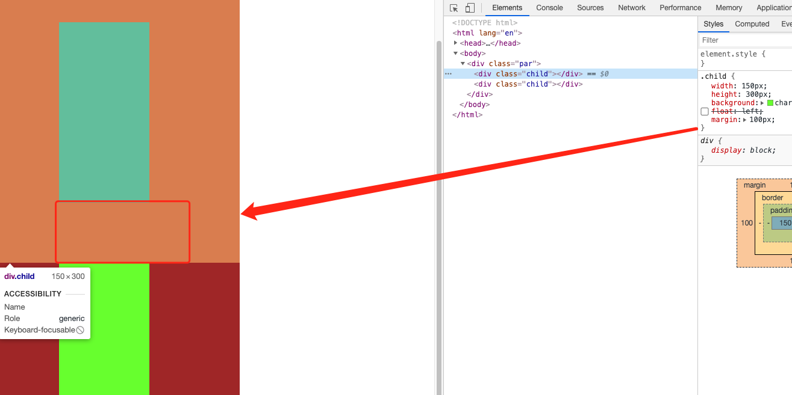
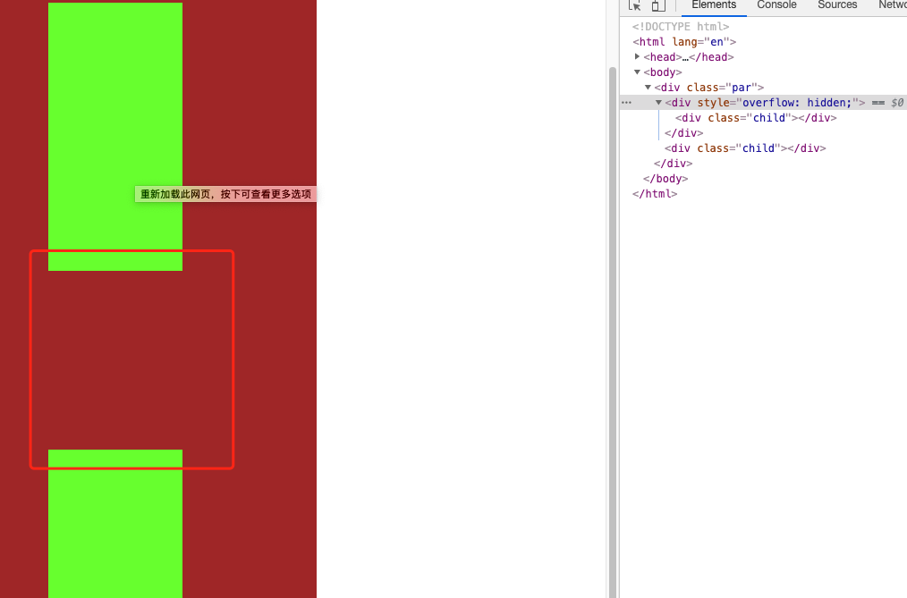

## BFC 的定义

> BFC(Block formatting context)直译为"块级格式化上下文"。它是一个独立的渲染区域，只有 Block-level box 参与， 它规定了内部的 Block-level Box 如何布局，并且与这个区域外部毫不相干

## BFC 基本单位组成

- Box: css 布局的基本单位

  Box 是 css 布局的对象和基本单位，直观的来讲，就是一个页面是由很多个 Box 组成的，元素的类型和 display 属性决定了这个 Box 的类型，不同类型的 Box,会参与不同的 Formatting Context（一个决定如何渲染文档的容器），因此 Box 的元素会以不同的方式渲染

  - block-level box:display 属性为 block, list-item, table 的元素，会生成 block-level box。并且参与 block fomatting context；

  - inline-level box:display 属性为 inline, inline-block, inline-table 的元素，会生成 inline-level box。并且参与 inline formatting context；

- Formatting Context 是 W3c css2.1 规范中的一个概念，他是页面中的一块渲染区域，并且有一套渲染规则，他决定了其子元素如何定位以及和其他元素的关系和相互作用，最常见的有 BFC 和 IFC

## 哪些因素会生成 BFC 呢？

- 根元素

- float 的值不是 none。
- position 的值是 absolute 或者 fixed。
- display 的值是 inline-block、table-cell、flex、table-caption 或者 inline-flex
- overflow 的值不是 visible

## BFC 布局规则

- 内部的 Box 会在垂直方向，一个接一个地放置。

- Box 垂直方向的距离由 margin 决定。属于同一个 BFC 的两个相邻 Box 的 margin 会发生重叠
- 每个元素的 margin box 的左边，与包含块 border box 的左边相接触（对于从左往右的格式化，否则相反），即使存在浮动也是如此
- BFC 的区域不会与 float box 重叠
- BFC 就是页面上的一个隔离的独立容器，容器里面的子元素不会影响到外面的元素。反之也如此。
- 计算 BFC 的高度时，浮动元素也参与计算

## 利用 BFC 能解决什么问题呢？

### 1. 解决垂直盒子 margin 重叠的问题？

```html
<!DOCTYPE html>
<html lang="en">
  <head>
    <meta charset="UTF-8" />
    <meta name="viewport" content="width=device-width, initial-scale=1.0" />
    <title>Document</title>
    <style type="text/css">
      .par {
        width: 400px;
        /* height: 300px; */
        background: brown;
        overflow: hidden;
      }
      .child {
        width: 150px;
        height: 300px;
        background: chartreuse;
        /* float: left; */
        margin: 100px;
      }
    </style>
  </head>
  <body>
    <div class="par">
      <div class="child"></div>
      <div class="child"></div>
    </div>
  </body>
</html>
```

效果如图所示：

<!--  -->


上述代码两个 child 盒子之间的距离是多少呢？答案是 200 吗？错误！有人说为什么不是 200 呢，你看第一个盒子下边距是 100，第二个盒子的上边距是 100，那加起来应该是 200 啊，别的不会算数加法这还能出错？其实不是这样的，因为两个垂直的盒子之间的 margin 间距上下重叠了，所以取最大值就是 100，既两个盒子的距离是 100，那怎么解决这个问题呢？，那就要用到 BFC 了

**重叠的计算法则是：**

- 1. 全部都为正值，取最大者
- 2. 不全是正值，则都取绝对值，然后用正值减去最大值
- 3. 没有正值，则都取绝对值，然后用 0 减去最大值

下面是解决 margin 重叠的方法，使用一个 BFC 的盒子把一个 child 包裹起来，这样两个盒子就是属于不同的 BFC,那就不会发生重叠了

```html
<body>
  <div class="par">
    <div style="overflow:hidden"><div class="child"></div><div>
    <div class="child"></div>
  </div>
</body>
```

效果如图所示：

<!--  -->


### 2. 清除内部浮动？

有的人会想，为什么`overflow:hidden`可以清楚浮动呢？说实话我之前也不是到底是为什么？只是看这样解决就一直这样写，现在学了 BFC 才知道原因，计算高度的时候浮动元素也参加，所以盒子外面加了`overflo:hidden`高度就出来了

这是一个外部的盒子背景没有高度最后出现高度的例子：

```html
<!DOCTYPE html>
<html lang="en">
  <head>
    <meta charset="UTF-8" />
    <meta name="viewport" content="width=device-width, initial-scale=1.0" />
    <title>Document</title>
    <style type="text/css">
      .par {
        width: 400px;
        /* height: 300px; */
        background: brown;
        overflow: hidden; //使par盒子变成了BFC
      }
      .child {
        width: 150px;
        height: 300px;
        background: chartreuse;
        float: left;
        margin: 100px;
      }
    </style>
  </head>
  <body>
    <div class="par">
      <div class="child"></div>
      <div class="child"></div>
    </div>
  </body>
</html>
```
