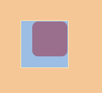
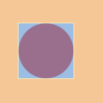
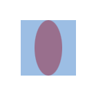

# clip-path 使用

## clip-path 概念理解

`clip-path` CSS 属性可以创建一个只有元素的部分区域可以显示的剪切区域。区域内的部分显示，区域外的隐藏。

## clip-path 的几种值

- `inset`：将元素剪裁为一个矩形

  - 定义：`clip-path: inset(<距离元素上面的距离>,<距离元素右面的距离> ,<距离元素下面的距离>,<距离元素左面的距离>,<圆角边框> ）`，括号内的值类似于`margin、padding`值的写法，可以写一个值，也可以写多个值。

  - 使用：`clip-path: inset(2px 2px 20px 20px round 10px)`;

  - 示例：

  ```html
  <style type="text/css">
    .box {
      margin: 50px;
      width: 80px;
      height: 80px;
      background-color: red;
      border: 1px solid #000;
      clip-path: inset(2px 2px 20px 20px round 10px);
    }
  </style>
  <div class="box"></div>
  ```

  效果:

  

- `circle`：将元素剪裁成一个圆

  - 定义：`clip-path: circle(圆的半径 at 圆心)`

  - 使用：`clip-path: circle(40px at 50% 50%)`

  - 示例

  ```html
  <style type="text/css">
    .box1 {
      margin: 50px;
      width: 80px;
      height: 80px;
      background-color: red;
      border: 1px solid #000;
      clip-path: circle(40px at 50% 50%);
    }
  </style>
  <div class="box1"></div>
  ```

  效果：

  

- `ellipse`：将元素剪裁成一个椭圆

  - 定义：`clip-path: ellipse(圆的水平半径 圆的垂直半径 at 圆心)`

  - 使用：`clip-path: ellipse(20px 40px at 50% 50%)`

  - 示例

  ```html
  <style type="text/css">
    .box2 {
      margin: 50px;
      width: 80px;
      height: 80px;
      background-color: red;
      border: 1px solid #000;
      clip-path: ellipse(20px 40px at 50% 50%);
    }
  </style>
  <div class="box2"></div>
  ```

  效果：

  

- `polygon`：将元素剪裁成一个多边形，这里其实就是描点，多点连线，最少三个点，以距离左上角的长度为单位，跟 canvas 画布很像，下面以三角形为例

  - 定义：`clip-path: polygon(<距离左上角的X轴长度 距离左上角Y轴的长度>，<距离左上角的X轴长度 距离左上角Y轴的长度>，<距离左上角的X轴长度 距离左上角Y轴的长度>)`

  - 使用：`clip-path: polygon(40px 0px, 0px 80px, 80px 80px);`

  - 示例

  ```html
  <style type="text/css">
    .box3 {
      margin: 50px;
      width: 400px;
      height: 80px;
      background-color: red;
      border: 1px solid #000;
      clip-path: polygon(0 0, 95% 0, 100% 15%, 100% 100%, 5% 100%, 0 85%, 0 0);
    }
  </style>
  <div class="box3"></div>
  ```

  效果：

  
