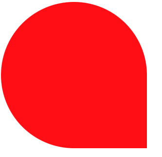

## 绘制三角形

```css
div {
  width: 0;
  height: 0;
  /* background: red; */
  border: 30px solid;
  border-left-color: transparent;
  border-bottom-color: yellowgreen;
  border-right-color: transparent;
  border-top-color: teal;
}
```

## 梯形

```css
div {
  /* width: 300px; */
  /* height: 300px; */
  /* background: red; */
  width: 200px;
  border: 30px solid;
  border-left-color: transparent;
  border-bottom-color: yellowgreen;
  border-right-color: transparent;
  border-top-color: transparent;
}
```

## 气泡效果

```css
div {
  width: 300px;
  height: 300px;
  background: red;
  border-top-left-radius: 50%;
  border-top-right-radius: 50%;
  border-bottom-left-radius: 50%;
}
```

效果：

<!--  -->


## 椭圆

```css
div {
  width: 100px;
  height: 80px;
  background: cadetblue;
  border-top-left-radius: 50%;
  border-top-right-radius: 50%;
  border-bottom-left-radius: 50%;
  border-bottom-right-radius: 50%;
}
```

## 圆角梯形

```html
<!DOCTYPE html>
<html lang="en">
  <head>
    <meta charset="UTF-8" />
    <meta name="viewport" content="width=device-width, initial-scale=1.0" />
    <title>Document</title>
    <style type="text/css">
      .tabs {
        position: relative;
      }

      .tabs-con {
        display: inline-block;
        width: 80px;
        height: 40px;
        margin: 0 20px;
        background: yellowgreen;
        border-top-left-radius: 10px;
        border-top-right-radius: 10px;
      }

      .tabs > span::before {
        content: '';
        display: inline-block;
        width: 10px;
        height: 10px;
        border-radius: 0 0 10px 0;
        background: #fff;
        position: relative;
        left: -10px;
        top: 10px;
        z-index: 10;
      }
      .tabs > span::after {
        content: '';
        display: inline-block;
        width: 10px;
        height: 10px;
        border-radius: 0 0 0 10px;
        background: #fff;
        position: relative;
        left: 70px;
        top: 10px;
        z-index: 10;
      }

      .tabs-footer {
        display: inline-block;
        width: 100px;
        height: 10px;
        background: yellowgreen;
        margin-left: -10px;
        position: absolute;
        left: 20px;
        top: 30px;
      }

      .tabs-footer::before {
        content: '';
        display: inline-block;
        width: 10px;
        height: 10px;
        background: yellowgreen;
        position: relative;
        top: -17px;
      }

      .tabs-footer::after {
        content: '';
        display: inline-block;
        width: 10px;
        height: 10px;
        background: yellowgreen;
        position: relative;
        right: -80px;
        top: -17px;
      }
    </style>
  </head>

  <body>
    <div class="tabs">
      <span class="tabs-con"></span>
      <div class="tabs-footer"></div>
    </div>
  </body>
</html>
```

效果如图：

<!--  -->

