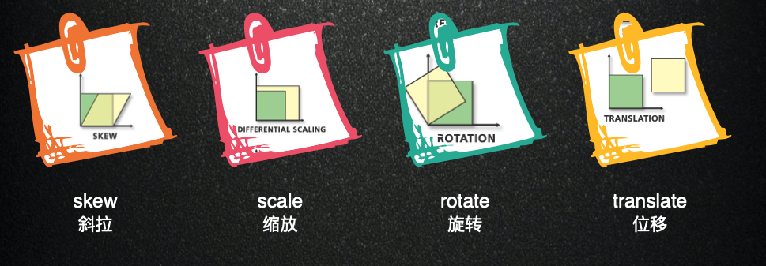

## 矩阵的概念

在数学中，矩阵(Matrix)是一个 按照⻓方阵列排列的复数或实数集合， 最早来自于方程组的系数及常数所构成 的方阵。

矩阵是高等代数学中的常⻅工具， 也常⻅于统计分析等应用数学学科中。 在物理学中，矩阵于电路学、力学、光 学和量子物理中都有应用;计算机科学 中，三维动画制作也需要用到矩阵。 矩阵的运算是数值分析领域的重要问 题。由 m × n 个数 aij 排成的 m 行 n 列的 数表称为 m 行 n 列的矩阵，简称 m × n 矩 阵。这 m×n 个数称为矩阵 A 的元素，简 称为元

## 计算规则

矩阵第 m 行与第 n 列交叉位置的那个值，等于第一个矩阵第 m 行与第二个矩阵第 n 列，对应位置的每个值的乘积之和。。线性代数是向量计算的基础，很多重要的数学 模型都要用到向量计算。矩阵的本质就是线性方程式，两者是一一对应关系。如果从 线性方程式的⻆度，理解矩阵乘法就毫无难度。

## CSS 中矩阵应用

- matrix()
  是元素 2D 平面的移动变换(transform)，2D 变换矩阵为 3\*3
- matrix3d()
  是 3D 变换，3D 变换则是 4\*4 的矩阵。

## transform 原理

- skew 斜拉
- scale 缩放
- rotate 旋转
- translate 位移

<!--  -->

transform: `matrix(a,b,c,d,e,f);`
无论是旋转还是拉伸什么的，本质上都是应用的 matrix()方法实现的(修改 matrix()方法固定几个值)，只是类似于 transform:rotate 这种表现形式，我们更容易理解，记忆与上手。

transform-origin
通过`transform-origin`属性进行设置的时 候，矩阵相关计算也随之发生改变。实 际图形效果上就是，旋转拉伸的中心点 变了!

[matrix3d](http://ds-overdesign.com/transform/matrix3d.html)

## 矩阵应用场景？

- SVG `transform="matrix(a b c d e f)"`
- Canvas `context.transform(2,0,0,2,150,150)`
- WebGL 矩阵在 3D 渲染中不可缺少，坐标变换有模型变换，视图变换，投影变 换等多种
- CSS 3D `matrix3d`
