# ios 开发和上架证书创建

## 1、首先是创建开发者账号

| 开发者类型 | 说明             | 申请周期 | 费用  | 其它                                                                                                  |
| ---------- | ---------------- | -------- | ----- | ----------------------------------------------------------------------------------------------------- |
| 个人       | App Store 上发布 | 一周     | 99\$  | 只能有一个开发者，需要提供个人信用卡信息，只能装 100 台机器                                           |
| 公司       | App Store 上发布 | 两到三周 | 99\$  | 可以有多个开发者，除信用卡外还需要授权许可，公司地址，公司唯一号，只能装 100 台机器，需要申请邓白氏码 |
| 企业       | 企业内部发布     | 两到三周 | 299\$ | 不限制台数，发布内部 App,不限制设备，代码级别的技术支持，需要申请邓白氏码                             |

## 2、登录苹果开发者账号

登录[苹果开发者网站](https://developer.apple.com/account)，进入首页选择`Certificates, IDs & Profiles`

  <!--  -->
  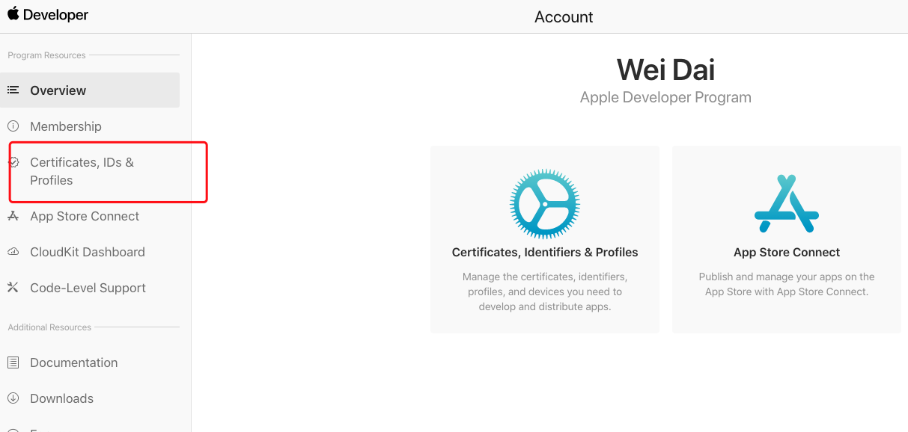

## 3、首先进入 Identifiers 注册 AppID 信息

  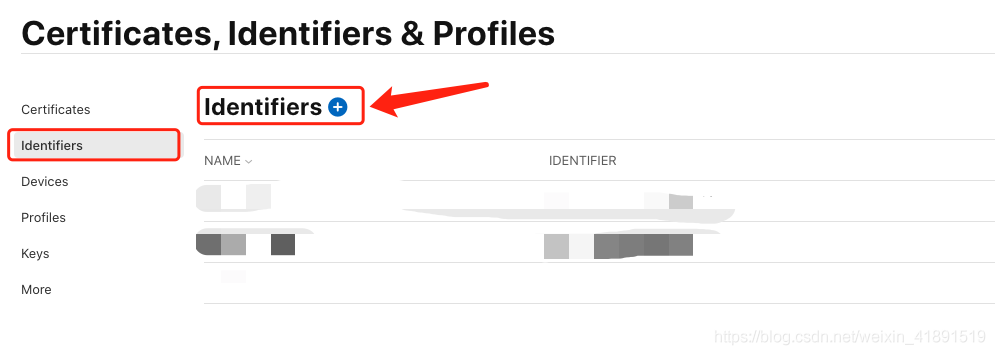
  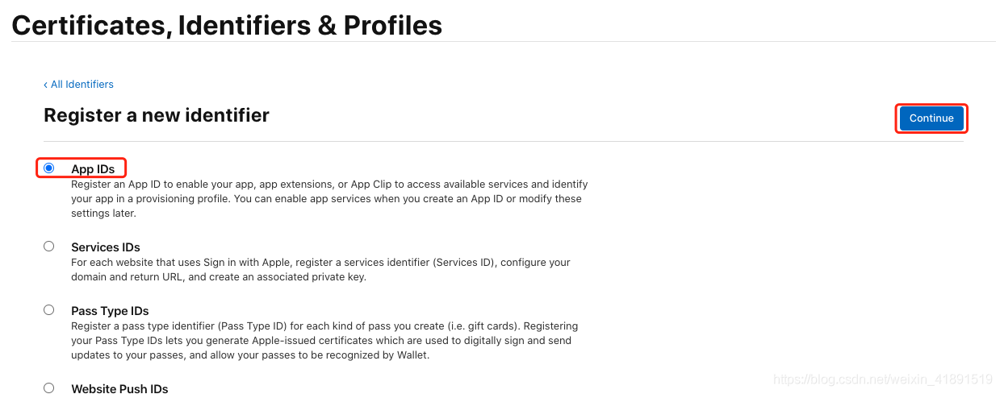
  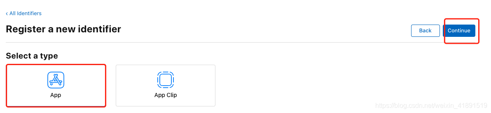
  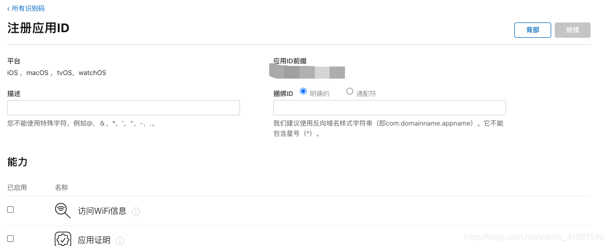
  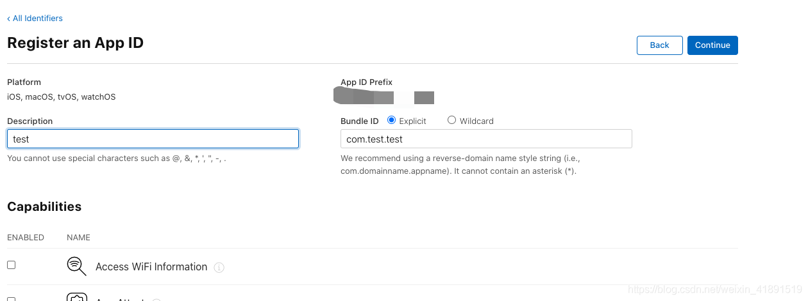

然后点击`continue`就能在列表里面看到这个`AppId`了

## 4、申请证书

### 4.1、创建本地`CSR证书`

mac 上打开钥匙串程序，

  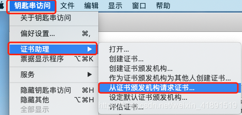
  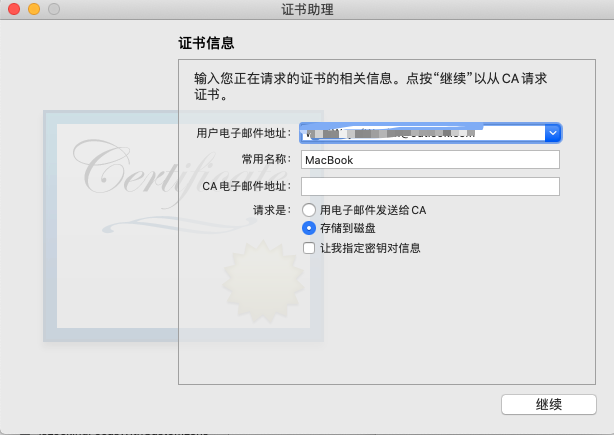

### 4.2、申请开发者证书

  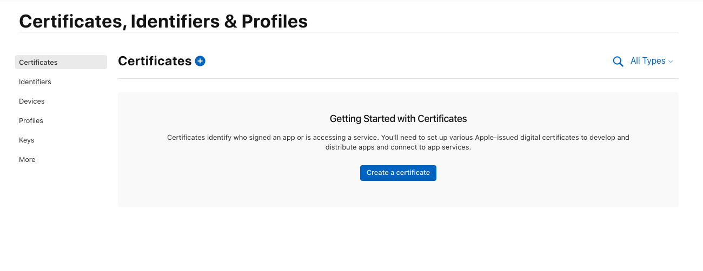
  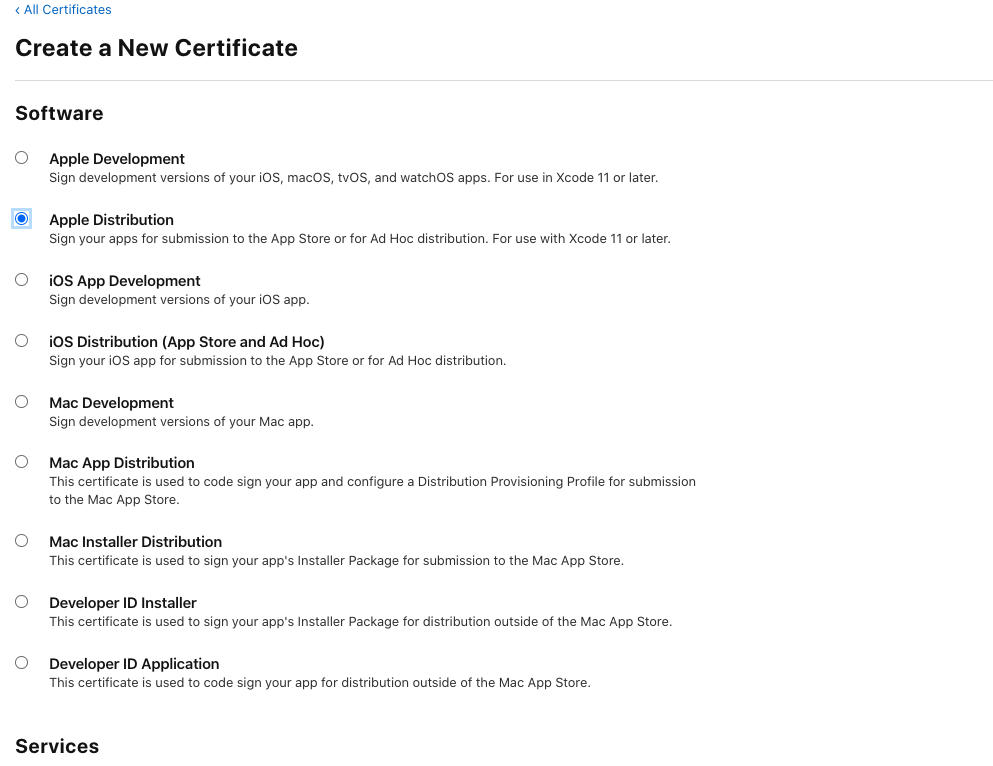

**前四项都要申请**

下一步要选择的文件就是上一步创建的本地`CSR`文件

## 5、申请描述文件

开发者描述文件，便与本地开发打测试包

<!--  -->
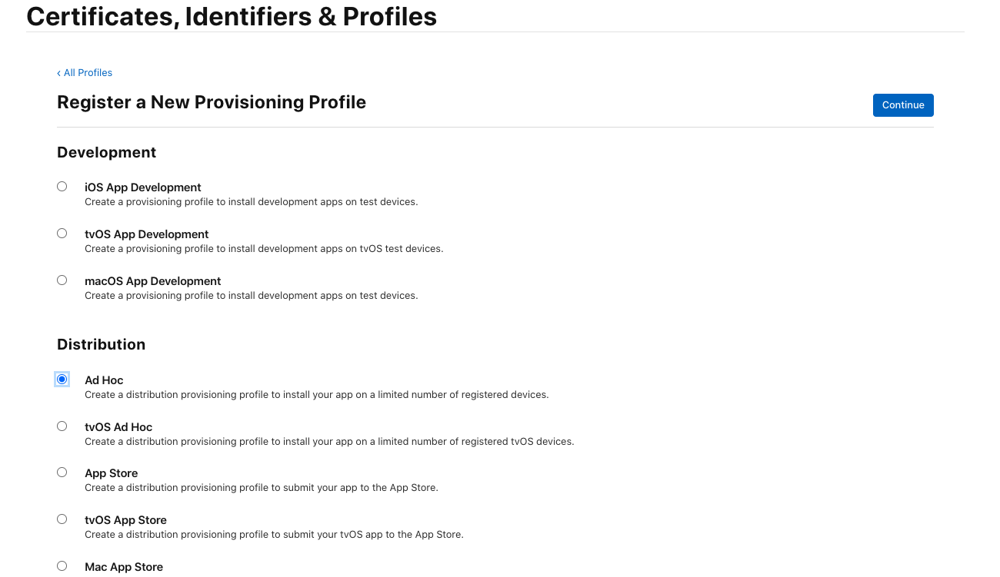

打包上传到`app store`的描述文件

<!--  -->
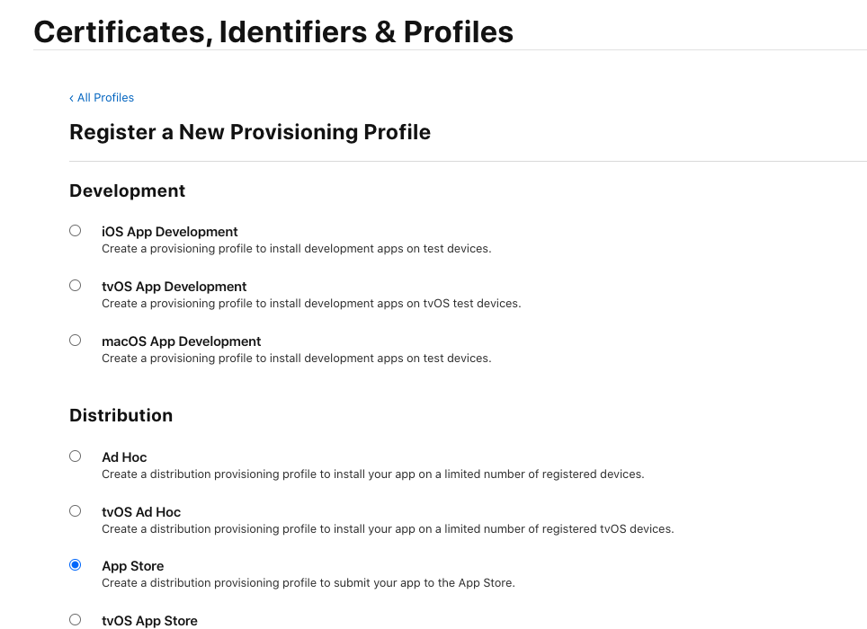

主要是选择`Ad Hoc`和`App store`这两种描述文件，下一步就按照之前创建的 appId 选就行了
