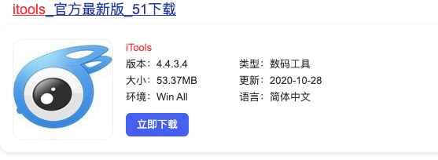
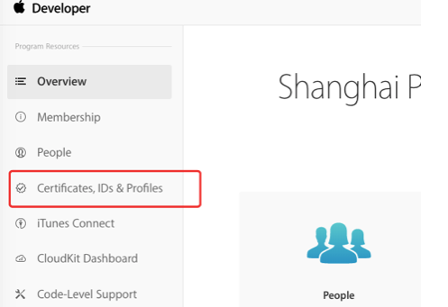
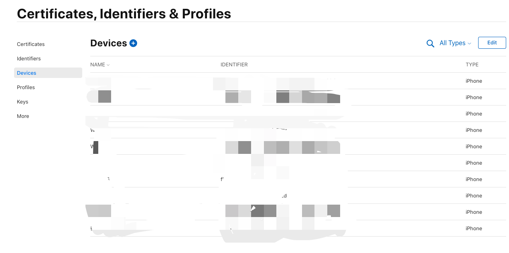
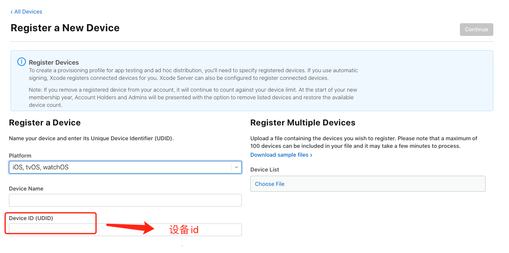
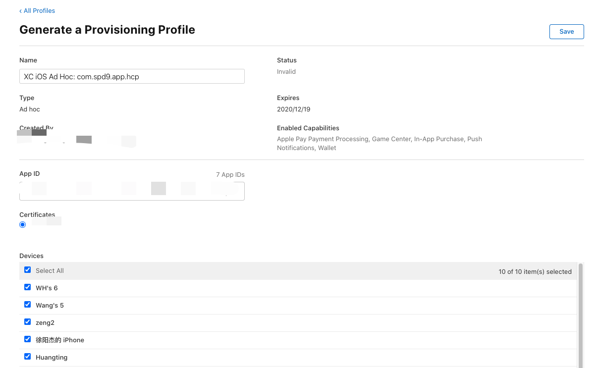

# ios 测试包的打包安装

### 首先下载 itools

1. 首先下载[itools](https://www.itools.cn/),如果是 window 则直接在浏览器搜索找到该图所对应的网址 点普通下载即可。

<!--  -->

2. 安装好 itools 之后 打开，使用数据线链接电脑和手机，如果是 mac 电脑的就会显示该页面

<!--  -->

点击更多找到**设备标识**，复制**设备标识**

### 登录苹果开发者网站

登录[苹果开发者网站](https://developer.apple.com),找到下面图对应的`Certificates ,IDs & Profiles`

<!--  -->

选择`Devices`,然后添加从`itools`里面查看到的设备标识，按照指示点击下一步，完成设备的添加

<!--  -->

<!--  -->

### 重新下载描述文件

点击侧边栏`Profiles`,选择对应的`AppId`的开发描述文件

<!--  -->

选择之前创建好的开发描述文件，点击编辑，把`devices`全部勾选，然后保存下载，双击安装，重新打包就能安装在手机上了。
