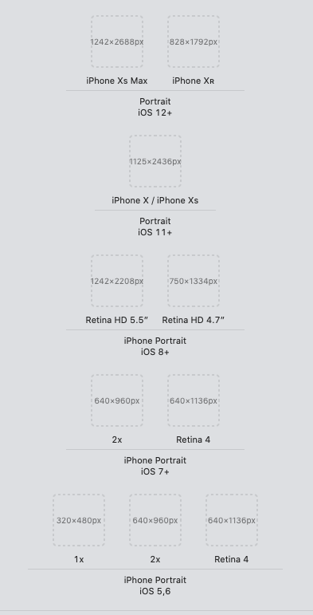
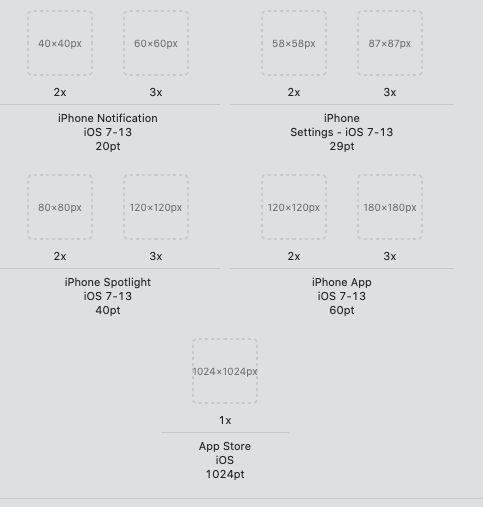

# react native 的坑

## 1、react native 打包

### ios 打包

1. xcode-product-archive
2. 打完之后 export 选择第二个 save for ad hoc
3. 默认不改证书 选择 shanghaipushu

### android 打包

发布前测试应用有没有问题：
`react-native run-android --variant=release`

安卓打包步骤：

- 打包：`cd android && ./gradlew assembleRelease`
- 直接安装到真机：`cd android && ./gradlew installRelease`

**Mac 运行到 android 模拟器**

`cd ~/Library/Android/sdk/tools/ && ./emulator @Nexus_6P_API_28`

## 2、native-echats 的使用

使用`native-echats`的时候会出现打包在`android`下面是空白页的情况，则需要修改里面的代码

```js
import React, { Component } from 'react';
import { WebView, View, StyleSheet, Platform } from 'react-native';
import renderChart from './renderChart';
import echarts from './echarts.min';

export default class App extends Component {
  componentWillReceiveProps(nextProps) {
    if (nextProps.option !== this.props.option) {
      this.refs.chart.reload();
    }
  }

  render() {
    let source;
    if (__DEV__) {
      source = require('./tpl.html');
    } else {
      source =
        Platform.OS === 'ios'
          ? require('./tpl.html')
          : { uri: 'file:///android_asset/tpl.html' };
    }
    return (
      <View style={{ flex: 1, height: this.props.height || 400 }}>
        <WebView
          ref="chart"
          scrollEnabled={false}
          originWhitelist={['*']}
          injectedJavaScript={renderChart(this.props)}
          style={{
            height: this.props.height || 400,
            backgroundColor: this.props.backgroundColor || 'transparent',
          }}
          scalesPageToFit={Platform.OS === 'ios' ? false : true}
          source={source}
          onMessage={event =>
            this.props.onPress
              ? this.props.onPress(JSON.parse(event.nativeEvent.data))
              : null
          }
        />
      </View>
    );
  }
}
```

## 3、修改 android 的包名

假设原包名为`com.pushTets`，修改后包名为`com.spd9.dpb`，以下地方需要修改

1. `android/app/src/main/java/com/PROJECT_NAME/MainActivity.java`
2. `android/app/src/main/java/com/PROJECT_NAME/ MainApplication.java`
3. `android/app/src/main/AndroidManifest.xml`
4. `android/app/BUCK`

直接对上述的文件进行搜索替换，然后进入`android`目录执行`./gradlew clean` 清除缓存

把`android/app/src/main/java/com/PROJECT_NAME/MainActivity.java`和
`/MainApplication.java`两个文件移入新创建的目录,新创建的目录要和包名相对应

## 4、react native 启动页的尺寸

### ios 的启动页尺寸

<!--  -->


### ios 应用图标尺寸

<!--  -->


### android 的启动页尺寸

文件名称是：`launch_screen.png`

- 480 x 762（drawable-xhdpi）
- 720 x 1242（drawable-xxhdpi）
- 1080 x 1882（drawable-xxxhdpi）

### android 应用图标尺寸

- mipmap-hdpi（72 x 72）
- mipmap-mdpi（48 x 48）
- mipmap-xhdpi（96 x 96）
- mipmap-xxhdpi（144 x 144）
- mipmap-xxxhdpi（192 x 192）
