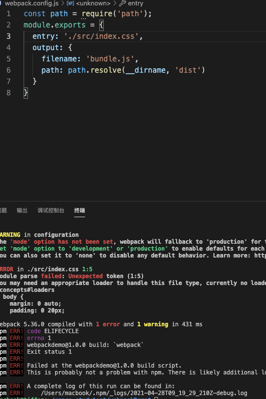
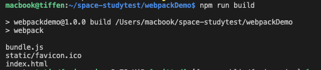

# webpack 基本使用

Webpack 最初的目标就是实现前端项目的模块化，也就是说它所解决的问题是**如何在前端项目中更高效地管理和维护项目中的每一个资源**

## webpack-cli 的作用

`webpack-cli` 作用就是可以让我们执行 `webpack` 命令

## webpack 快速上手

### 安装 webpack

创建一个项目名叫`webpackDemo`的文件夹，执行下面的代码

```bash
$ npm i webpack webpack-cli --save-dev
```

新建一个`src/index.js`文件

```js
function init() {
  let element = document.createElement('div');
  element.innerHTML = 'Hello Webpack';
  document.body.appendChild(element);
}

init();
```

项目根目录下新建一个 dist/index.html 文件

```html
<!DOCTYPE html>
<html lang="en">
  <head>
    <meta charset="UTF-8" />
    <meta http-equiv="X-UA-Compatible" content="IE=edge" />
    <meta name="viewport" content="width=device-width, initial-scale=1.0" />
    <title>Document</title>
    <script src="main.js"></script>
  </head>
  <body></body>
</html>
```

完成上述之后执行`npx webpack`，就看一看到 dist 里面生成了`main.js`,打开`index.html`效果就能看到上面的文字，

### 使用配置文件

在项目的根目录下添加一个`webpack.config.js`

```js
const path = require('path');
module.exports = {
  entry: './src/index.js',
  output: {
    filename: 'bundle.js',
    path: path.resolve(__dirname, 'dist'),
  },
};
```

除了 entry 的配置以外，我们还可以通过 output 属性设置输出文件的位置。output 属性的值必须是一个对象，通过这个对象的 filename 指定输出文件的文件名称，path 指定输出的目录

现在我们继续执行命令行`npx webpack --config webpack.config.js`

但是上面的执行命令很麻烦，所以我们把命令写成`npm scripts`方便一点

初始化`$ npm init`,生成`package.json`,然后把命令添加在 scripts 里面

```bash
{
  ...
  "scripts": {
    "test": "echo \"Error: no test specified\" && exit 1",
    "build":"webpack"
  },
}
```

这样就会看到`dist`目录下面会有一个`bundle.js`

我们打开 bundle.js 可以看一下里面的代码:

```js
!(function() {
  let e = document.createElement('div');
  (e.innerHTML = 'Hello Webpack1'), document.body.append(e);
})();
```

整体代码就是一个立即执行函数

现在我们需要添加样式，假设我们把 css 文件打包可以



可以看到 webpack 并不能打包 css 文件，那我们该怎么办呢？这就需要用到 Loader 了。

## webpack 配置项

### entry

默认入口 `main.js`

```js
module.exports = {
  entry: '/src/scripts/app.js',
};
```

### output

filename：打包完的 js 名称,默认打包名称 main.js

可以设置 '[name].js' 对应入口的 js 名称

如果我们想在静态资源 CDN 服务器上访问我们的文件,可以设置 `publicPath`, 如:

```js
const path = require('path');
module.exports = {
  ...
  output: {
    filename: 'bundle.js',
    path: path.resolve(__dirname, 'dist'),
    //在服务器脚本用到，以确保文件资源能够在 http://xx:cnd 下正确访问
    publicPath: 'http://xx:cnd/',
  }
};
```

## Loader 是什么？

`loader`是`webpack`用来处理非 js 文件的

## 资源处理(Loader)

`Loader` 就是负责完成项目中各种各样资源模块的加载，从而实现整体项目的模块化

### css 处理

为了从 JavaScript 模块中 import 一个 CSS 文件，你需要在 module 配置中 安装并添加 `style-loader` 和 `css-loader`：

```bash
npm install --save-dev style-loader css-loader
```

`webpack.config.js`

```js
module.exports = {
  ...
  module: {
      rules: [
          {
              test: /\.css$/,
              use: [
                  'style-loader',
                  'css-loadder'
              ]
          }
      ]
  }
};
```

### 自定义 Loader

根目录下创建`markdown-loader.js`

```js
// ./markdown-loader.js
module.exports = source => {
  // 加载到的模块内容 => '# About\n\nthis is a markdown file.'
  console.log(source);
  // 返回值就是最终被打包的内容
  return 'console.log("hello loader ~")';
};
```

`wenpack.config.js`

```js
const path = require('path');
module.exports = {
  entry: './src/index.js',
  output: {
    filename: 'bundle.js',
    path: path.resolve(__dirname, 'dist'),
  },
  module: {
    rules: [
      // {
      //   test: /\.css$/, // 根据打包过程中所遇到文件路径匹配是否使用这个 loader
      //   use: ['style-loader',
      //         'css-loader'] // 指定具体的 loader
      // }
      {
        test: /\.md$/,
        use: './markdown-loader',
      },
    ],
  },
};
```

最后可以在控制台里面看到打印的 console.log

### img 处理

使用过`webpack`打包的同学都知道图片是根据图片大小来打包的，图片小的是以`base64`来打到页面里面的，但是图片大的还是会单独打包出来，那么这是根据什么原理来进行的呢？

如果想要打包的图片名称和自己定义的名称是一样的，那要怎么做呢？

```js
let img1 = require('./image.png');
console.log(img1);
```

这样直接引入肯定是不行的，我们就需要在`webpack.config.js`里面写入下面的`loader`方法

```js
module.export={
  ...,
  module:{
    rules:[
      {
        test: /\.(jpg|png|gif)$/,
        use: [
          {
            loader: 'file-loader', //处理图片
            options:{
              name:'[name].[hash:8].[ext]' ,
              outputPath:'images/' //输出图片打包目录  这样打包之后文件夹里面就会多一个`images`文件夹
            }
          },
        ]
      }
    ]
  }
}
```

- `name` 是代表源文件名称
- `ext` 是代表源文件后缀
- `[hash:8]`是代表占位符，防止缓存，可以根据自己的需求来设置几位，不加`hash`,这样打包出来的文件就和原来的文件名称相同了

### file-loader 和 url-loader 的区别

区别在于 `url-loader` 会把图片转为`base64`，而不是单独打包出一张图片。

好处是图片打包在`js`文件中，页面不需要额外发送一次`http`请求，而缺点是如果图片很大的话，`js`文件就会很大，会导致`js`加载变慢，页面出现空白的情况。所以当图片比较小的时候适合用 `url-loader`。

`url-loader` 是最佳使用方法

```js
module.export={
  ...,
  module:{
    rules:[
      {
        test: /\.(jpg|png|gif)$/,
        use: [
          {
            loader: 'url-loader',
            options:{
              name:'[name].[hash:8].[ext]',
              outputPath:'images/',
              limit:100 * 2048  //设置图片大小限制
            }
          },
        ]
      }
    ]
  }
}
```

意思是如果图片超过`204800`个字节（200kb），就使用和`file-loader`相同的方式进行打包。
如果图片小于`204800`个字节（200kb），就使用`base64`方式进行打包。

## 插件(plugin)

`Plugin` 则是用来解决项目中除了资源模块打包以外的其他自动化工作，所以说 Plugin 的能力范围更广，用途自然也就更多

**比较常见的场景**

- 在打包之前清除 dist 里面的文件
- 自动生成所需要的 HTML 文件
- 根据不同环境注入类似 API 地址这种可能变化的部分
- 拷贝不需要参与打包的资源文件输出到目录
- 压缩 webpack 打包完成后输出的文件
- 自动发布打包结果到服务器实现自动部署

### 自动清除输出目录的插件

```bash
$ npm install clean-webpack-plugin --save-dev
```

在 webpack.config.js 里面添加

```js
const { CleanWebpackPlugin } = require('clean-webpack-plugin')

module.exports={
  ...
  plugins: [
    new CleanWebpackPlugin()
  ]
}
```

### 生成 HTML 插件

```bash
$ npm install html-webpack-plugin --save-dev
```

在 webpack.config.js 里面添加

```js
const HtmlWebpackPlugin = require('html-webpack-plugin')
module.exports = {
  ...
  plugins: [
    ...
    new HtmlWebpackPlugin()
  ]
}
```

运行之后 会自动在 dist 里面新建一个 index.html,但是 index.html 里面的一些内容比如 title 可能需要修改，可以通改这个插件修改

```js
const HtmlWebpackPlugin = require('html-webpack-plugin')
module.exports = {
  ...
  plugins: [
    ...
    new HtmlWebpackPlugin({
      title: 'Webpack Plugin Sample',
      meta: {
        viewport: 'width=device-width'
      }
      //or
      template: './src/index.html' //自定义一个html模板
    })
  ]
}
```

### 复制文件的插件

在我们的项目中一般还有一些不需要参与构建的静态文件，那它们最终也需要发布到线上，例如网站的 favicon、robots.txt 等

一般我们建议，把这类文件统一放在项目根目录下的 public 或者 static 目录中，我们希望 Webpack 在打包时一并将这个目录下所有的文件复制到输出目录

这样就需要用到`CopyWebpackPlugin`这个插件

```bash
$ npm install  CopyWebpackPlugin --save-dev
```

webpack.config.js

```js
const CopyWebpackPlugin = require('copy-webpack-plugin')

module.exports = {
  ...
  plugins: [
    ...
    new CopyWebpackPlugin({
      patterns: [
        { from: "public/favicon.ico", to: "static" },
      ] // 需要拷贝的目录或者路径通配符
    }),
  ]
}
```

执行`npm run build`之后可以看到这个文件被打到`dist`文件下面，新建了一个`static`里面是目标文件

### 自定义 plugin

根目录下新建一个`my-comments-plugin.js`

```js
class MyCommentsPlugin {
  apply(compiler) {
    compiler.hooks.emit.tap('MyCommentsPlugin', compilation => {
      // compilation => 可以理解为此次打包的上下文
      for (const name in compilation.assets) {
        console.log(name); // 输出文件名称
      }
    });
  }
}

module.exports = MyCommentsPlugin;
```

在`webpack.config.js`里面引入该插件,执行命令之后可以看到在控制台里面打印出了文件名，结果如下



## dev Server

为了提高日常开发体验，避免每次修改代码都要进行手动修改的操作，我们使用`webpack-dev-server`来提高工作效率

```bash
# 安装 webpack-dev-server

$ npm install webpack-dev-server --save-dev

# 运行 webpack-dev-server

$ npx webpack serve

```

不过这里需要注意的是，webpack-dev-server 为了提高工作速率，它并没有将打包结果写入到磁盘中，而是暂时存放在内存中，内部的 HTTP Server 也是从内存中读取这些文件的。这样一来，就会减少很多不必要的磁盘读写操作，大大提高了整体的构建效率

`webpack.config.js`里面的配置

```js
const path = require('path')

module.exports = {
  ...
  devServer: {
    contentBase: path.join(__dirname, 'dist'),
    compress: true,
    port: 9000,
    proxy: {  //代理
      '/api': {
        target: 'https://api.github.com',
        changeOrigin: true // 确保请求 GitHub 的主机名就是：api.github.com
      }
    }
  }
}

```

那此时我们请求 `http://localhost:8080/api/users` ，就相当于请求了 `https://api.github.com/api/users`。
这是在开发中解决跨域的一种比较好的方法

可以看到修改代码，浏览器就能同步看到更新

## 热替换（HMR）机制

是因为我们每次修改完代码，Webpack 都可以监视到变化，然后自动打包，再通知浏览器自动刷新，一旦页面整体刷新，那页面中的任何操作状态都将会丢失，像 input 框里面的内容就会没有，需要重新填写，那样就是非常麻烦，所以我们需要一个更新代码但是不刷新页面的更新，那就是热替换机制。

`webpack.config.js`配置如下：

```js
const webpack = require('webpack');

module.exports = {
  // ...
  devServer: {
    // 开启 HMR 特性，如果资源不支持 HMR 会 fallback 到 live reloading
    hot: true,
    // 只使用 HMR，不会 fallback 到 live reloading
    // hotOnly: true
  },
  plugins: [
    // ...
    // HMR 特性所需要的插件
    new webpack.HotModuleReplacementPlugin(),
  ],
};
```

入口文件：

```js
if (module.hot) {
  module.hot.accept('./entry', () => {
    // render()
    //自己的操作
  });
}
```

## tree-shaking

我们使用 Webpack 生产模式打包的优化过程中，就使用自动开启这个功能，以此来检测我们代码中的未引用代码，然后自动移除它们

```js
module.exports = {
  // ... 其他配置项
  optimization: {
    // 模块只导出被使用的成员
    usedExports: true,
    // 压缩输出结果
    minimize: true,
    // 尽可能合并每一个模块到一个函数中
    concatenateModules: true,
    //声明代码有没有副作用
    sideEffects: true,
  },
};
```

- `usedExports` - 打包结果中只导出外部用到的成员；
- `minimize` - 压缩打包结果
- `concatenateModules`

`Tree-shaking`实现的前提是 `ES Modules`，也就是说：最终交给 Webpack 打包的代码，必须是使用 ES Modules 的方式来组织的模块化

`Tree-shaking` 只能移除没有用到的代码成员，而想要完整移除没有用到的模块，那就需要开启 `sideEffects` 特性了

## source Map

`source Map`可以让我们看到源代码，定位错位的代码具体位置，但是一般上线的产品是不需要`source Map`的

`Source Map`会暴露我的源代码到生产环境。如果没有控制 Source Map 文件访问权限的话，但凡是有点技术的人都可以很容易的复原项目中涉及的绝大多数源代码，这非常不合理也不安全，我想很多人可能都忽略了这个问题

```js
module.exports = {
  ...
  devtool: 'source-map' // source map 设置
}
```

开发环境下我会选择 `cheap-module-eval-source-map`

生产环境选择`none`

`Source Map` 并不是 `Webpack` 特有的功能，它们两者的关系只是：`Webpack` 支持 `Source Map`

## 优化(optimization)

### Code Splitting（代码分割）

为了解决打包结果过大导致的问题，Webpack 设计了一种分包功能：`Code Splitting`（代码分割）。

`Code Splitting` 通过把项目中的资源模块按照我们设计的规则打包到不同的 `bundle` 中，从而降低应用的启动成本，提高响应速度

`webpack.config.js`配置

```js
module.exports = {
  //...
  optimization: {
    splitChunks: {
      // 自动提取所有公共模块到单独 bundle
      chunks: 'all',
    },
  },
  // ... 其他配置
};
```

### 魔法注释

默认通过动态导入产生的 bundle 文件，它的 name 就是一个序号，这并没有什么不好，因为大多数时候，在生产环境中我们根本不用关心资源文件的名称。

但是如果你还是需要给这些 bundle 命名的话，就可以使用 Webpack 所特有的魔法注释去实现。具体方式如下:

```js
import(/* webpackChunkName: 'posts' */ './posts/posts').then(
  ({ default: posts }) => {
    mainElement.appendChild(posts());
  },
);
```

除此之外，魔法注释还有个特殊用途：如果你的 chunkName 相同的话，那相同的 chunkName 最终就会被打包到一起，例如我们这里可以把这两个 chunkName 都设置为 components，然后再次运行打包，那此时这两个模块都会被打包到一个文件中

## 解析(resolve)

```js
module.export={
  ...
  resolve: {
    extensions: ['.js','.css'],//引入文件不用加后缀
    alias:{
      '@':'路径'
    }
  }
}

```

## externals(外部扩展)

例如一些第三方插件可以直接使用外部扩展的方式，避免第三方包体积过大

```js
module.exports = {
  //...
  externals: {
    jquery: 'jQuery',
  },
};
```

## 总结

- 通过 `Loader` 处理特殊类型资源的加载，例如加载样式、图片；

  `Loader` 机制起了很重要的作用，因为如果没有 `Loader` 的话，Webpack 就无法实现各种各样类型的资源文件加载，那 Webpack 也就只能算是一个用来合并 JS 模块代码的工具了

- 通过 `Plugin` 实现各种自动化的构建任务，例如自动压缩、自动发布。

  `Plugin`它并不会影响 `Webpack` 的核心工作过程，只是 Webpack 为了提供一个强大的扩展能力

## 环境变量(env)

官方的环境`process.env.NODE_ENV` 只有 `development`本地开发 和 `production`构建生产两个环境。而环境的扩展也只是分别对这两个环境分别扩展，并不能满足我们在线上发布多个环境对需求

```bash
npm start: .env.development.local, .env.development, .env.local, .env
npm run build: .env.production.local, .env.production, .env.local, .env
```

### 为什么要配置 env 环境

因为每个人本地开发环境可能是不一样的，但是线上环境却要保持一致，而且为了避免线上环境被本地环境替换，所以需要配置`env`本地环境，来保证开发的统一性

### 使用

1. `package.json`里面配置`"proxy": "https://www.baidu.com"`
2. 在项目根目录下新建`.env`或者`.env.local`

```bash
#PROXY='http://192.168.1.1:3000/'

PORT=3002
```

这样项目中就可以使用代理了，也可以保证不会出现跨域的问题

## 其他

### 提取公共代码

```js
module.export={
  ...
  plugins: [
    new webpack.optimize.CommonsChunkPlugin({
      name: 'vendor',
      filename: '[name].[hash:8].js',
      minChunks: 3,
      chunks: ['jquery', 'underscore'],
    });
  ]
}
```

### 配置全局开关

```js
module.export={
  plugins: [
    new webpack.DefinePlugin({
      DEBUG: true, //开发true 生产模式false
    }),
  ];
}

const Constant = {
  API_HOST: DEBUG ? '开发url' : '上线url',
};
```

## 插件

### Webpack Bundle Analyzer

通过交互式的、可缩放的树状图来可视化 webpack 输出文件的大小。


该插件将帮助你您执行以下操作：

- 了解你的包里真正有什么
- 找出哪些模块构成了捆绑软件的最大组成部分
- 查找错误到达的模块
- 优化你的 Webpack 捆绑包

```js
# NPM
npm install --save-dev webpack-bundle-analyzer
# Yarn
yarn add -D webpack-bundle-analyzer

# 使用
const BundleAnalyzerPlugin = require('webpack-bundle analyzer');
module.exports = {
  plugins: [
    new BundleAnalyzerPlugin()
  ]
}
```

### webpack-pwa-manifest

`webpack-pwa-manifest` 将自己描述为“用于`Webpack`的渐进式`Web App`清单生成器，具有自动图标大小调整和指纹识别支持。

如果您在配置上使用注入，请确保 `HtmlWebpackPlugin` 出现在`plugins` 数组中的 `WebpackPwaManifest` 之前

特征：

- 自动图标大小调整
- 图标指纹
- 清单指纹
- HTML 上的自动清单注入
- 热重载支持

```js
# npm安装
npm install --save-dev webpack-pwa-manifest

# 使用

import WebpackPwaManifest from 'webpack-pwa-manifest'
...
plugins: [
  new WebpackPwaManifest({
    name: 'My Progressive Web App',
    short_name: 'MyPWA',
    description: 'My awesome Progressive Web App!',
    background_color: '#ffffff',
    crossorigin: 'use-credentials', // 可以是null、use-credentials还是anonymous
    icons: [
      {
        src: path.resolve('src/assets/icon.png'),
        sizes: [96, 128, 192, 256, 384, 512] // 多个大小
      },
      {
        src: path.resolve('src/assets/large-icon.png'),
        size: '1024x1024' // 你还可以使用specification模式
      }
    ]
  })
]
```

### duplicate-package-checker-webpack-plugin

这是一个`webpack`插件，当你的捆绑包包含同一软件包的多个版本时，会发出警告

为什么要安装这个？

由于不同的软件包版本，单个软件包可能多次包含在`webpack`捆绑软件中。这种情况可能会在没有任何警告的情况下发生，从而导致捆绑软件中出现额外的膨胀，并可能导致难以发现的错误。

该插件会在这种情况下警告你，以最大程度地减少捆绑包的大小，并避免由于意外的重复包装而导致的错误。

```js
# npm 安装
npm install duplicate-package-checker-webpack-plugin --save-dev

# 使用

const DuplicatePackageCheckerPlugin = require("duplicate-package-checker-webpack-plugin");
module.exports = {
  plugins: [new DuplicatePackageCheckerPlugin()]
};
```

## 其他打包方式

### rollup

`Rollup` 是一款 ES Modules 打包器，相比于 Webpack，Rollup 要小巧的多

[跳转地址](/myblog/webpack/rollup.md)

### parcel

`Parcel` 是一款完全零配置的前端打包器，它提供了 “傻瓜式” 的使用体验，我们只需了解它提供的几个简单的命令，就可以直接使用它去构建我们的前端应用程序了

[跳转地址](/myblog/webpack/parcel.md)
