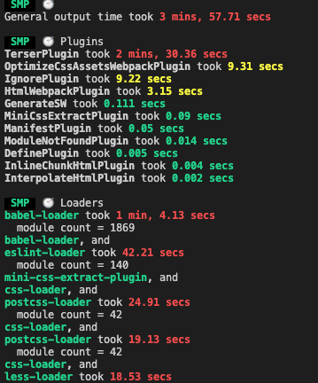
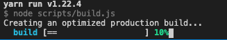
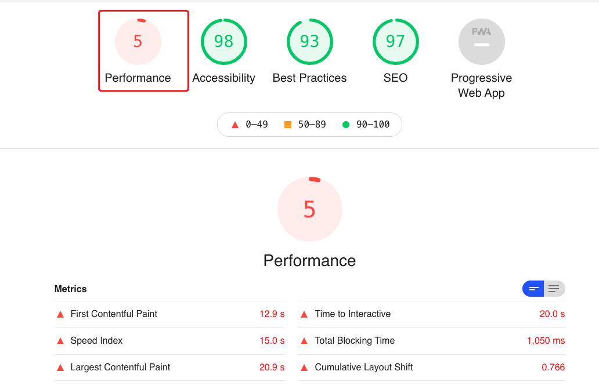

# webpack 性能优化与与原理分析

## 性能优化

### 深度 `tree-shaking`

- `webpack-deep-scope-plugin` 深度范围分析的 webpack 插件
- `webpack-parallel-uglify-plugin` 该插件可帮助具有多个入口点的项目加快其构建速度
- [purifycss-webpack](https://www.npmjs.com/package/purifycss-webpack) 该插件使用 PurifyCSS 从 CSS 中删除未使用的选择器

  ```js
  //extract-text-webpack-plugin和purifycss-webpack配合使用
  const path = require(' path ');
  const glob = require(' glob ')
  const ExtractTextPlugin = require(' extract-text-webpack-plugin ');
  const PurifyCSSPlugin = require('purifycss-webpack');

  module.exports={
    ...
    plugins: [
      new ExtractTextPlugin('[name].[contenthash].css'),
      // Make sure this is after ExtractTextPlugin!
      new PurifyCSSPlugin({
        // Give paths to parse for rules. These should be absolute!
        paths: glob.sync(path.join(__dirname, 'app/*.html')),
      })
    ]
  }
  ```

### css 压缩

CSS 的多核压缩: `optimize-css-assets-webpack-plugin`

[cssnano](https://cssnano.co/): cssnano 会采用格式良好的 CSS 并通过许多有针对性的优化来运行它

```js
  //提取css
  var OptimizeCssAssetsPlugin = require('optimize-css-assets-webpack-plugin');
  // contenthash 自己负责自己的内容
  new MiniCssExtractPlugin({
    filename: 'static/css/[name].[contenthash:8].css',
    chunkFilename: 'static/css/[name].[contenthash:8].chunk.css',
  }),
  new OptimizeCssAssetsPlugin({ //压缩css
    assetNameRegExp: /\.css$/g,
    cssProcessor: require('cssnano'),
    cssProcessorPluginOptions: {
      preset: ['default', { discardComments: { removeAll: true } }],
    },
    canPrint: true,
  }),
```

### 开启多核压缩(js)

happypack(比较慢，慎用) 多线程编译 webpack 不支持的情况下使用`thread-loader`(一般情况下不建议使用) ，

JavaScript 的多核压缩可以开启`terser-webpack-plugin`，`terser-webpack-plugin`可以代替`uglifyjs-webpack-plugin`解决 uglifyjs 不支持`es6`语法问题

```js
const TerserJSPlugin = require('terser-webpack-plugin');
module.exports = {
  optimization: {
    minimizer: [
      new TerserJSPlugin({
        cache: true, // 是否缓存(比较有效，但是要谨慎使用)
        parallel: true, // 是否并行打包 目前默认值是true
        sourceMap: true,
      }),
    ],
  },
};
```

官方维护：多核压缩[uglifyjs-webpack-plugin](https://github.com/webpack-contrib/uglifyjs-webpack-plugin)

非官方维护：`webpack-parallel-uglify-plugin`

```js
//uglifyjs-webpack-plugin
const UglifyJsPlugin = require('uglifyjs-webpack-plugin');

module.exports = {
  optimization: {
    minimizer: [new UglifyJsPlugin()],
  },
};
```

### speed-measure-webpack-plugin 打包速度分析

```js
//分析完了 哪个比较慢就解决哪个
const SpeedMeasurePlugin = require('speed-measure-webpack-plugin');
const smp = new SpeedMeasurePlugin();
module.exports = smp.wrap(merge(webpackConfig, _mergeConfig));
```

### progress-bar-webpack-plugin 打包进度展示

### hard-source-webpack-plugin 对整个工程开启缓存

- `webpack-dashboard` 增强了 webpack 的输出，包含依赖的大小、进度和其他细节。

  webpack-bundle-analyzer 打包结果分析

  webpack --profile --json > stats.json

  14-1 http://alexkuz.github.io/webpack-chart/

  14-2 http://webpack.github.io/analyse/

- `inline-manifest-webpack-plugin` 把 runtime 放到 html 里

  html-inline-css-webpack-plugin 把一些核心的 CSS 放到⻚面内部

  html-webpack-inline-source-plugin 内部资源引入

- `cache-loader` loader 的缓存 => 'babel-loader?cacheDirectory=true'
  哪里慢就往哪里塞

  `exclude: /node_modules/,` // 排除不处理的目录

  `include: path.resolve(\_\_dirname, 'src')` // 精确指定要处理的目录

### 压缩图片

[image-webpack-loader](https://www.npmjs.com/package/image-webpack-loader)

```js
rules: [
  {
    test: /\.(gif|png|jpe?g|svg)$/i,
    use: [
      'file-loader',
      {
        loader: 'image-webpack-loader',
        options: {
          bypassOnDebug: true, // webpack@1.x
          disable: true, // webpack@2.x and newer
        },
      },
    ],
  },
];
```

### 压缩推荐选项

[HtmlWebpackPlugins](https://www.npmjs.com/package/html-webpack-plugin)

```js
new HtmlWebpackPlugin({
  inlineSource: '.css$',
  template: path.join(__dirname, `src/${pageName}/index.html`),
  filename: `${pageName}.html`,
  chunks: ['vendors', pageName],
  inject: true,
  minify: {
    html5: true,
    collapseWhitespace: true,
    preserveLineBreaks: false,
    minifyCSS: true,
    minifyJS: true,
    removeComments: false,
  },
});
```

### webpack 外部扩展

index.html

```html
<script
  src="https://code.jquery.com/jquery-3.1.0.js"
  integrity="sha256-slogkvB1K3VOkzAI8QITxV3VzpOnkeNVsKvtkYLMjfk="
  crossorigin="anonymous"
></script>
```

webconfig.config.js

```js
module.exports = {
  //...
  externals: {
    jquery: 'jQuery',
  },
};
```

这样就剥离了那些不需要改动的依赖模块，换句话，下面展示的代码还可以正常运行：

```js
import $ from 'jquery';

$('.my-element').animate(/* ... */);
```

这样不仅之前对第三方库的用法方式不变，还把第三方库剥离出 webpack 的打包中，从而加速 webpack 的打包速度

### webpack 集群编译

wenpack 打包比较慢的终极解决方案，三台机器一起编译，最后送回主机解压合在一起

### 代码求值

`prepack-webpack-plugin`

### 动态引入

`@babel/plugin-syntax-dynamic-import`

Webpack5 不间断进程(continuous processes)和缓存

对于大型复杂项目应用，在开发阶段，开发者一般习惯使用 Webpack --watch 选项或者 webpack- dev-server 启动一个不间断的进程(continuous processes)以达到最佳的构建速度和效率。 Webpack --watch 选项和 webpack-dev-server 都会监听文件系统，进而在必要时，触发持续编译 构建动作。 原理其实就是轮询判断文件的最后编辑时间是否变化，某个文件发生了变化，并不会立刻告诉监听 者，而是先缓存起来，等待 aggregateTimeout(Webpack 的 --watch 选项内置的类似 batching 的 能力)

https://github.com/paulmillr/chokidar

## 工程优化与原理

- 构建配置设计成一个库，比如:hjs-webpack、Neutrino、webpack-blocks

- 抽成一个工具进行管理，比如:create-react-app, kyt, nwb

- 更多的快速构建工具:lerna 、brunch、 rome 、snowpack (过往 Browserify、Rollup.js、Gulp、 Parcel、Microbundle)

- 更友好的提示错误
  - friendly-errors-webpack-plugin
  - webpack-build-notifier
  - set-iterm2-badge && node-bash-title 标题和窗口内容修改

```js
function() {
  this.hooks.done.tap('done', (stats) => {
    if (stats.compilation.errors && stats.compilation.errors.length&& process.argv.indexOf('--watch') == -1)
        {
          console.log('build error');
          process.exit(1);
    }
    })
}
```

- splitchunks 公用库的代码拆分 去除打包 分离⻚面公用包 `html-webpack-externals-plugin`

- 使用动态 polyfill

它会根据你的浏览器 UA 头，判断你是否支持某些特性，从而返回给你一个合适的 polyfill。

- 集成到 CI 监控文件的大小 https://github.com/siddharthkp/bundlesize

- set-iterm2-badge && node-bash-title 标题和窗口内容修改

## 实战

### 打包优化

对自己公司的项目打包进行优化的步骤，项目使用 react 脚手架初始化的构建的项目，但是打包时间是`257`秒,现在对打包速度进行优化

1. `terser-webpack-plugin` 默认在脚手架里面，所以只是配置了缓存和并行打包参数
2. 首先使用 `speed-measure-webpack-plugin`插件进行分析，看到底是哪块比较慢

```js
//安装
yarn add -D speed-measure-webpack-plugin

//使用
const SpeedMeasurePlugin = require("speed-measure-webpack-plugin");
const smp = new SpeedMeasurePlugin();
const webpackConfig = smp.wrap({
  //webpack.config return对象
});
```

显示的结果如下：

<!--  -->


3. 也可以使用`cache-loader`,但是要注意：这个使用多了会造成电脑卡顿，可以使用`hard-source-webpack-plugin`进行全局缓存

4. `webpack-bundle-analyzer`分析打包出来的文件大小

5. 使用`external+CDN`外部引入的方式可以减少打包体积

```js
//webpack.config.js
module.exports ={
  ...
  externals:{
    'react': 'React',
    'react-dom': 'ReactDOM',
    'antd':'antd',
    'moment':'moment',
    'axios':'axios',
    'redux':'Redux',
    'react-redux':'ReactRedux'
  }
}
//index.html里面引入
<script rel="preload" src="https://cdn.staticfile.org/react/16.12.0/umd/react.production.min.js"></script>
<script rel="preload" src="https://cdn.staticfile.org/react-dom/16.12.0/umd/react-dom.production.min.js"></script>
<script rel="preload" src='https://cdn.staticfile.org/redux/4.0.5/redux.min.js'></script>
```

6. 提取公共代码

```js
optimization: {
  splitChunks: {
    chunks: 'all',
    name: false,
    minSize: 30000,
    cacheGroups: {
      // 提取 node_modules 中代码
      vendors: {
        test: /[\\/]node_modules[\\/]/,
        name: "vendor",
        chunks: "initial", //all表示所有模块，async代表只管异步加载的, initial代表初始化时就能获取的模块
        minChunks: 2, //模块被引用2次以上的才抽离
        priority: -10
      },
      commons: {
        // async 设置提取异步代码中的公用代码
        chunks: "async",
        name: "commons-async",
        /**
         * minSize 默认为 30000
         * 想要使代码拆分真的按照我们的设置来
         * 需要减小 minSize
         */
        minSize: 30000,
        // 至少为两个 chunks 的公用代码
        minChunks: 2,
      },
      // styles: {
      //   name: "index",
      //   test: /\.(css|less)$/,
      //   chunks: "all",
      //   enforce: true,
      // },
    },
  },
}
```

7. 因为打包速度太慢，为了提高打包的体验，我加了一个进度条`progress-bar-webpack-plugin`,这样可以知道打包的进度，给开发者一个明确的提示

```js
//安装
yarn add -D progress-bar-webpack-plugin

//使用
var ProgressBarPlugin = require('progress-bar-webpack-plugin');
plugins: [
  new ProgressBarPlugin()
]
```

8. 压缩图片、js、css

9. 给服务器添加`gzip`压缩减少传输体积

效果如下：

<!--  -->


### 首页性能优化

#### 1、检测性能

首先使用`Lighthouse`对首页进行检测，需要在`chrome`浏览器里面安装`Lighthouse`安装插件，检测网站必须是`https`域名，最后出来结果如下图：



发现性能太低了，`FCP`和`LCP`都是花费时间很长的，接下来就需要对上面慢的地方进行优化。

#### 2、
