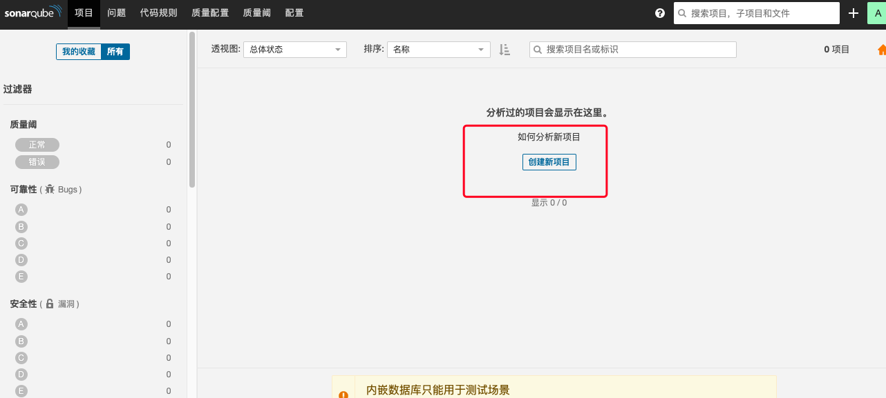
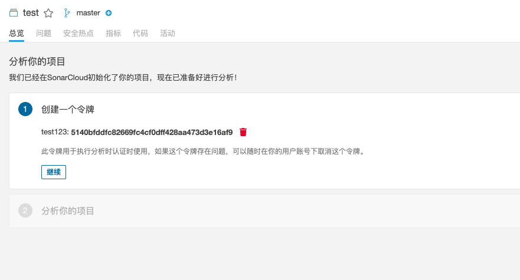
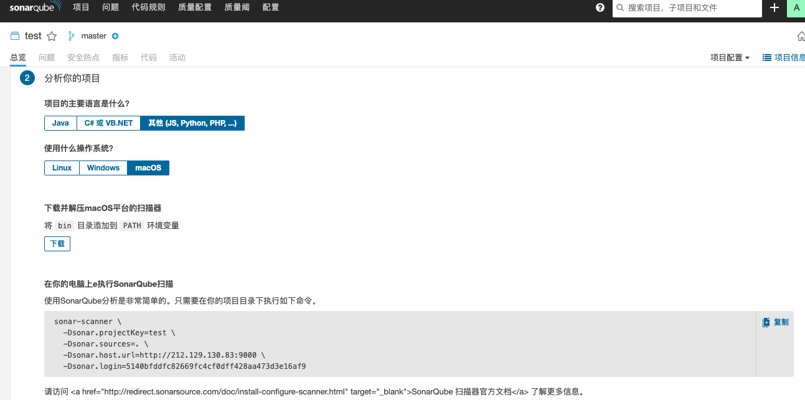

# sonar 代码检测

## sonar 是什么？为什么要使用？

## 安装 sonar 的 准备条件

- `mysql 5.6 or 5.7`[mysql 教程](https://www.cnblogs.com/jj123/p/15740668.html)
- `java jdk 11`
- [Sonar 包](https://www.sonarqube.org/)官网下载

### mysql 安装

首先检查当前服务器上是否安装过 mysql，根据下面的命令来执行

```bash
#1.检查是否已经安装过mysql，执行命令
rpm -qa | grep mysql

#如果已存在，则执行删除命令 后边为Mysql目录
rpm -e --nodeps mysql-xxxx

#2、查询所有Mysql对应的文件夹
whereis mysqlm
find / -name mysql

#删除相关目录或文件
rm -rf /usr/bin/mysql /usr/include/mysql /data/mysql /data/mysql/mysql

#验证是否删除完毕
whereis mysqlm
find / -name mysql

#3、检查mysql用户组和用户是否存在，如果没有，则创建
cat /etc/group | grep mysql
cat /etc/passwd |grep mysql
groupadd mysql
useradd -r -g mysql mysql

```

### 下载 mysql

[mysql 下载](https://dev.mysql.com/downloads/mysql/)

```bash
# 下载命令
[root@localhost /]wget https://dev.mysql.com/get/Downloads/MySQL-5.7/mysql-5.7.24-linux-glibc2.12-x86_64.tar.gz

# 解压并移动位置
[root@localhost /]tar xzvf mysql-5.7.24-linux-glibc2.12-x86_64.tar.gz
[root@localhost /]mv mysql-5.7.24-linux-glibc2.12-x86_64 /usr/local/mysql

#2、在mysql目录下创建data目录
[root@localhost mysql]mkdir /usr/local/mysql/data

#3、更改mysql目录下所有的目录及文件夹所属的用户组和用户，以及权限
#如果提示chown: 无效的用户: "mysql:mysql"，则需要新建mysql用户
#先执行
groupadd mysql
useradd -r -g mysql mysql
#后执行 注意 /usr/local/mysql 只是你放mysql的位置 根据自己安装路径来修改
chown -R mysql:mysql /usr/local/mysql
chmod -R 755 /usr/local/mysql

#4、编译安装并初始化mysql,务必记住初始化输出日志末尾的密码（数据库管理员临时密码）
cd /usr/local/mysql/bin
./mysqld --initialize --user=mysql --datadir=/usr/local/mysql/data --basedir=/usr/local/mysql

#5、编辑配置文件my.cnf，添加配置如下
vim /etc/my.cnf
[mysqld]
datadir=/usr/local/mysql/data
port = 3306
sql_mode=NO_ENGINE_SUBSTITUTION,STRICT_TRANS_TABLES
symbolic-links=0
max_connections=400
innodb_file_per_table=1
lower_case_table_names=1
character_set_server=utf8
#mysqld_safe这里面的代码注释掉，否则会报错
[mysqld_safe]

#6、启动mysql，出现success就是成功
/usr/local/mysql/support-files/mysql.server start

#7、添加软连接，并重启mysql服务
ln -s /usr/local/mysql/support-files/mysql.server /etc/init.d/mysql
ln -s /usr/local/mysql/bin/mysql /usr/bin/mysql
service mysql restart

#8、登录mysql，修改密码(密码为步骤4生成的临时密码)
mysql -u root -p
#使用以下命令修改密码
set password for root@localhost = password('123456');

#9、开放远程连接
mysql>use mysql;
msyql>update user set user.Host='%' where user.User='root';
mysql>flush privileges;
# 执行完上边命令后，通过数据库客户端就可以连上云数据库
```

安装好数据库之后 执行下面的 sql 语句创建表

```bash
CREATE DATABASE sonar DEFAULT CHARACTER SET utf8;
```

## sonar 安装

[Sonar 包](https://www.sonarqube.org/)官网下载

```bash
# 安装解压软件
yum install unzip
# 解压sonar包
unzip sonarqube-9.4.zip
# 移动sonar文件位置并且改名
mv sonarqube-9.4 /usr/local/
# 给sonar文件夹权限
chmod 777 -R  sonarqube-9.4/
# 新增sonar用户
useradd sonar
passwd sonar

# 编辑/usr/local/sonarqube-9.4/conf/sonar.properties文件，修改下面的参数
sonar.jdbc.username=root
sonar.jdbc.password=123456
sonar.embeddedDatabase.port=9092
sonar.jdbc.url=jdbc:mysql://124.221.101.9:3306/sonar?useUnicode=true&characterEncoding=utf8

sonar.web.host=0.0.0.0
sonar.web.context=/
sonar.web.port=9000

# 给sonar用户sonarqube权限
 chown -R sonar:sonar /usr/local/sonarqube-9.4

# 启动，命令类型（status,console,restart,start）console命令可以查看错误
 ./sonar.sh start

# 查看运行成功没有
ss -ntpl | grep 9000

```

出现如下提示就是创建成功

<!--  -->


可以在浏览器用“ 服务器 `ip:9000` 来访问


登录账号密码都是 admin

### sonar 汉化

通过下面红框的点击事件来执行

<!--  -->


### sonar 创建项目







### 配置本地 sonar-scanner 环境

添加环境变量 `open .bash_profile`

```bash
# sonar-scanner 追加bin

# export SCANNER_HOME="你下载的sonar-scanner地址"
export SCANNER_HOME="/Users/hondry/opt/sonar-scanner"
export PATH=$PATH:$SCANNER_HOME/bin
# 然后退出编辑 source .bash_profile 或者 zsh .zshrc 使更改生效 例：zsh shell 下
zsh .zshrc
# 然后在 shell 中 校验是否安装完成
sonar-scanner -v
```

能查看到版本号就是完成了配置。下面就是实战项目

### 实战

如果我们要建一个某一个项目的代码，那就在该项目的根目录下面新建`sonar-project.properties`,填入在 sonar 上面创建项目的最后一步的代码

```javascript
sonar-scanner \
  -Dsonar.projectKey=test \
  -Dsonar.sources=. \ //修改需要扫描的路径
  -Dsonar.host.url=http://212.129.130.83:9000 \  //服务器Ip
  -Dsonar.login=5140bfddfc82669fc4cf0dff428aa473d3e16af9
```

修改需要扫描的文件夹

<!--  -->


使用终端 `shell(zsh/bash)` 执行你的这个 `sonar-project.properties`文件

```bash
# 时间有点长 耐心等待结果
zsh sonar-project.properties
```

## 问题

### 1、没有权限的时候报错


给整个文件夹权限就可以了

```bash
chmod 777 -R  sonarqube-9.4/
```

### 2、 找不到或无法加载主类


