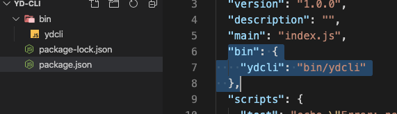

市面上有很多脚手架工具，一句命令行就能生成一个初始项目，比如 vue-cli,react-cli，但是这写脚手架是什么创建出来的呢？
下面我们来探索

新建一个项目 yd_cli，里面创建一个 bin 文件夹，执行`npm init -y`，生成 package.json
然后在 bin 文件夹里面新建一个 ydcli(不加任何后缀)，`package.json`里面新增

```json
"bin": {
  "ydcli": "bin/ydcli"
},
```

结构如下：

<!--  -->


执行`npm link`,再执行`ydcli`就可以在打印出里面的代码

下面就开始正式写代码了,主要用到了以下一些插件：

- figlet 生成
- @darkobits/lolcatjs 生成随机颜色
- commander 命令行中参数的处理
