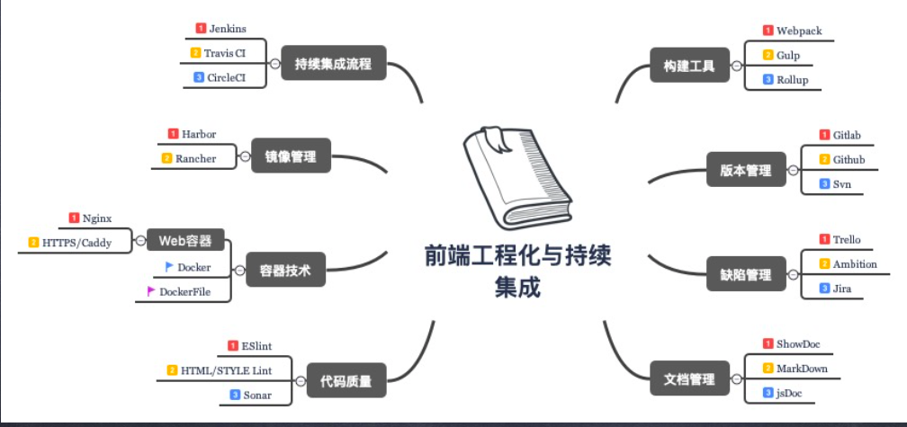
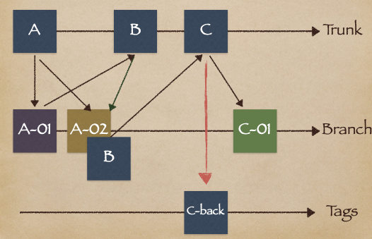

<!--  -->


## 什么是持续集成？(CI)

在持续集成环境中，开发人员将会频繁的提交 代码到主干。这些新提交在最终合并到主线之 前，都需要通过编译和自动化测试流进行验 证。这样做是基于之前持续集成过程中很重视 自动化测试验证结果，以保障所有的提交在合 并主干之后的质量问题，对可能出现的一些问 题进行预警

## 什么是代码交付？(CD)

持续交付就是讲我们的应用发布出去的过程。这个过程 可以确保我们尽可能快的实现交付。这就意味着除了自 动化测试，我们还需要有自动化的发布流，以及通过一 个按键就可以随时随地实现应用的部署上线

## 什么是持续部署？

任何修改通过了所有已有的工作流就会直接和客 户见面。没有人为干预(没有一键部署按钮)，只有当一 个修改在工作流中构建失败才能阻止它部署到产品线。当开发人员在主分 支中合并一个提交时，这个分支将被构建、测试，如果一 切顺利，则部署到生产环境中。

## 使用工具

- 1.统一代码仓库通过分支管理合并主干 SVN。
- 2.自动化构建工具，编译、部署、测试、监控、本机 开发上线环境。FIS3/Webpack/jdists/package.json/ chai/supertest/mocha/selenium-webdriver
- 3.持续集成平台。Jenkins、Travis CI
- 4.部署工具。rsync、shelljs、yargs
- 5.运营有权限操作运营页面保存即可上线

## svn 命令

svn 流程

<!--  -->


[svn 命令](/myblog/devneeds/svn)

## 前端工程化目标

- 自动化编译。
- 前端模块化。
- 定位静态资源。
- 前端开发组件化。
- 自动化部署测试配合版本库。
- 自动化性能优化(前端架构开发下)

## 自动化编译流程


```json
-> 读入foo.es的文件内容，编译成js内容
-> 分析js内容，找到资源定位标记 'foo.scss' -> 对foo.scss进行编译:
-> 读入foo.scss的文件内容，编译成css内容
-> 分析css内容，找到资源定位标记 ``url(foo.png)`` -> 对 foo.png 进行编译:
-> 读入foo.png的内容 -> 图片压缩
-> 返回图片内容
-> 根据foo.png的最终内容计算md5戳，替换url(foo.png)为url(/static/img/foo_2af0b.png)
-> 替换完毕所有资源定位标记，对css内容进行压缩
-> 返回css内容
-> 根据foo.css的最终内容计算md5戳，替换'foo.scss'为 '/static/scss/foo_bae39.css'
-> 替换完毕所有资源定位标记，对js内容进行压缩
-> 返回js内容
-> 根据最终的js内容计算md5戳，得到foo.coffee的资源url为 '/static/scripts/foo_3fc20.js'
```

## 静态资源定位

- 1.配置超长时间的本地缓存 — 节省带宽，提高 性能
- 2.采用内容摘要作为缓存更新依据— 精确的缓 存控制
- 3.静态资源 CDN 部署—— 优化网络请求
- 4.更资源发布路径实现非覆盖式发布 — 平滑升 级

## 自动化部署

Travis CI 是部署到 github,不能部署到自己电脑

Circle CI 收费，界面美观

Jenkins 可以部署到自己电脑(服务器)
