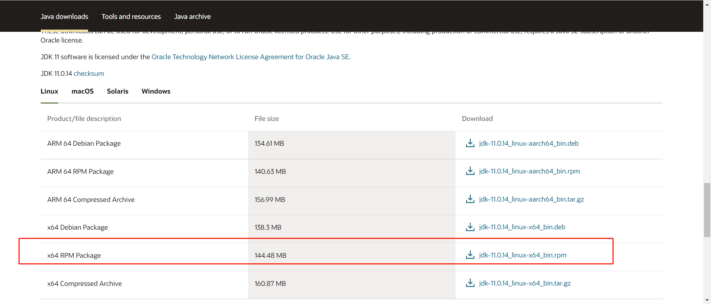

# java 环境安装

## yum 在线下载安装 java

一般是安装 `java 8` 、 `java 11`、`java 1.8` 版本

下面是安装 java11 的执行命令过程

```bash
# 查找java相关的列表
yum -y list java*
# 安装jdk
yum install java-1.8.0-openjdk.x86_64
# 安装完之后验证
java -version
# 通过yum安装的默认路径为：/usr/lib/jvm

# 将jdk的安装路径加入到JAVA_HOME
cat /etc/profile
# 编辑profile文件
vi /etc/profile
# 在profile文件里面加入下面的代码（路径根据自己设置的来）
export JAVA_HOME=/usr/java/jdk-11.0.14/bin/java
export PATH=$JAVA_HOME/bin:$PATH
export CLASSPATH=.:$JAVA_HOME/lib/dt.jar:$JAVA_HOME/lib/tools.jar

# 让profile文件生效
source /etc/profile

# 查看JAVA_HOME变量
echo $JAVA_HOME
```

## 离线 java 环境

> 注意：不要用 `yum` 命令下载安装，因为安装的版本不一样

**Linux 安装 JDK**

先从[java 官网](https://www.oracle.com/java/technologies/downloads/#java11)下载 jdk 文件，因为这个文件不能用 `wget` 直接在服务器端下载，所以我选择从本机电脑上下载之后上传到服务器安装

<Alert type='info'>
  Linux 系统选择 rmp 后缀的文件夹下载
</Alert>



使用 sftp 上传到服务器（还有其他两种方式 ftp,scp）,参考<router-link to='/myblog/node/loginserver'>远程传输文件到服务器</router-link>

或者使用 FinalShell 连接工具直接上传

3. 安装 jdk

```bash
# 1、安装java
rpm -ivh 文件名

# 2、编辑/etc/profile 步骤同上
vi /etc/profile

# 3、检查 java 环境是否安装好
java -version

# result 出现如下结果就是安装完成！
#java version "11.0.14" 2022-01-18 LTS
#Java(TM) SE Runtime Environment 18.9 (build 11.0.14+8-LTS-263)
#Java HotSpot(TM) 64-Bit Server VM 18.9 (build 11.0.14+8-LTS-263, mixed mode)

```
