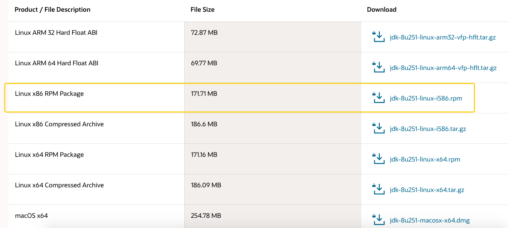
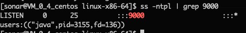
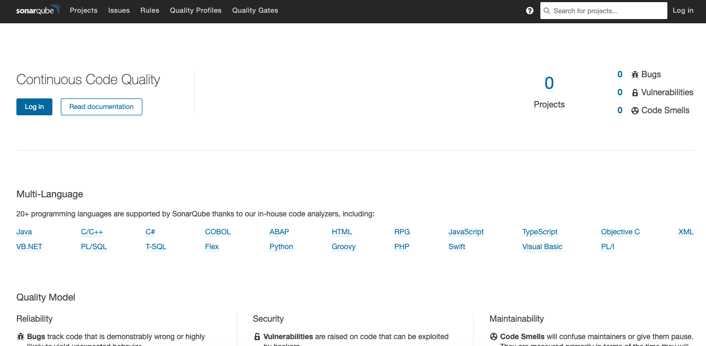
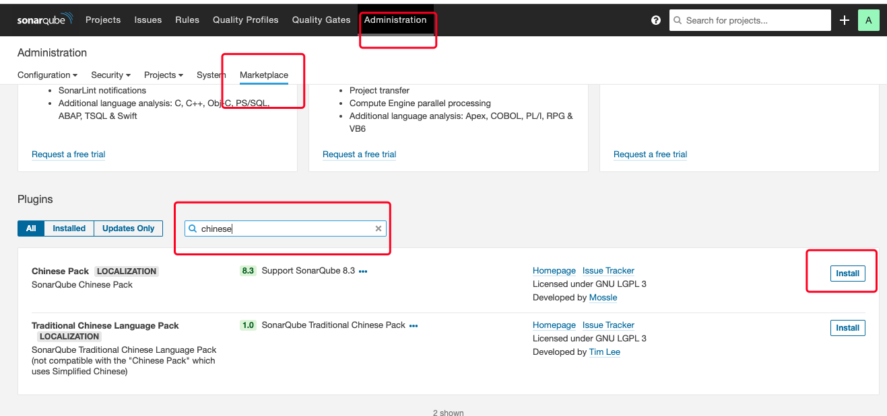
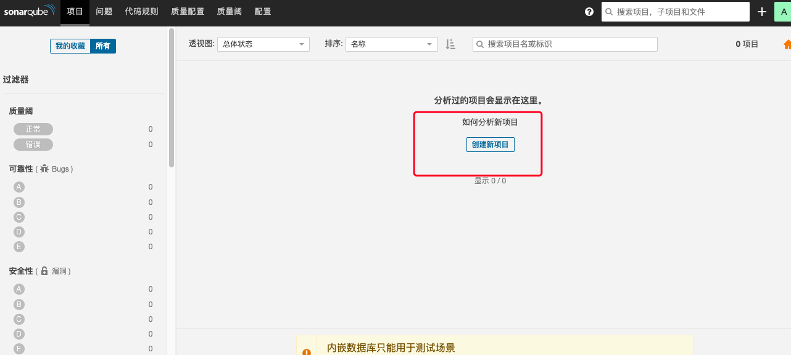
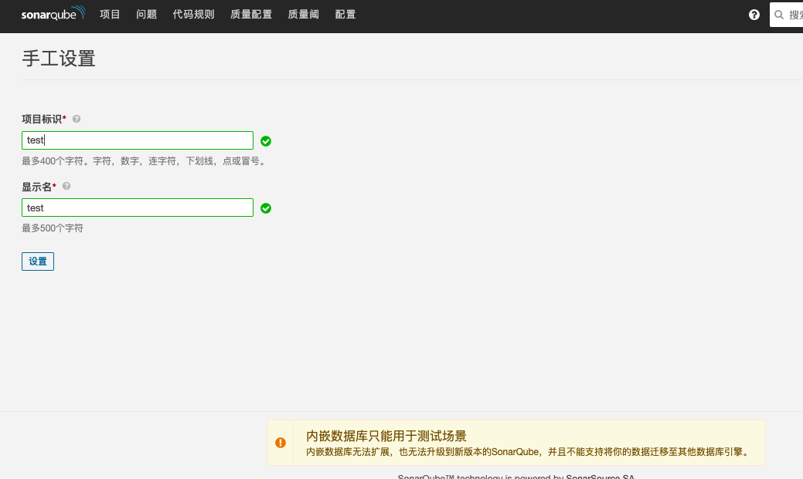
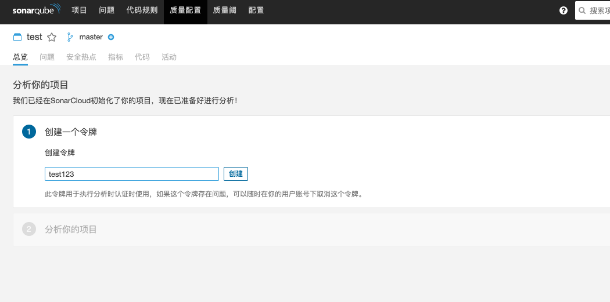
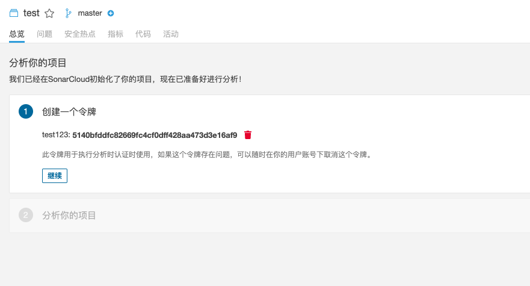
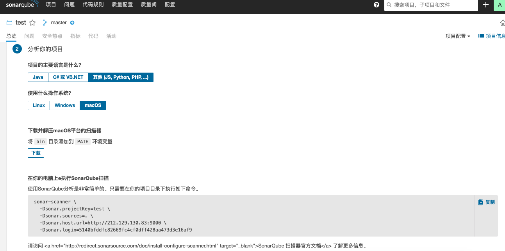
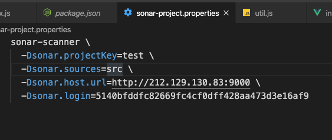

## Sonar 安装

### sonar 是什么

Sonar (SonarQube)是一个开源平台，用于管理源代码的质量。Sonar 不只是一个质量数据报告工具，更是代码质量管理平台。支持的语言包括：Java、PHP、C#、C、Cobol、PL/SQL、Flex 等

### 特点

- 代码覆盖：通过单元测试，将会显示哪行代码被选中
- 改善编码规则
- 搜寻编码规则：按照名字，插件，激活级别和类别进行查询
- 项目搜寻：按照项目的名字进行查询

- 对比数据：比较同一张表中的任何测量的趋势

### 第一步先安装 java 环境

> 注意：不要用 yum 命令下载安装，因为安装的版本不一样

1.  MacOs 安装 JDK

直接下载 dmg 安装(注意版本不是 1.8，而是 14.0.1)

2. Linux 安装 JDK

先从[java 官网](https://www.oracle.com/java/technologies/javase/javase-jdk8-downloads.html)下载 jdk 文件，因为这个文件不能用 wget 直接在服务器端下载，所以我选择从本机电脑上下载之后上传到服务器安装
Linux 系统选择 rmp 后缀的文件夹下载

<!--  -->


使用 sftp 上传到服务器（还有其他两种方式 ftp,scp）,参考<router-link to='/myblog/node/loginserver'>远程传输文件到服务器</router-link>

3. 安装 jdk

```bash
[root@localhost]# rpm -ivh 文件名
```

检查 java 环境是否安装好

```bash
[root@localhost]# java -version
```

出现如下结果就是安装完成！

```javascript
java version "14.0.1" 2020-04-14
Java(TM) SE Runtime Environment (build 14.0.1+7)
Java HotSpot(TM) 64-Bit Server VM (build 14.0.1+7, mixed mode, sharing)
```

### 第二步创建非 root 用户

添加新用户

```bash
[root@localhost]# useradd sonar
```

给 sonar 用户设置密码

```bash
[root@localhost]# passwd sonar
```

新用户创建完成

### 第三步下载 sonar

在[SonarQube](https://www.sonarqube.org/)官网下载

通过 linux 命令 scp 命令远程上传到服务器

### 第四步安装 sonar

```bash
#给sonar权限操作sonarqube
[root@localhost opt]# chown -R sonar /opt/sonarqube-8.4.0.35506

#切换用户
[root@localhost opt]# su sonar

#进入/opt/sonarqube-8.4.0.35506/bin/linux-x86-64文件夹下，启动sonar.sh
[sonar@localhost]# cd /opt/sonarqube-8.4.0.35506/bin/linux-x86-64
# ./sonar.sh 查看可执行的命令（status,console,restart,start）
[sonar@localhost linux-x86-64]# ./sonar.sh start

#如果启动不了就执行这一步
[sonar@localhost linux-x86-64]# ./sonar.sh console

```

出现如下提示就是创建成功

<!--  -->


可以在浏览器用“ 服务器 ip:9000 ”来访问

<!--  -->


登录账号密码都是 admin

### sonar 汉化

通过下面红框的点击事件来执行

<!--  -->


## SonarScanner 安装

### sonar 创建项目

<!-- 


 -->






### 配置本地 sonar-scanner 环境

添加环境变量 `open .bash_profile`

```bash
# sonar-scanner 追加bin

# export SCANNER_HOME="你下载的sonar-scanner地址"
export SCANNER_HOME="/Users/hondry/opt/sonar-scanner"
export PATH=$PATH:$SCANNER_HOME/bin
# 然后退出编辑 source .bash_profile 或者 zsh .zshrc 使更改生效 例：zsh shell 下
zsh .zshrc
# 然后在 shell 中 校验是否安装完成
sonar-scanner -v
```

能查看到版本号就是完成了配置。下面就是实战项目

### 实战

如果我们要建一个某一个项目的代码，那就在该项目的根目录下面新建`sonar-project.properties`,填入在 sonar 上面创建项目的最后一步的代码

```javascript
sonar-scanner \
  -Dsonar.projectKey=test \
  -Dsonar.sources=. \ //修改需要扫描的路径
  -Dsonar.host.url=http://212.129.130.83:9000 \  //服务器Ip
  -Dsonar.login=5140bfddfc82669fc4cf0dff428aa473d3e16af9
```

修改需要扫描的文件夹

<!--  -->


使用终端 `shell(zsh/bash)` 执行你的这个 `sonar-project.properties`文件

```bash
# 时间有点长 耐心等待结果
zsh sonar-project.properties
```
