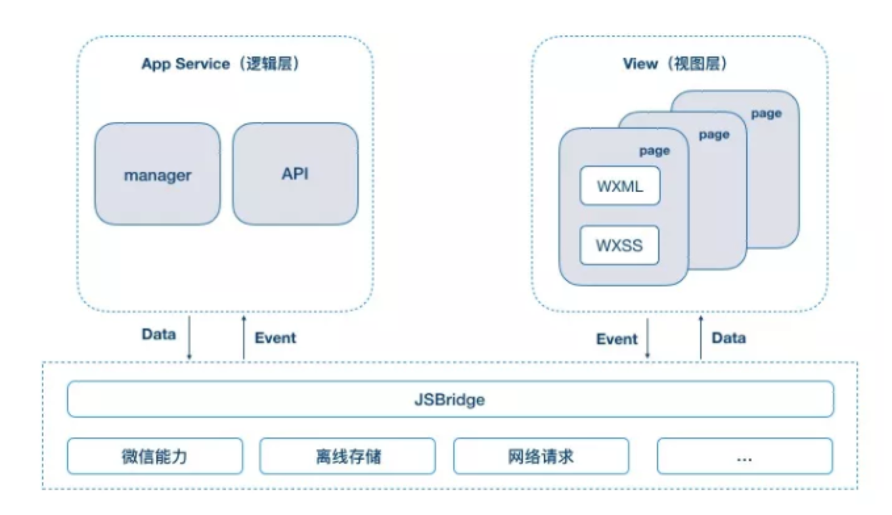
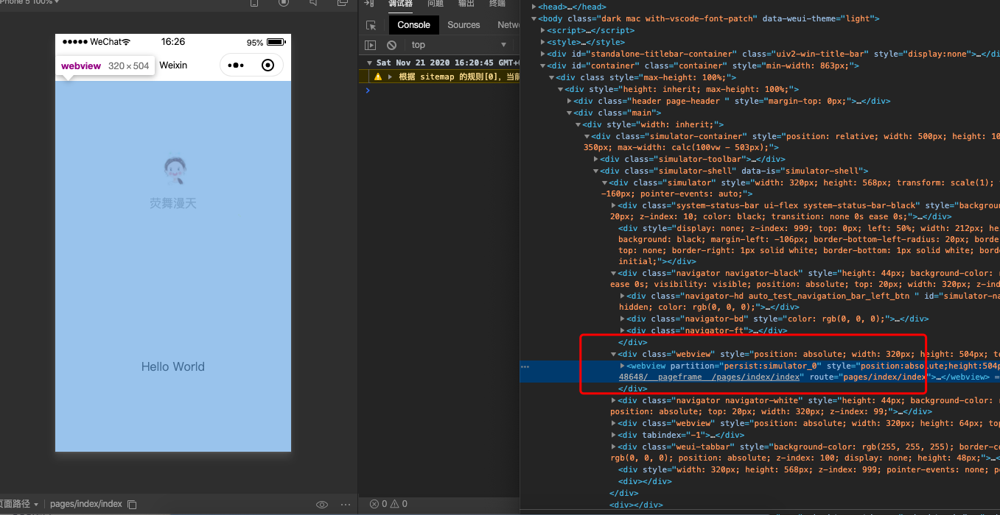
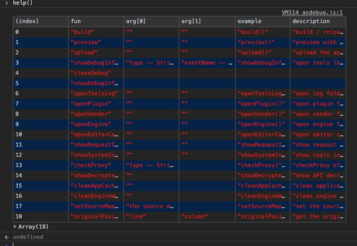
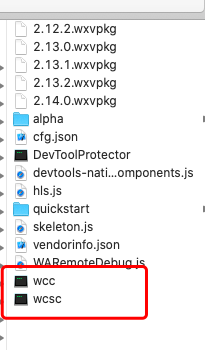

## 小程序底层架构

**首先我们看看小程序代码的组成部分**

js（开发逻辑代码）=》js =>v8 解析

wxss（控制小程序样式）=》css（浏览器渲染）=》css

wxml (xml 控制渲染层展示)=》html（浏览器渲染）=>dom

**wxss wxml 是自己实现了一套渲染机制还是是用了预编译？**

最终是是用了预编译

js 浏览器=》单线程 回阻塞

### 小程序的基本架构

因为浏览器是**单线程**的，同时运行 css,html，js 可能回阻塞，所以小程序对这一部分进行了优化
采用了**双线程架构**

小程序主要分为逻辑层(js)和渲染层（wxml、wxss）,这两者之间通过`JSBridge`来通信，还有就是他们的原生部分



他们之间通过 event 和 data 来通信。通信是有微信客户端（native）做的一层中转；

然后也可以通过`jsBridge`来调用原生的 api，比如什么相机、扫码等功能。

`setData`就是把数据通过消息机制传过去来改变视图

这个视图层，最后我们打包出来的代码，就是 html 和 css，在这里面运行，视图层目前使用 `WebView` 作为渲染载体，你可以尝试写 span 标签或者 div 这都是可以的。

逻辑层是由独立的 `JsCore` 作为 js 的运行环境,所以他和浏览器不一样，只有一些 js 对应的方法，不能直接操作 dom 和获取 dom，中间都需要通信这一层中转，在架构上，WebView 和 JavascriptCore 都是独立的模块，并不具备数据直接共享的通道。

当前，视图层和逻辑层的数据传输，实际上通过两边提供的 `evaluateJavascript` 所实现。

即用户传输的数据，需要将其转换为字符串形式传递，同时把转换后的数据内容拼接成一份 JS 脚本，再通过执行 JS 脚本的形式传递到两边独立环境。

由于这之间他们是彼此独立的，是基于消息驱动来渲染的，所以不会阻塞页面；

所以这就不会造成渲染的阻塞，我的渲染不会影响你的 js 逻辑，js 的执行也不会柱塞渲染的过程；

比如你在发送一些请求的时候，这种一般是经由 native 转发；


### 查看小程序运行

- 打开微信小程序的调试器

  微信开发者工具===》左上角的调试===》调试微信开发者工具

  

  可以看到上述小程序运行界面嵌套的其实是一个`webview`,在本地调试环境中，wenbiew 里面嵌套的是 iframe,但是在真机练运行的时候，里面嵌套的是 webview

  调试代码：

  ```js
  document.getElementsByTagName('webview')[0].showDevTools(true, null);
  ```

  逻辑层查看：

  ```js
  //直接在小程序项目的调试那一栏里面直接输出下面的代码
  document;
  ```

  小程序里面的每一个页面就是一个 webview，逻辑层 js 只有一份（装载所有页面的逻辑 js）

- 小程序限制

  小程序刚出来时候有限制 5 个层级，这是因为只维护了 5 层。现在是 10 层

- 基础库

  

  可以直接在调试框里面执行上述方法

  ```js
  //基础库（对于底层运行时的封装、提供事件、数据变更、通信、基础函数）
  openVedor(); //可以直接打开基础库的文件夹
  ```

  里面有`wcc`和`wcsc`文件

  

  - wcc: wxml compiler=>wxml 编辑器=》js
    1. 初始化，执行 js，生成构建虚拟 dom 的函数
    2. 数据传递给 虚拟 dom 的函数=》vDom 描述
    3. vDom 描述=》exparser =>解析=》构建真实 Dom
    4. 数据变更 2-3=》diff=>渲染
  - wcsc: wxss Stylesheet Compiler =>wxss 编辑器=》js
    1. wxss ==>js (把 rpx 单位处理，处理成函数)
    2. 获取手机物理及像素分辨力来计算应该多少，
    3. 生成新的 style 插入

  基础库==>wxappUnpacker==>破解.wxvpkg 文件，查看源码(比较难读)

### 源码解析

- 视图层 WAWebview.js

  - `Foundation` 基础模块 提供环境变量`env` `isService` `isWebview` `eventEmit` `jsbridge` `ready监听` 配置

  - `WeixinJSBridge` 消息通信机制
  - `NativeBuffer` 转换数据格式
  - `Reporter` 日志系统
  - `exparser` 组件系统
    - `shadomDOM` (webComponent 规范 例子：wx-element)
    - 提供友好交互的组件（承接原生）
    - video 原生的组件 事件系统
  - `__virtualDOM__` 虚拟 dom

- 逻辑层引擎 WAService.js

  - `Foundation` 基础模块 提供环境变量`env` `isService` `isWebview` `eventEmit` `jsbridge` `ready监听` 配置

  - `WeixinJSBridge` 消息通信机制
  - 路由管理
  - 生命周期管理
  - `__subContextEngine__`: 提供 `App`、`Page`、`Component`、`Behavior`、`getApp`、`getCurrentPages` 等方法

### 小程序初始化

#### 渲染层

1. 初始化`_webviewId_`、`wxCode_`
2. 加载生成渲染器的代码(wxml=>js)
3. 加载执行 wxss=>js()=>生成 css
4. 初始化页面配置
5. \$gwx=>generateFunc(渲染器==>VDOM)，需要数据
6.

```js
var generateFunc = $gwx(decodeName);
if (generateFunc) {
  var CE = window.CustomEvent;
  document.dispatchEvent(
    new CE('generateFuncReady', {
      detail: {
        generateFunc: generateFunc,
      },
    }),
  );
} else {
  document.body.innerText = decodeName + ' not found';
  console.error(decodeName + ' not found');
}
```

`generateFuncReady` 基础库的方法

```js
//基础库源代码
/*
1. 定义generateFuncReady，渲染成已经获取到wxml，通过$gwx编译成生成函数
2. webView渲染层触发dispatch(new Custom('generateFuncReady',detail:$gwx('...')))
*/
(generateFuncReady = function() {
  setTimeout(function() {
    !(function() {
      var e = arguments;
      //判断是否WeixinJSBridge准备完成，
      r(function() {
        //触发WeixinJSBridge
        WeixinJSBridge.publish.apply(WeixinJSBridge, o(e));
      });
    })('GenerateFuncReady', {});
  }, 20);
}),
  document.addEventListener('generateFuncReady', generateFuncReady);
```

7. generateFuncReady ==>generateFunc（）==>VDOM
8. 如果，这中间再发生什么变化，触发了 setData，这个时候就会重新调用我们刚刚的虚拟 dom 生成方法，然后在对应的 webview 层的基础代码来触发 dom diff 的过程

**流程**


#### 逻辑层

1. 初始化配置项 页面配置 全局 路由

2. 加载逻辑层基础库 （Page、App、Component、wx.getSetting.wx.scanCode）

3. 加载所有页面的配置和渲染器方法

## 现有小程序框架实现

### 为什么有小程序框架

一开始小程序才出来的时候，他的定义了一个不论不类的语法、原生开发对于预编译器和 webpack 都支持不会，对于开发效率和工程构建流程都不方便；还有就是他这个 ide 确实和专业的 ide 比起来，实在不好用；

所以就出来了用 vue 和 react 相关的语法来开发，这样也没有再去搞个新的写法，还有就是 vue 和 react 周边的生态也比较多，有很多相关的工具和第三方库，所以就衍生了一系列框架；

一开始小程序才出来的时候，他的定义了一个不论不类的语法、原生开发对于预编译器和 webpack 都支持不会，对于开发效率和工程构建流程都不方便；还有就是他这个 ide 确实和专业的 ide 比起来，实在不好用；

所以就出来了用 vue 和 react 相关的语法来开发，这样也没有再去搞个新的写法，还有就是 vue 和 react 周边的生态也比较多，有很多相关的工具和第三方库，所以就衍生了一系列框架；

### 编译时框架

必须按照语法规则来开发，因为模板需要解析成微信的代码（wxml、wxss、js），性能最好，但是不会做性能优化

- **wepy**

  这个是比较早的框架了，通过一些预编译的手段来开发，他的风格写法就和`vue`差不多，不过他这个还是一种编译的语言，这个是腾讯早起开发的；什么是预编译呢，就是把对应的语法编译成`AST`抽象语法树，然后通过一些规则来处理成为小程序对应的运行的语言

- **uniapp**

### 半编译半运行框架

大多数人的选择

- **mpvue**

因为 taro 和 wepy 这两个框架都是采用的静态编译的方式，把我们写的代码，解析成为抽象语法树，然后通过语法分析把代码转换为可以运行在小程序的代码。比如我们写 taro 的时候，他就把代码编译成小程序代码，然后把 render 方法里面的 jsx 提取出来，编译成小程序的静态模板，js 就处理为小程序的页面的一些生命周期，但是对于 js 这种语言本来就是一种动态语言，编译成为静态的方式，就会有很多的写法和使用限制，毕竟要写对应的解析规则来处理特定的语法；

比如这种语法（大致写一下，可以打开对应的这个模板 taro 加油项目尝试一下），taro 就不认；所以就需要换一种思路来看整个生态，所以就出来了 mpvue；

这个就完全是基于 vue 的语法来开发，它是把 vue 的库直接给 fork 过来的，对于我们现在市面上的 vue 和 react 的一个大结构，主要就是分成 runtime 运行时，还有就是 compilier 编译时，运行时就是真正的框架的运行的流程，但是真正的视图展现还是在端上面（可能是 web 端、客户端、小程序端），所以 mpvue 就是保留了 vue 的运行时的机制，但是对于模板这一层他做的思路和 taro 的思路大致相同，可以大致[看一下](https://github.com/Meituan-Dianping/mpvue)他的源码结构；增加了端的代码和编译的一下方式，大致看一下 packages 里面的几个包，这几个就是对应的编译 vue 的单组件（SFC）到小程序的端代码

### 运行时框架

一般不推荐用

1. vue、react(保留了自己的运行时)，
2. path=>操作 dom(逻辑层)
3. 下面框架提供了 dom 运行状态，var document={}

- **remax**
- **taro-next**
- **kbone**

4. dom => 描述 => setData => 渲染基础模板

## 总结

小程序是一个性能很不错的`hybrid`
