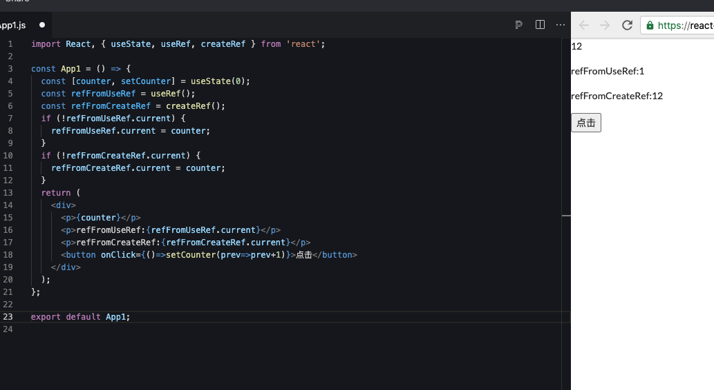

# React Hooks 探索

## 为什么要使用 React hooks?

- 16.8 版本之后可以在函数组件中使用 `state`,`hook` 就相当于钩子，

- 可以使我们在非 `class` 的情况下，可以使用更多的 `react` 特性
- 不用非得把 `class` 组件改成 hooks 写法
- `hooks` 代码更加简洁，上手更加简单
- 生命周期不用学
- `redux` `也不是必需品，mobx` 上手非常容易
- 开发体验比较好，可以让函数组件维护内部状态 `state`

> 同样逻辑的函数组件相比类组件而言，复杂度要低得多得多。

## react 为什么难上手？

- 生命周期难以理解，很难熟练应用

- `Redux` 状态管理，概念非常多，难以理解，
- 高阶组件理解起来不容易，必须掌握
- 优秀的解决方案，都在 `react` 社区

## Hooks 核心概念与应用

### useState

- 每次渲染，函数都会重新执行，函数执行完，内存就被释放掉
- 在函数内部创建一个当前函数组件的装填，提供了一个修改状态的方法

```js
//useState使用的例子
import React, { useState, useEffect } from 'react';

function App() {
  const [count, setCount] = useState(1);
  const changeCount = () => {
    setCount(count + 1);
  };
  return (
    <div className="App">
      <p>点击次数：{count}</p>
      <button onClick={changeCount}>加1</button>
    </div>
  );
}

export default App;
```

### useEffect

- 组件总会执行一些副作用操作，函数组件中，纯函数接受 `props`,固定输入总会得到固定输出
- 副作用：

  只想渲染一个 `dom->dom` 渲染完了还想执行一段逻辑(副作用)

  `hook`之前副作用都是不被允许的，副作用也分需要清除的和不需要清除的

- `useEffect` 是`componentDidMount`，`componentDidUpdate` 和 `componentWillUnmount` 这三个函数的组合
- `useEffect(fn)`组件渲染到屏幕之后才执行，返回一个清除副作用的函数或者不返回
- 一般是不需要同步的，如果需要同步则使用 `useLayoutEffect`
- 定义第二个参数，告诉 `react` 不依赖 `props`,`state`

```js
import React,{useState, useEffect} from 'react';

function App() {
   const [count,setCount]=useState(1);
   const changeCount=()=>{
      setCount(count+1)
   }
   /**
   * 第一种 不传第二个参数，一般不推荐
   * 这样会导致useEffect只要有state更新就会执行，导致性能问题
   */

   useEffect(()=>{
      console.log('执行')
      document.title='你好'
   })
   /**
   * 第二种 传空数组
   * 这种就是相当于componentDidMount 只执行一次
   */
   useEffect(()=>{
      console.log('执行1')
      document.title='你好1'
   },[])
   /**
   * 第三种 传依赖更新的值
   * componentDidMount+componentDidUpdate
   */
   useEffect(()=>{
      //count变化 下面的代码才会执行
      console.log('count',count)
      document.title='你好1'
      //卸载函数，组件
      return ()={
         //清除  相当与componentWillUnmount
         //里面写卸载的逻辑
      }
   },[count])


   return (
      <div className="App">
         <p>点击次数：{count}</p>
         <button onClick={changeCount}>加1</button>
      </div>
   );
}

export default App;
```

> 首先需要说明，数组中的变量一般都是来源于组件本身的数据（props 或者 state）

### useLayoutEffect

`useEffect` 是异步的，要等到浏览器将所有变化渲染到屏幕后才会被执行，`useLayoutEffect` 是同步的,这是执行时机上的区别

- `useEffect` 不会造成视觉阻塞
- `useLayoutEffect` 会造成视觉阻塞

### useContext

使用了 `context` 能力，顶层的组件，解决组件之间状态共享的问题

### useReducer

`useState` 内部就是靠 `useReducer` 实现的,接受三个参数，`state` 和配套的 `dispatch`

### useRef

创建 `ref`,访问 `dom` 节点，操作 `dom`

```js
let refInput=useRef(null)

useEffect(()=>{
   console.log('refInput',refInput)
},[])

<input ref={refInput}/>
```

### useRef 和 createRef 的区别？

`useRef` 在 react hook 中的作用, 正如官网说的, 它像一个变量, 类似于 `this` , 它就像一个盒子, 你可以存放任何东西

**createRef 每次渲染都会返回一个新的引用，而 useRef 每次都会返回相同的引用**

例如下面的例子：

```js
import React, { useState, useRef, createRef } from 'react';

const App1 = () => {
  const [counter, setCounter] = useState(0);
  const refFromUseRef = useRef();
  const refFromCreateRef = createRef();
  if (!refFromUseRef.current) {
    refFromUseRef.current = counter;
  }
  if (!refFromCreateRef.current) {
    refFromCreateRef.current = counter;
  }
  return (
    <div>
      <p>{counter}</p>
      <p>refFromUseRef:{refFromUseRef.current}</p>
      <p>refFromCreateRef:{refFromCreateRef.current}</p>
      <button onClick={() => setCounter(prev => prev + 1)}>点击</button>
    </div>
  );
};

export default App1;
```

结果如下：



总结：

- `useRef` 不仅仅是用来管理 DOM ref 的，它还相当于 this , 可以存放任何变量.
- `useRef` 可以很好的解决闭包带来的不方便性. 你可以在各种库中看到它的身影, 比如 react-use 中的 useInterval , usePrevious ……

**值得注意的是** 当 `useRef` 的内容发生变化时,它不会通知您。更改.current 属性不会导致重新呈现。 因为他一直是一个引用

### useMemo&&useCallback

- 相同点

  这两个都是性能优化的手段，类似于组件中的`shouldComponentUpdate`,在子组件中使用`shouldComponentUpdate`,判定该组件的`props`和`state`是否有变化，从而避免每次父组件`render`时都去重新渲染组件

- 不同点

  - `useMemo`返回的是一个值，用于避免在每次渲染时都进行高开销的计算

    ```js
    const Parent = () => {
      const [count, setCount] = useState(0);
      const [color, setColor] = useState('');
      const [price, setPrice] = useState(10);
      const handleClick = () => {
        setCount(count + 1);
      };
      const getTotal = () => {
        console.log('getTotal 执行了 ...'); // 该函数依赖于count和price，但color变化也会导致该函数的执行
        return count * price;
      };
      //所以我们把getTotal函数修改一下
      // 这样就只有count和price改变的时候，getTotal才会执行
      const getTotal = useMemo(() => {
        console.log('getTotal 执行了 ...');
        return count * price;
      }, [count.price]);
      return (
        <div>
          <div>
            {' '}
            颜色: <input onChange={e => setColor(e.target.value)} />
          </div>
          <div>
            {' '}
            单价: <input
              value={price}
              onChange={e => setPrice(Number(e.target.value))}
            />
          </div>
          <div>
            {' '}
            数量:{count} <button onClick={handleClick}>+1</button>
          </div>
          <div>总价:{getTotal()}</div>
        </div>
      );
    };
    ```

  - `useCallback`返回的是一个函数，**用于缓存函数**,只有当依赖项改变时，函数才会重新执行返回新的函数，对于父组件中的函数作为 props 传递给子组件时，只要父组件数据改变，函数重新执行，作为 props 的函数也会产生新的实例，导致子组件的刷新

  **useCallback 第二个参数依赖项什么情况下使用呢?**

  ```js
  const handleInputChange = useCallback(e => {
    setText(e.target.value + count);
  }, []);
  //没有依赖项的时候，handleInputChange只在初始化的时候调用一次函数就被缓存起来

  const handleInputChange = useCallback(
    e => {
      setText(e.target.value + count);
    },
    [count],
  );
  //有依赖项的时候，count加入到依赖项，count变化后重新生成新的函数，改变函数内部的count值
  ```

  **如果该函数和变量作为 props 传给组件，请一定要用，避免子组件的非必要渲染**

### 自定义 Hook

- 逻辑功能相同的片段->封装成单独的函数使用

- 自定义 `hook` 可以调用官方提供的 `hook`

- use 开头，表示只能在函数组件中进行使用

- 抽离公共代码，每次调用都有一个独立的 `state`

  ```js
  //定义hook
  const usePrevious = state => {
    const ref = useRef();
    useEffect(() => {
      ref.current = state;
    });
    return ref.current;
  };

  //使用
  const prev = usePrevious(counter);
  ```

## hook 使用规则

- 只能在最顶层使用 `hook`，不要再循环，嵌套函数中调用 `hook`
- 只在 `React` 函数中调用 `hook`

## hooks 的坑

### capture value（意外的值）

```js
const [age, setAge] = useState(20);
<button
  onClick={() => {
    setAge(30);
    setTimeout(() => {
      console.log('更新', age);
    }, 2000);
  }}
>
  改变age
</button>;
```

上述代码执行的结果是 20 还是 30 呢，答案是 20，为什么不是 30 呢？因为 setTimeout 是有上下文的，setAge 只会会在执行一次 App,因为有 setTimeout 所以 age 并不会被回收,这个是 js 闭包导致的，不是 hooks 导致的

### 死循环

断掉多重依赖

```js
//这样会导致每次执行的时候都会创建一个changeCount，浪费内存
const changeCount = () => {
  setCount(count + 1);
};
//第一次会重新创建
const changeCount = useCallback(() => {
  setCount(count + 1);
}, [count]);

/**
 * 死循环 useEffect调用changeCount,setCount改变了count,
 * count改变了changeCount就会改变，就会知道useEffect执行，导致陷入死循环
 */
const changeCount = useCallback(() => {
  setCount(count + 1);
}, [count]);
useEffect(() => {
  changeCount();
}, [changeCount]);
```

### 怎么避免子组件不必要的渲染

使用 `React.memo` 包裹子组件(默认执行浅渲染,功能和 `PureComponent` 一样),`userCallback` 包裹执行方法，只用 `useCallback` 是不行的，最好是两者结合

```js
//子组件
import React, { useState, useEffect } from 'react';

function Hello1(props) {
  //包裹之后该组件就不会被触发
  console.log('子组件更新1');
  return <div>这是子组件1</div>;
}

export default React.memo(Hello1);
```

### 多个 setName,setAge 会执行两次

`class Component`里面`setState`多次会最后合成一次来执行，但是`Hooks`里面却不是，他是有几次就执行几次

```js
//执行批处理
import { unstable, unstable_batchedUpdates } from 'react-dom';

unstable_batchedUpdates(() => {
  setCount(23);
  setName('tf');
});
```
