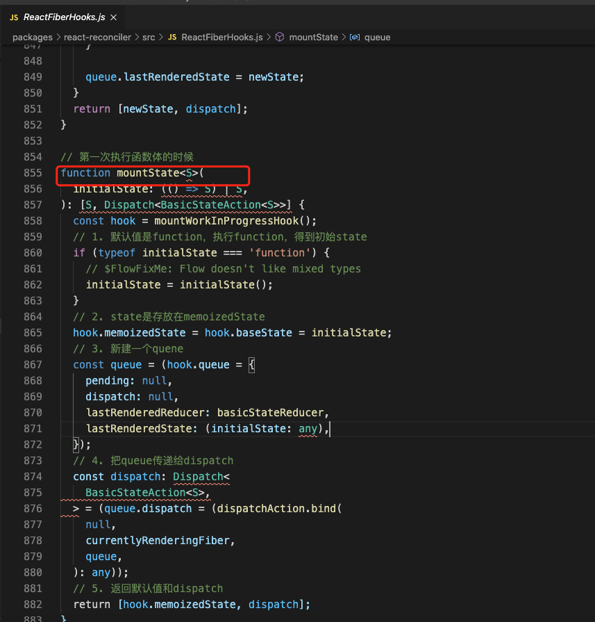
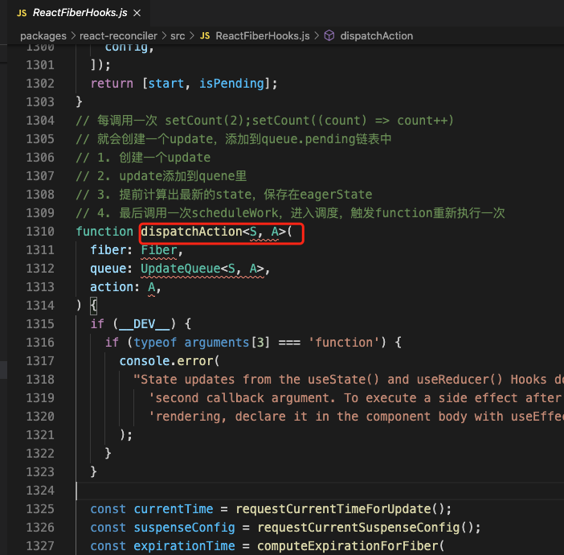
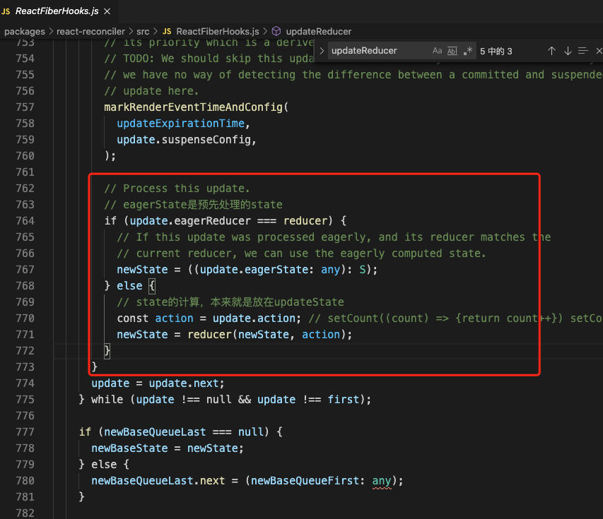
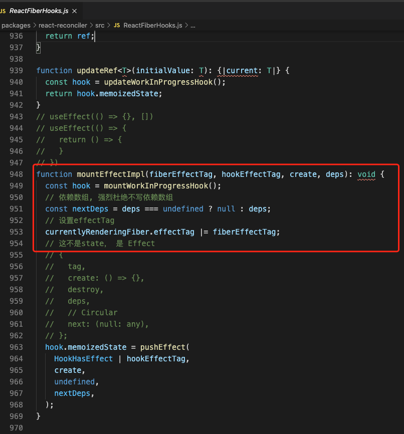
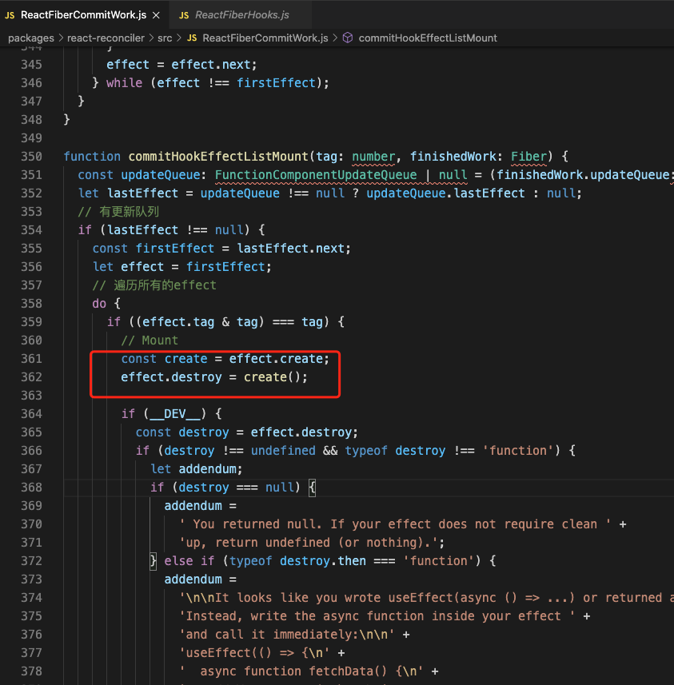
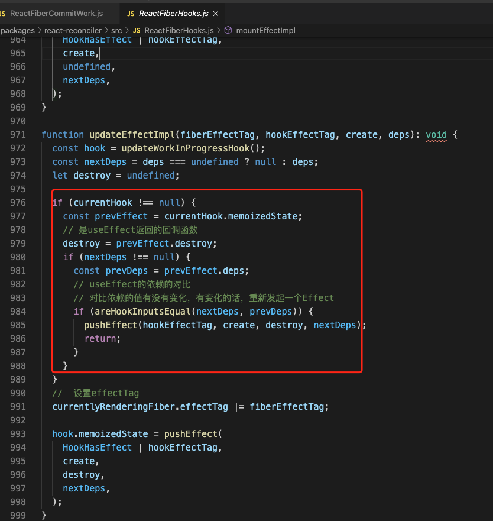
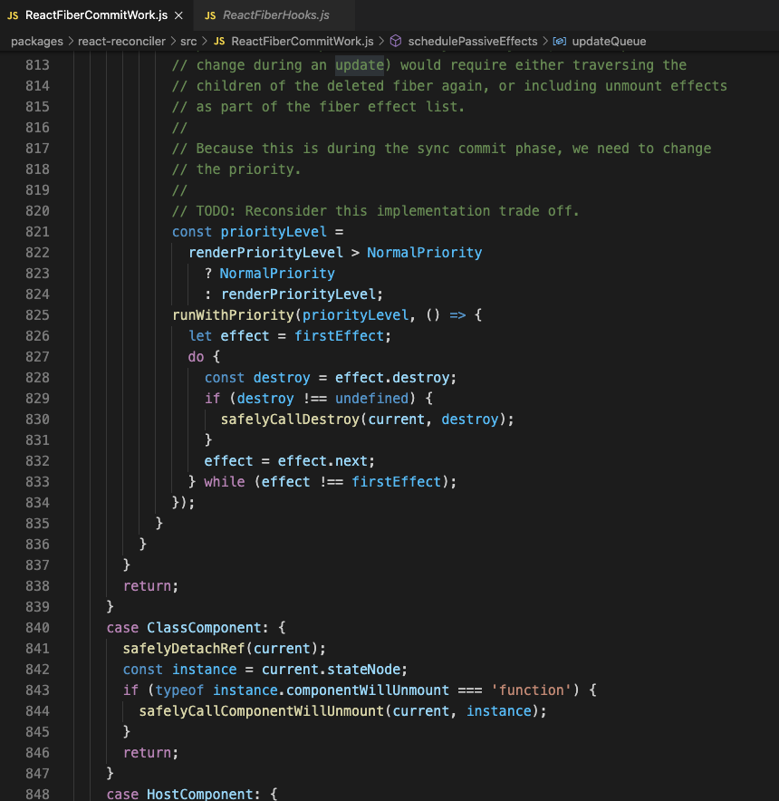

## useState 的 3 个阶段

### mountState

第一次执行函数体的时候，调用`useState`会执行`mountState`，它主要做了以下几件事情：

<!--  -->


1. 默认值是`function`，执行`function`，得到初始`state`
2. `state`是存放在`memoizedState`属性中
3. 新建一个`quene`
4. 把`queue`传递给`dispatch`
5. 返回默认值和`dispatch`

我们在写代码初始化`state`的时候,也可以用如下方法写：

```js
//以function的形式写，但是一般我们可能不会用到这种写法
const [name, setName] = useState(() => 'yyyy');
```

### dispatchAction

<!--  -->


1. 创建一个`update`
2. `update`添加到`quene`里
3. 如果当前有时间，提前计算出最新的`state`，保存在`eagerState`
4. 调用一次`scheduleWork`

```js
// 每调用一次 setCount(2);setCount((count) => count++)
// 就会创建一个update，添加到queue.pending链表中
```

### updateState

<!--  -->


1. 递归执行`quene`里的`update`
2. 计算最新的`state`，赋值给`memoizedState`

## useEffect 的 2 个阶段

### MountEffect

<!--  -->

1. 处理依赖数组
2. 设置`effectTag`
3. 新增一个`Effect`到`currentlyRenderingFiber.updateQueue` 中参与`到compleleRoot`中

**MountEffect 执行时机**

在 commitRoot => commitLayoutEffects => commitLifeCycles => commitHookEffectListMount
里执行 MountEffect

<!--  -->


### UpdateEffect

1. 设置`EffectTag`
2. 对比依赖是否发生变化，
 如不一样，则重新 push 一个新的`Effect`

### UpdateEffect

<!--  -->


### destroy

在`commitUnmount`阶段卸载组件，这时`distory`方法会被调用

<!--  -->

