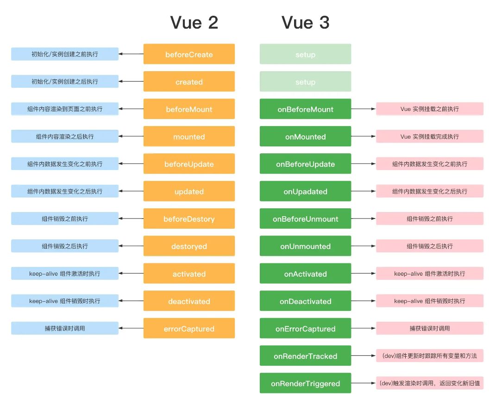

# vue3+ts+vite 组合式 api 知识点

## 1、ref 和 reactive

- `ref`:用来给基本数据类型绑定响应式数据，`script`里面访问时需要通过 `.value` 的形式， `tamplate`里面使用的时候会自动解析,不需要`.value`
- `reactive`: 用来给复杂数据类型绑定响应式数据，直接访问即可;

```js
  <template>
  <p>{{ count }}</p>
  <a-button @click="handleAdd">点击+1</a-button>
  <p>{{ person.age }}</p>
  <a-button @click="handleAddAge">年龄+1</a-button>
</template>
<script setup lang="ts">
import { ref, Ref, reactive } from "vue";

//用接口来定义对象的类型
interface Person {
  name: string;
  age: number;
  sex?: string;
}

const count: Ref<number> = ref(0);
const handleAdd = () => {
  count.value++;
};
const person: Person = reactive({
  name: "李子木",
  age: 18,
});
const handleAddAge = () => {
  person.age++;
  console.log(person); //{name: '李子木', age: 24}
};
</script>
<style scoped>
.read-the-docs {
  color: #888;
}
</style>
```

**ref 和 reactive 的区别**

1. 从定义数据方面：
   - `ref` 通常用来定义基本类型数据
   - `reactive` 用来定义：对象（或者数组）类型数据
   - `ref` 也可以用来定义对象或者数组类型的数据，内部会通过 `reactive` 转为代理对象
2. 从原理方面：
   - `ref` 通过 `Object.defineProperty()`的 `get` 和 `set` 实现数据代理。
   - `reactive` 使用 `Proxy` 实现数据代理，并且通过 `Reflect` 操作源对象内部的数据。
3. 从使用方面：
   - `ref` 在`script`中操作数据需要`.value`,在`template` 模板中不需要。
   - `reactive` 都不需要`.value`
   - `ref`函数只能操作浅层次的数据，把基本数据类型当作自己的属性值；深层次依赖于 `reactive`

## 2、toRef、toRefs、toRaw

- `toRef`: 如果原始对象是非响应式的,数据会变,但不会更新视图

  ```js
  <template>
    <p>{{ state1 }}</p>
    <a-button @click="handleAddAge1">年龄+1</a-button>
  </template>
  <script setup lang="ts">
  import { ref, Ref, reactive, toRef } from "vue";

  //这样写是不会更新视图的，要用下面的这种写法
  const person = {
    name: "李子木",
    age: 18,
  };
  const handleAddAge = () => {
    person.age++;
    console.log(person); //{name: '李子木', age: 24}
  };
  // 使用toRef来达到数据更新的目的，但是页面视图是不会更新的
  const person1 = {
    name: "李子木",
    age: 18,
  };
  const state1 = toRef(person1, "age");
  const handleAddAge1 = () => {
    state1.value++;
    console.log("person1", person1, "state1", state1);
  };
  </script>
  <style scoped>
  .read-the-docs {
    color: #888;
  }
  </style>

  ```

  > `toRef` 返回的值是否具有响应性取决于被解构的对象本身是否具有响应性。响应式数据经过 `toRef` 返回的值仍具有响应性，非响应式数据经过 `toRef` 返回的值仍没有响应性。

- `toRefs`: 相当于对对象内每个属性调用 `toRef`,`toRefs` 返回的对象内的属性使用时需要加`.value`,主要是方便我们解构使用

  ```js
  <template>
    <p>{{ name }}---{{ age }}</p>
    <a-button @click="handleAddAge">点击+1</a-button>
  </template>
  <script setup lang="ts">
  import { ref, Ref, reactive, toRefs } from "vue";
  const person = reactive({
    name: "李子木",
    age: 18,
  });
  let { name, age } = toRefs(person);
  const handleAddAge = () => {
    name.value = "李子柒";
    age.value = 19;
  };
  </script>

  <style scoped>
    .read-the-docs {
      color: #888;
    }
  </style>
  ```

  > 对象必须也是响应式的，要不然视图也不会更新

- `toRaw`:将响应式对象修改为普通对象，从响应式数据变成不是响应式数据

```js
  <template>
    <p>{{ data.name }}---{{ data.age }}</p>
    <a-button @click="handleAddAge">点击+1</a-button>
  </template>
  <script setup lang="ts">
  import { ref, Ref, reactive, toRefs, toRaw } from "vue";

  const person = reactive({
    name: "李子木",
    age: 18,
  });
  let data = toRaw(person);
  const handleAddAge = () => {
    data.name = "李子柒";
    data.age = 19;
    console.log(data);
  };
  </script>
  <style scoped>
  .read-the-docs {
    color: #888;
  }
  </style>
```

## 3、computed

`computed`属性 `vue2` 和 `vue3` 的用法差不多

```js
  <template>
    <p>computed:{{ add }}</p>
    <!-- <a-button @click="handleAdd">点击+1</a-button> -->
  </template>
  <script setup lang="ts">
  import { ref, Ref, computed } from "vue";

  const count: Ref<number> = ref(0);
  const add = computed(() => {
    count.value++;
    return count;
  });
  </script>
  <style scoped>
    .read-the-docs {
      color: #888;
    }
  </style>

```

## 4、watch

`vue3` `watch` 的作用和 `Vue2` 中的 `watch` 作用是一样的，他们都是用来监听响应式状态发生变化的，当响应式状态发生变化时，就会触发一个回调函数。

当 `watch` 监听的是一个响应式对象时，会隐式地创建一个深层侦听器，即该响应式对象里面的任何属性发生变化，都会触发监听函数中的回调函数。即当 `watch` 监听的是一个响应式对象时，默认开启 `deep：true`

- 可以监听某个 `ref` 对象。此时 `watch` 的第一个参数可以直接是 `ref`
- 可以监听某个 `reactive` 对象。此时 `watch` 的第一个参数必须是一个函数
- 对于 `props` 对象。我们进行监听的时候也必须采用函数的形式，哪怕监听的是 `props` 中某个对象的属性。

```js
  <template>
    <p>价格：<a-input v-model:value="price" /></p>
    <p>数量：<a-input v-model:value="num" /></p>
    <p>总价：{{ total }}</p>
    <!-- <a-button @click="handleAdd">点击+1</a-button> -->
  </template>
  <script setup lang="ts">
  import { ref, Ref, computed, watch } from "vue";

  const price: Ref<string> = ref("");
  const num: Ref<string> = ref("");
  let total: Ref<number> = ref(0);
  //右边的属性必须转换成左边的属性，要不然ts就会报红色警告
  watch([price, num], (val) => {
    total.value = +val[0] * +val[1];
  });
  </script>
  <style scoped>
  .read-the-docs {
    color: #888;
  }
  </style>
```

## 5、WatchEffect

会立即执行传入的一个函数，同时响应式追踪其依赖，并在其依赖变更时重新运行该函数。（有点像计算属性）
如果用到 a 就只会监听 a, 就是用到几个监听几个 而且是非惰性,会默认调用一次

- 停止监听
  当 `watchEffect` 在组件的 `setup()` 函数或生命周期钩子被调用时，侦听器会被链接到该组件的生命周期，并在组件卸载时自动停止。但是我们采用异步(例如在`setTimeout`里面)的方式创建了一个监听器，这个时候监听器没有与当前组件绑定，所以即使组件销毁了，监听器依然存在。

  ```js
    <script setup lang="ts">
      import { watchEffect } from 'vue';
      // 它会自动停止
      watchEffect(() => {});
      // ...这个则不会！
      setTimeout(() => {
        watchEffect(() => {});
      }, 100);

      const stop = watchEffect(() => {
        /* ... */
      });

      // 显式调用
      stop();
      </script>
  ```

- 清除副作用（onInvalidate）
  `watchEffect` 的第一个参数——`effect` 函数——可以接收一个参数：叫 `onInvalidate`，也是一个函数，用于清除 `effect` 产生的副作用就是在触发监听之前会调用一个函数可以处理你的逻辑，例如防抖

  ```js
  import { ref, watchEffect } from 'vue';
  let num = ref(0);

  //3s后改变值
  setTimeout(() => {
    num.value++;
  }, 3000);

  watchEffect(onInvalidate => {
    console.log(num.value);
    onInvalidate(() => {
      console.log('执行');
    });
  });
  //执行顺序0 执行 1
  ```

- 配置选项
  `watchEffect` 的第二个参数，用来定义副作用刷新时机，可以作为一个调试器来使用

  **flush(更新时机)：**

  1. `pre`：组件更新前执行
  2. `sync`：强制效果始终同步触发
  3. `post`：组件更新后执行

  ```js
  <script setup lang="ts">
    import { ref, watchEffect } from "vue";
    let num = ref(0)

    //3s后改变值
    setTimeout(() => {
      num.value++
    }, 3000)

    watchEffect((onInvalidate) => {
      console.log(num.value)
      onInvalidate(() => {
        console.log('执行');
      });
    }, {
      flush: "post", //此时这个函数会在组件更新之后去执行
      onTrigger(e) { //作为一个调试工具，可在开发中方便调试
        console.log('触发', e);
      },
    })
    </script>
  ```

## 6、生命周期



## 7、父子组件传参和回调以及调用子组件的方法和属性

- `defineProps` 来接收父组件传递的值， `defineProps`是无须引入的直接使用即可
- `withDefaults` 定义默认值
- `defineEmits` 子组件派发事件
- `defineExpose` 获取子组件的实例和内部属性，必须在子组件用改函数暴露出来

```js
  //父组件
  <template>
    <HelloWorld
      ref="childRef"
      msg="Vite + Vue"
      :count="0"
      :list="list"
      @callback="hanldeGetParams"
    />
  </template>
  <script setup lang="ts">
  import { ref, onMounted, reactive, nextTick } from "vue";
  import HelloWorld from "./components/HelloWorld.vue";
  const list = reactive<number[]>([1, 2, 3]);
  const hanldeGetParams = (val: string) => {
    console.log(val);
  };
  const childRef = ref<InstanceType<typeof HelloWorld>>();
  onMounted(() => {
    console.log(childRef.value?.num);
  });
  </script>

  <style scoped>
  .logo {
    height: 6em;
    padding: 1.5em;
    will-change: filter;
    transition: filter 300ms;
  }
  .logo:hover {
    filter: drop-shadow(0 0 2em #646cffaa);
  }
  .logo.vue:hover {
    filter: drop-shadow(0 0 2em #42b883aa);
  }
  </style>


//子组件HelloWorld接收
  <template>
    <div>{{ msg }}--{{ count }}</div>
    {{ list }} {{ num }}
    <a-button @click="handleParent">给父组件返回参数</a-button>
  </template>
  <script setup lang="ts">
  import { ref, Ref, watchEffect } from "vue";
  //获取参数
  type Props = {
    msg: string;
    count: number;
    list: Array<number>;
  };
  const num: Ref<number> = ref(0);
  //默认参数
  withDefaults(defineProps<Props>(), {
    msg: "1222",
  });
  //子组件事件派发
  const emits = defineEmits(["callback"]);
  const handleParent = () => {
    emits("callback", "这是子组件给父组件的参数");
  };
  //暴露子组件方法
  defineExpose({
    num,
  });
  </script>
  <style scoped>
  .read-the-docs {
    color: #888;
  }
  </style>


```

## 8、插槽

```js
//父组件
<HelloWorld>
  <template v-slot:content="{ msg }">
    <div>{{ msg }}</div>
  </template>
</HelloWorld>
//子组件
<div>
  <slot name="content" msg="hello!"></slot>
</div>
```

## 9、keep-alive 缓存组件

- 作用和 `vue2` 一致，只是生命周期名称有所更改
- 初次进入时：`onMounted> onActivated`
- 退出后触发 `deactivated`
- 再次进入：只会触发 `onActivated`

> 事件挂载的方法等，只执行一次的放在 `onMounted` 中；组件每次进去执行的方法放在 `onActivated` 中

## 10、provide/inject

`provide` 可以在祖先组件中指定我们想要提供给后代组件的数据或方法，而在任何后代组件中，我们都可以使用 `inject` 来接收 `provide` 提供的数据或方法。

```js
//父组件
  <template>
    <Children></Children>
  </template>

  <script setup lang="ts">
  import { ref, provide } from 'vue'
  import Children from "./Children.vue"

  const msg = ref('hello,小李')

  provide('msg', msg)
  </script>
//子组件
  <template>
    <div>
      <p>msg：{{msg}}</p>
      <button @click="onChangeMsg">改变msg</button>
    </div>
  </template>

  <script setup lang="ts">
  import { inject, Ref, ref } from 'vue'

  const list = inject<Ref<number[]>>("list", ref([]));
  const onChangeMsg = () => {
    msg.value = 'shuge'
  }
  </script>
```

## 11、v-model 变更

v-model 改动还是不少的，我们都知道，`v-model` 是 `props` 和 `emit` 组合而成的语法糖,`vue3` 中 `v-model` 有以下改动

- 变更：`value => modelValue`
- 变更：`update:input => update:modelValue`
- 新增：一个组件可以设置多个 `v-model`
- 新增：开发者可以自定义 `v-model` 修饰符
- `v-bind` 的 `.sync` 修饰符和组件的 `model` 选项已移除

```js
//父组件
  <template>
    <HelloWorld v-model="msg" v-model:msg="msg1"> </HelloWorld>
    拿到最新的数据:{{ msg }} {{ msg1 }}
  </template>
  <script setup lang="ts">
  import { ref, Ref, onMounted, reactive, provide } from "vue";
  import HelloWorld from "./components/HelloWorld.vue";

  const msg: Ref<string> = ref("11");
  const msg1: Ref<string> = ref("222");
  </script>
//子组件
  <template>
    <div>
      {{ msg }} {{ modelValue }}
      <a-button @click="handleAdd">点击</a-button>
      <slot name="content" msg="hello!"></slot>
    </div>
  </template>
  <script setup lang="ts">
  import { ref, Ref, inject, reactive } from "vue";

  type Props = {
    modelValue: string;
    msg: string;
  };
  defineProps<Props>();

  const emit = defineEmits(["update:modelValue", "update:msg"]);
  const handleAdd = () => {
    emit("update:modelValue", "qqqqq");
    emit("update:msg", "123");
  };
  </script>
  <style scoped>
  .read-the-docs {
    color: #888;
  }
  </style>
```

## 12、Teleport 传送组件

## 13、自定义 hooks

我们都知道在 `vue2` 中有个东西叫 `mixins`，他可以将多个组件中相同的逻辑抽离出来，实现一次写代码，多组件受益的效果。
但是 `mixins` 的副作用就是引用的多了变量的来源就不清晰了，而且还会有变量来源不明确,不利于阅读，容易使代码变得难以维护。

- `Vue3` 的 `hook函数` 相当于 `vue2` 的 `mixin`, 不同的是 `hooks` 是函数
- `Vue3` 的 `hook函数` 可以帮助我们提高代码的复用性, 让我们能在不同的组件中都利用 `hooks` 函数

```js
//useWindowResize.ts
import { onMounted, onUnmounted, ref } from 'vue';

function useWindowResize() {
  const width = ref(0);
  const height = ref(0);
  function onResize() {
    width.value = window.innerWidth;
    height.value = window.innerHeight;
  }
  onMounted(() => {
    window.addEventListener('resize', onResize);
    onResize();
  });
  onUnmounted(() => {
    window.removeEventListener('resize', onResize);
  });
  return {
    width,
    height,
  };
}

export default useWindowResize;

//使用
<template>
  <h3>屏幕尺寸</h3>
  <div>宽度：{{ width }}</div>
  <div>高度：{{ height }}</div>
</template>

<script setup lang="ts">
import useWindowResize from "./hooks/useWindowResize.ts";
const { width, height } = useWindowResize();
</script>
```

## 14、自定义指令

在 `<script setup>` 中，任何以`v`开头的驼峰式命名的变量都可以被用作一个自定义指令。在上面的例子中，`vFocus` 即可以在模板中以 `v-focus` 的形式使用。

在没有使用 `<script setup>` 的情况下，自定义指令需要通过 `directives` 选项注册：

**自定义指令的生命周期**

- `created` 元素初始化的时候
- `beforeMount` 指令绑定到元素后调用 只调用一次
- `mounted` 元素插入父级 `dom` 调用
- `beforeUpdate` 元素被更新之前调用
- `update` 这个周期方法被移除 改用`updated`
- `beforeUnmount` 在元素被移除前调用
- `unmounted` 指令被移除后调用 只调用一次

```js
<template>
  <div v-move class="box">
    <div class="header"></div>
    <div>内容</div>
  </div>
</template>

<script setup lang="ts">
import { Directive } from "vue";
const vMove: Directive = {
  mounted(el: HTMLElement) {
    let moveEl = el.firstElementChild as HTMLElement;
    const mouseDown = (e: MouseEvent) => {
      //鼠标点击物体那一刻相对于物体左侧边框的距离=点击时的位置相对于浏览器最左边的距离-物体左边框相对于浏览器最左边的距离
      console.log(e.clientX, e.clientY, "起始位置", el.offsetLeft);
      let X = e.clientX - el.offsetLeft;
      let Y = e.clientY - el.offsetTop;
      const move = (e: MouseEvent) => {
        el.style.left = e.clientX - X + "px";
        el.style.top = e.clientY - Y + "px";
        console.log(e.clientX, e.clientY, "位置改变");
      };
      document.addEventListener("mousemove", move);
      document.addEventListener("mouseup", () => {
        document.removeEventListener("mousemove", move);
      });
    };
    moveEl.addEventListener("mousedown", mouseDown);
  },
};

</script>

<style>
.box {
  position: fixed;
  left: 50%;
  top: 50%;
  transform: translate(-50%, -50%);
  width: 200px;
  height: 200px;
  border: 1px solid #ccc;
}

.header {
  height: 20px;
  background: black;
  cursor: move;
}
</style>

```

全局注册

```js
// 使 v-focus 在所有组件中都可用
app.directive('focus', {
  /* ... */
});
```

> 只有当所需功能只能通过直接的 `DOM` 操作来实现时，才应该使用自定义指令。其他情况下应该尽可能地使用 `v-bind` 这样的内置指令来声明式地使用模板，这样更高效，也对服务端渲染更友好。

## 15、style v-bind CSS 变量注入

```js
<template>
  <span> style v-bind CSS变量注入</span>
</template>
<script lang="ts" setup>
  import { ref } from 'vue'
  const color = ref('f00')
</script>
<style scoped>
  span {
    /* 使用v-bind绑定组件中定义的变量 */
    color: v-bind('color');
  }
</style>
```

## 在使用 vue3 的时候接触的 ts 的知识点

### type 和 interface 的区别

`type`(类型别名)会给一个类型起个新名字。 `type` 有时和 `interface` 很像，但是可以作用于原始值（基本类型），联合类型，元组以及其它任何你需要手写的类型。起别名不会新建一个类型 - 它创建了一个新名字来引用那个类型。给基本类型起别名通常没什么用，尽管可以做为文档的一种形式使用。

**相同点**

- 接口和类型别名都可以用来描述对象或函数的类型，只是语法不同

  ```js
  type MyTYpe = {
    name: string,
    say(): void,
  };

  interface MyInterface {
    name: string;
    say(): void;
  }
  ```

- 都允许扩展,`interface` 用 `extends` 来实现扩展,`type` 使用 `&` 实现扩展

  ```js
  //interface的使用
  interface MyInterface {
    name: string;
    say(): void;
  }

  interface MyInterface2 extends MyInterface {
    sex: string;
  }

  let person: MyInterface2 = {
    name: '小李',
    sex: '男',
    say(): void {
      console.log('hello,小李！');
    },
  };
  小李;
  //type的使用
  type MyType = {
    name: string,
    say(): void,
  };
  type MyType2 = MyType & {
    sex: string,
  };
  let value: MyType2 = {
    name: '小李',
    sex: '男',
    say(): void {
      console.log('hello 啊，小李！');
    },
  };
  ```

**不同点**

- `type` 可以声明基本数据类型别名/联合类型/元组等，而 `interface` 不行
- `interface` 能够合并声明，而 `type` 不行

```

```
