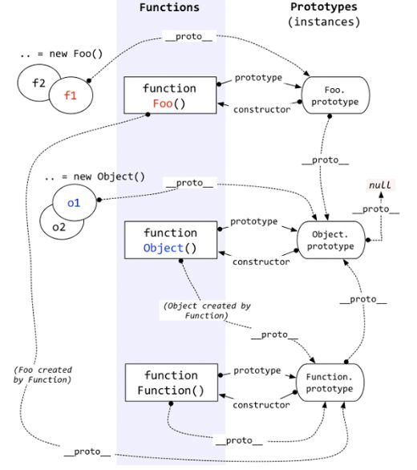

# 原型和原型链

在 js 中，所有对象(包括函数)都有`__proto__`属性，一般这个是被称为隐式的原型，该隐式原型指向构造该对象的构造函数的原型。
但是`prototype`是只有函数才有的属性,这个属性是一个指针，指向一个包含所有实例共享的属性和方法的对象，称之为原型对象。原型对象也有一个`constructor`属性，该属性指回该函数

下面有一道面试题

```js
var F = function() {};
Object.prototype.a = function() {
  console.log('a');
};
Function.prototype.b = function() {
  console.log('b');
};

var f = new F();
// 请问f有方法a  方法b吗
f.a(); // 可以执行 a
f.b(); // 不能执行
```

因为`f.__proto__==F.prototype`,`F.prototype.__proto__==Object.prototype`,所以可以执行`a`方法,
由于`f`的原型链上没经过`Function.prototype`，所以取不到`b`方法。

由于构造函数`F`是由`Function new`出来的，所以`F.__proto__`指向`Function.prototype`，所以 F 函数可以取到`b`方法

**原型链经典图**

<!--  -->


## 参考资料

[https://zhuanlan.zhihu.com/p/22989691](https://zhuanlan.zhihu.com/p/22989691)
