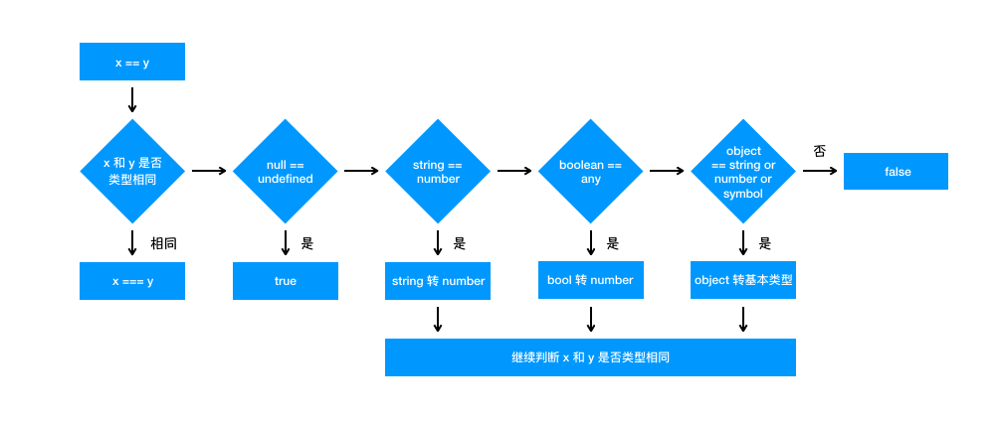

## JS 类型比较

对于 `==` 来说，如果对比双方的类型不一样的话，就会进行类型转换，这也就用到了我们上一章节讲的内容

1. 首先会判断两者类型是否相同。相同的话就是比大小了

2. 类型不相同的话，那么就会进行类型转换
3. 会先判断是否在对比 `null` 和 `undefined`，是的话就会返回 `true`
4. 判断两者类型是否为 `string` 和 `number`，是的话就会将字符串转换为 `number`

```js
1=='1'
  ↓
1==1
```

5. 判断其中一方是否为 `boolean`，是的话就会把 `boolean` 转为 `number` 再进行判断

```js
'1' == true
      ↓
'1' ==  1
        ↓
1  ==  1
```

6. 判断其中一方是否为 `object` 且另一方为 `string`、`number` 或者 `symbol`，是的话就会把 `object` 转为原始类型再进行判断

```js
'1' == { name: 'yck' }
      ↓
'1' == '[object Object]'
```

## 请写出`[]==![]`的结果？

答案是`true`,为什么呢？

1. 因为`!`运算的优先级大于`==`,所以先执行`![]`,

`！`可将变量转换成`boolean`类型，`null`、`undefined`、`NaN`以及空字符串`('')`取反都为`true`，其余都为`false`

所以 `![]` 运算后的结果就是 `false`，也就是 `[] == ![]` 相当于 `[] == false`

2. 根据上面提到的规则（如果有一个操作数是布尔值，则在比较相等性之前先将其转换为数值——`false`转换为`0`，而`true`转换为`1`），则需要把 `false` 转成 `0`，也就是 `[] == ![]` 相当于 `[] == false` 相当于 `[] == 0`

3. 根据上面提到的规则（如果一个操作数是对象，另一个操作数不是，则调用对象的`valueOf()`方法，用得到的基本类型值按照前面的规则进行比较，如果对象没有`valueOf()`方法，则调用 `toString()）`，也就是 `[] == 0` 相当于 `'' == 0`

4. 根据上面提到的规则（如果一个操作数是字符串，另一个操作数是数值，在比较相等性之前先将字符串转换为数值）

`Number('')` -> 返回的是 0,相当于`0 == 0` 自然就返回 `true`了

**总结**

`[] == ![]` -> `[] == false` -> `[] == 0` -> `'' == 0` -> `0 == 0` -> true

那么对于 `{} == !{}` 也是同理的

关键在于 `{}.toString() -> NaN`(返回的是 NaN)

根据上面的规则（如果有一个操作数是 NaN，则相等操作符返回 false）

总结一下：

`{} == ! {}` -> `{} == false` -> `{} == 0` -> `NaN == 0` -> false

**if 的判断原理**

`if`的判断原理和`Boolean()`这个函数有关的，所以`if(***)` 就相当于`Boolean(***)`

**Boolean 的判断规则：**

- 数字类型：`NAN`、`0`的结果为`false,`其他情况为`true`
- 字符串类型：空字符串是`false`,其他情况为`true`
- Boolean 类型：`false`为`false`,`true`为`true`
- 对象类型`undefined`、`null`为`false`,其他为`true`



```js
//1、多了括号，所以是表达式
console.log({}+[]) //[object Object]

//2、前面是代码块 所以直接执行+[]
{}+[]   // 0

//3、因为[]会被强制转换为"", 然后+运算符 链接一个{ }, { }强制转换为字符串就是"[object Object]"
[]+{}   //[object Object]

//4、不同浏览器不同，默认按谷歌,同等类型求值
{}+{}  //[object Object][object Object]

//5、[]=='0' -> 0=='0' -> 0==false
console.log([]==false) //true

//6、没有可比性 {}肯定是有值的
console.log({}==false) //false

//7、数组是真实存在的，所以进入if
if([]){
  console.log([]==false) //true
}

//8、+'a'强制转number
('b'+'a'+ +'a'+'a').toLocaleLowerCase() //banana

//9、直接拿原始值比
0=='0' //true

//10、Boolean('0')是有真实的字符串，所以是true
Boolean(0)==Boolean('0')  //false

//11、NaN与任何值都不相等
NaN==0   //false
NaN<=0  //false

//12、Number(0,10)==0  null 尝试转为number
null<=0 //true

```
