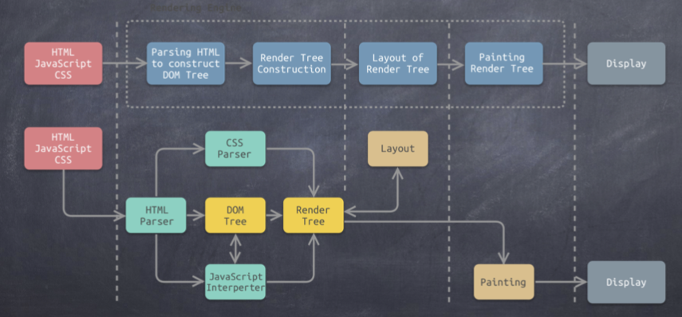

## 现代浏览器的特征

- 网络
- 资源管理
- 网页浏览
- 多页面管理
- 插件和扩展
- 账户和同步
- 安全机制
- 开发者工具

## 现代浏览器的结构

- 用户界面(User Interface)
- 浏览器引擎(Browser Engine)

  界面是直接和浏览器引擎打交道的，不会跨级和下面的打交道，能够解析 URL

- 渲染引擎(Rendering Engine)

  能够将 html/css/javascript 文本及相应的资源文件转换成图像结果。

  **渲染引擎的种类：**

  - IE,Edge(旧) ---> Trident 引擎
  - Firefox ---> GEcko 引擎
  - Safari ---> Webkit
  - Chromium/Chrome,Opera,Edge ---> Blink(Webkit fork)引擎

  **工作流程**

  输入时 html/css/javascript

  虚框里面是渲染引擎的处理流程，

  输出就是展示出来

  <!--  -->
  

  虚框里面的步骤：

  - 解析 DOM 树，生成 HTML 骨架
  - 生成渲染树，需要 css 参与
  - 对渲染树进行布局(排版规则)
  - 绘制 DOM 树显示出来

* 网络(NetWorking)

  处理字符集切换，先转码，再字符集切换。

* 插件和扩展(XML 解析器)

* 显示后端(Display Backend)

  给界面提供一些绘图和窗口的一些基本支持，包括各种字体

* 数据持久层(Data Persistence)

  内存的数据保存到硬盘上，还包括 cookie，证书等，

## Chrome 架构

- Browser：控制程序的 chrome 部分，包括地址栏，书签，后退和前进按钮，还处理 web 浏览器的不可见的合特权部分，例如网络请求和文件访问
- Renderer(渲染)：负责显示网站的选项卡的所有内容
- Plugin：控制网站使用的所有插件，例如 Flash
- GPU（负责 display 模块）：独立与其他金的 GPU 处理人物，他被分成多个不同的进程，因为 GPU 处理来自多个程序的请求并将它们绘制在同一页面中

所有浏览器都比较吃内存，

### 渲染器进程

- 渲染器进程负责选项卡内发生的所有事情，在渲染器进程中，主线程处理你为用户编写的大部分代码
- 如果你是用了 web worker 或 service worker,有时 javascript 代码的一部分将由工作线程处理,排版和栅格县城也在渲染器进程内运行，以便高效、流畅地呈现页面

### 渲染解析

- html 文档首先是生成 DOM 树，一边解析一边让网络请求线上的资源，主资源是文档本身，子资源是里面请求网络的进程，一旦扫到 script 文件，DOM 生成会暂停，因为 js 可能会操作 DOM
- 计算样式表，把样式表中定义的样式和 DOM 树的元素做关联（在主线程完成）
- 生成渲染树，布局处理模块根据样式描述规则来绘制

### Chorme 渲染过程-GPU

- CPU 什么工作都能做，但是做某些事效率不高，做整数运算
- GPU 众核处理器，浮点运算
- 一旦创建了层树并确定了绘制顺序，主线程就会将信息提交给合成器线程，合成器线程然后栅格化每个图层，一个图层可能像页面的整个长度一样大，因此合成器线程会将它们分成图块，并将每个图块发送到光栅线程。栅格线程栅格化每一个 title 并将他们存储在 GPU 内存中
- 通过 IPC 将合成器帧提交给浏览器进程，这是可以从 UI 线程添加到另一个合成器帧以用于浏览器 UI 更改，或者从其他渲染器添加扩充数据，这些合成器帧被发送到 GPU 用来在屏幕上显示，如果发生滚动事件，合成器线程会创建另一个合成器帧并发送到 GPU
- 合成的好处是他可以在不涉及主线程的情况下完成，合成线程不需要等待样式计算或 javascript 执行，这既是合成动画是平滑性能的最佳选择的原因，如果需要在即计算布局或绘图，则必须涉及主线程。

### Chorme 渲染过程-解析

- 构建 DOM
- 子资源加载 --注意 javascript 可以阻止解析
- 提示浏览器图和加载资源
- 样式表计算
- 布局
- 绘制
