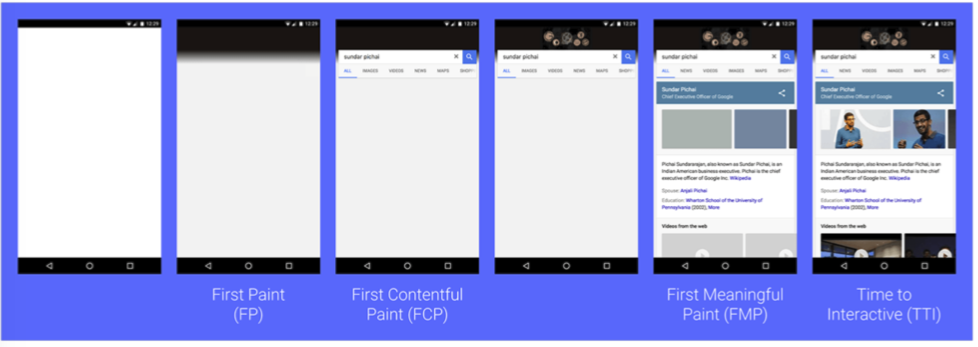
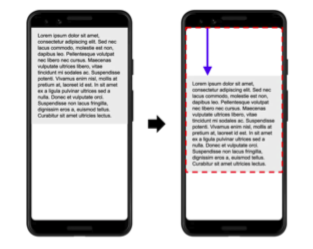

## 首屏性能相关名词

### 概念 ①

**1. TTFB**

Time To First Byte,首字节时间

**2. FP**

First Paint，**首次绘制**，它代表浏览器第一次向屏幕传输像素的时间，就是页面在屏幕上首次发生视觉变化的时间

**3. FCP**

First Contentful Paint ,**首次有内容的绘制**，代表浏览器第一次向屏幕绘制 “内容” (只有首次绘制文本、图片（包含背景图）、非白色的 canvas 或 SVG 时才被算作 FCP)

**4. FMP**

First Meaningful Paint ,**首次有意义的绘制**，主要内容”开始出现在屏幕上的时间点。它是我们测量用户加载体验的主要指标

**5. TTI**

Time To Interactive, 可交互时间，推荐的响应时间是 `100ms` 以内否则有延迟感，网页第一次 完全达到可交互状态 的时间点

**6. Long tasks**

超过了 50ms 的任务

**7. SSR&&CSR**

服务端渲染和客户端渲染

**8. Isomorphic JavaScript**

同构化

### 概念 ②

**1. LCP 最大内容绘制**

Largest Contentful Paint，用于记录视窗内最大的元素绘制的时间，该时间会随着⻚面渲染变化而变化，因为⻚面中的最大元素在渲染过程中可能会发生改变，另外该指标会在用户第一次交互后停止记录。

> 值的区间：

- 小于 2.5sec,不需要优化
- 2.5sec ~ 4.0sec,需要优化
- 大于 4.0sec,很需要优化

**2. FID 首次输入延迟**

First Input Delay，记录在 FCP 和 TTI 质检用户首次与页面交互响应的延迟。

> 值的区间：

- 小于 100ms,不需要优化
- 100ms ~ 300ms,需要优化
- 大于 300ms,很需要优化

**3. TBT 阻塞总时间**

Total Blocking Time，记录在 FCP 和 TTI 之间所有长任务的阻塞时间总和。

**4. CLS 累计位移偏移**

Cumulative Layout Shift，记录了⻚面上非预期的位移波动。使用按钮动态添加了某个元素，导致⻚面上其他位置的代码发生了偏移，造成了⻚面。

> 值的区间：

- 小于 0.1,不需要优化
- 0.1 ~ 0.25,需要优化
- 大于 0.25,很需要优化

### 举个例子 ①

下面的一张图显示了一个网站从输入网址到显示内容的过程

<!--  -->


在这个过程中主要是经历了 FP->FCP->FMP->TTI 的过程

**为什么会有白屏的产生呢？**

主要是 FP 主要做了以下工作：

- css、js 文件获取加载
- 解析 js
- 生成 DOM
- 生成 CSSDOM
  最后生成基本的 DOM 和基本的 css,这样首帧 html 包含的内存才产生，FP 产生的时候仅有一个 div 根节点，
  FCP 主要是包含页面的基本框架，但是没有数据内容，FMP 包含页面所有元素及数据

### 举个例子 ②

<!--  -->


如图所示，手机上的向下文本移动了 25% 的屏幕高度距离(位移距离)，位移前后影响
了 75% 的屏幕高度面积(位移影响的面积)，那么 CLS 为 0.25 \* 0.75 =0.1875

CLS 推荐值为低于 0.1，越低说明⻚面跳来跳去的情况就越少，用户体验越
好。毕竟很少有人喜欢阅读或者交互过程中网⻚突然动态插入 DOM 的情
况，比如说插入广告~

### 总结

- 首屏加载优化的核心任务是 LCP、FID、CLS

- LCP 代表了⻚面的速度指标， LCP 能体现的东⻄更多一些。一是指标实时更新，数据更精确，二是代表着⻚面最大元素的渲染时间，最大元素的快速载入能让用户感觉性能还挺好。

- FID 代表⻚面的交互体验指标，交互响应的快会让用户觉得网⻚流畅。

- CLS 代表了⻚面的稳定指标，尤其在手机上这个指标更为重要。因为手机屏幕挺小，CLS 值一大的话会让用户觉得⻚面体验做的很差

## css 会堵塞 DOM 渲染吗？

- js 会影响 DOM 渲染吗？

  `js`不影响`DOM`解析，影响`DOM`渲染

```html
<!DOCTYPE html>
<html lang="en">
  <head>
    <meta charset="UTF-8" />
    <meta name="viewport" content="width=device-width, initial-scale=1.0" />
    <title>Document</title>
  </head>
  <body>
    <h1>你好</h1>
    <script type="text/javascript">
      //DOM解析不影响 渲染依旧等待
      prompt('等待');
    </script>
  </body>
</html>
```

- css 会影响 DOM 的渲染和解析吗？

  `css` 不影响 `DOM` 解析，影响`DOM`渲染

```html
<!DOCTYPE html>
<html lang="en">
  <head>
    <meta charset="UTF-8" />
    <meta name="viewport" content="width=device-width, initial-scale=1.0" />
    <title>Document</title>

    <style type="text/css">
      h1 {
        color: red;
      }
    </style>
    <script type="type/javascript">
      function getDom(){
        console.log(document.querySelectorAll('h1'))
      }
      setTimeout(getDom,0)
    </script>
    <link
      rel="stylesheet"
      href="https://cdn.staticfile.org/twitter-bootstrap/5.0.0-alpha1/css/bootstrap-grid.css"
    />
  </head>
  <body>
    <!--
    1.css没回来之前 h1展示了 css不影响DOM渲染
    2.css没回来之前 h1没能拿到 css影响DOM解析
    css 影响DOM渲染 不影响DOM解析
   -->
    <h1>111</h1>
  </body>
</html>
```

- 同时存在 css 和 js 的时候，CSS 会影响 js 吗？

  会影响

```html
<!DOCTYPE html>
<html lang="en">
  <head>
    <meta charset="UTF-8" />
    <meta name="viewport" content="width=device-width, initial-scale=1.0" />
    <title>Document</title>

    <style type="text/css">
      h1 {
        color: red;
      }
    </style>

    <link
      rel="stylesheet"
      href="https://cdn.staticfile.org/twitter-bootstrap/5.0.0-alpha1/css/bootstrap-utilities.min.css"
    />
  </head>
  <body>
    <!--
    出现空白页面就是css阻塞了js
   -->
    <h1>111</h1>
    <script type="type/javascript">
      console.log(1)
    </script>
  </body>
</html>
```

- css 会影响 DOMContentLoaded 吗？

  有时影响，有时不影响，如果 `link` 下面还有脚本的话，则会影响

```html
<!DOCTYPE html>
<html lang="en">
  <head>
    <meta charset="UTF-8" />
    <meta name="viewport" content="width=device-width, initial-scale=1.0" />
    <title>Document</title>
    <script type="text/javascript">
      document.addEventListener('DOMContentLoaded', function() {
        console.log('DOMContentLoaded');
      });
    </script>

    <link
      rel="stylesheet"
      href="https://cdn.staticfile.org/twitter-bootstrap/5.0.0-alpha1/css/bootstrap-utilities.css"
    />
    <script type="text/javascript">
      console.log('nih');
    </script>
  </head>
  <body>
    <h1>111</h1>
  </body>
</html>
```
