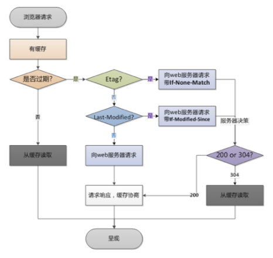
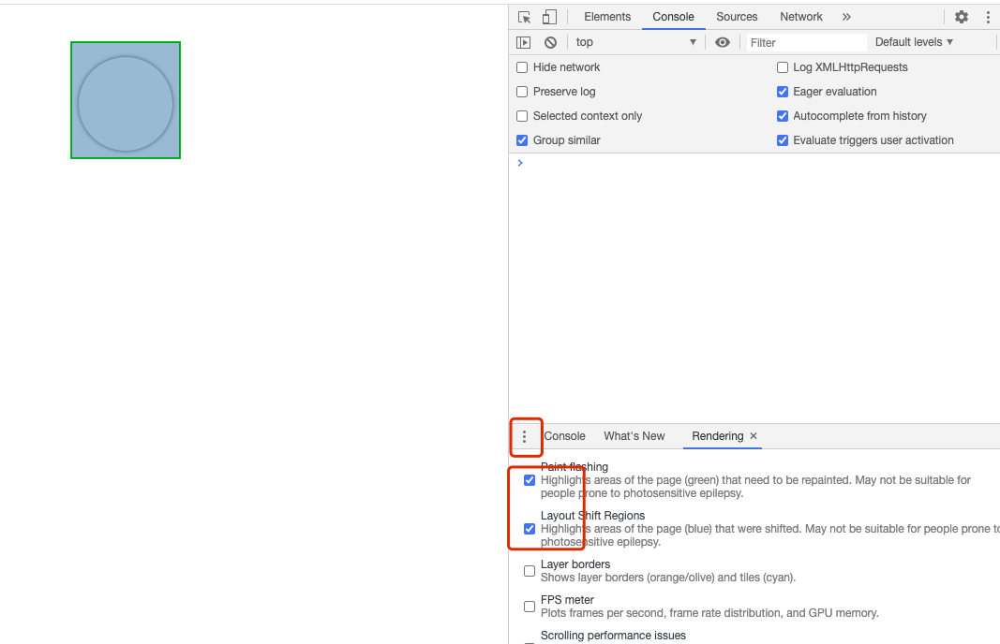
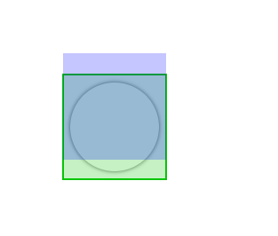
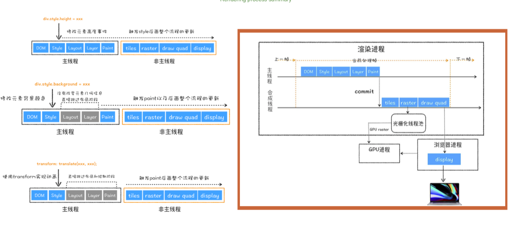

## 为什么要进行性能优化？

`PV` 是一天之内网站一个页面被访问的次数，`UV`是指网站有多少个独立用户

- 57%的用户更在乎网页 3 秒内是否完成加载
- 52%的在线用户认为网页打开速度影响到他们对网站的忠实度
- 每慢一秒造成页面 PV 降低 11%，用户满意度也随之降低 16%
- 近半数移动用户因为在 10 秒内认为打开页面而放弃

## 性能优化学徒工

### 雅虎军规

- 减少`http`请求数量
- 减少`DNS`的查找数量（使用 DNS 预解析）
- `html` 数量的控制，可以用伪类来代替新增 dom 元素，善用 `css`
- 文件压缩合并 文件大于 30kb 单独拎出来，小于 30kb 就合并在一起
- 多个 `CDN` 加速
- 离线缓存
- `keep-alive http2`

  `keep-alive` 解决的核心问题是：在一定时间内，同一域名多次请求数据，只建立一次 HTTP 请求，其他请求可复用每一次建立的链接通道，以达到提高请求效率的问题，一定时间是可以配置的。HTTP1 还是存在效率问题，

  第一个：串行的文件传输

  第二个：连接数躲过

  HTTP2 对同一域名下所有请求都是基于流，也就是说同一域名不管访问多少文件，也只建立一路连接，同样 Apache 的最大连接
  数为 300，因为有了这个新特性，最大并发可以提升到 300，比原来提升了 6 倍

### 缓存策略

缓存的优先级是：

- `cache-control` 本地缓存目录中，文件过期的时间（由服务器指定过期的间隔时间，由于浏览器根据间隔生成具体的时间）
- `expires`
  本地缓存目录中，文件过期的时间（由服务器指定具体的时间）

在 http 头中设置一个过期时间，在这个过期时间之前，浏览器的请求都不会发出，而是
自动从缓存中读取文件，除非缓存被清空，或者强制刷新。缺陷在于，服务器时间和用 户端时间可能存在不一致，所以 HTTP/1.1 加入了 cache-control 头来改进这个问题。

- `etag` 文件标识
  这也是一组请求/相应头 响应头:

etag: "D5FC8B85A045FF720547BC36FC872550" 请求头:

if-none-match: "D5FC8B85A045FF720547BC36FC872550"

原理类似，服务器端返回资源时，如果头部带上了 etag，那么资源下 次请求时就会把值加入到请求头 if-none-match 中，服务器可以对比 这个值，确定资源是否发生变化，如果没有发生变化，则返回 304。

- `last-modified`
  服务器端返回资源时，如果头部带上了 last-modified，那么 资源下次请求时就会把值加入到请求头 if-modified-since 中，服务器可以对比这个值，确定资源是否发生变化，如果 没有发生变化，则返回 304。

缓存还有本地缓存：localStorage，sessStorage，Cookies
localStorage：缓存空间 5M，速度比较快，属于异步

<!--  -->


```js
//1. 常用的缓存库 jquery http强缓存
//2. 业务代码 本地缓存 mad5变化非常频繁的 http->失败

//一般 首页不让缓存
//根据用户网速来判断展示哪些重要的，不重要的可以不展示
```

### 网站协议

- `HTTP2` 多路复用

浏览器请求//xx.cn/a.js-->解析域名—>HTTP 连接—>服务器处理文件—>返回数据-->浏览器解析、渲染文件。Keep-Alive 解决的核心问 题就在此，一定时间内，同一域名多次请求数据，只建立一次 HTTP 请求，其他请求可复用每一次建立的连接通道，以达到提高请求 效率的问题。一定时间是可以配置的，HTTP1.1 还是存在效率问题，第一个:串行的文件传输。第二个:连接数过多。HTTP/2 对同一 域名下所有请求都是基于流，也就是说同一域名不管访问多少文件，也只建立一路连接。同样 Apache 的最大连接数为 300，因为有了 这个新特性，最大的并发就可以提升到 300，比原来提升了 6 倍!

### 小字为先

## 渲染中性能优化

- 重绘影响
- 如何规避
- 重排影响
- 高效渲染
  下面看一个 demo,来看看重排和重绘到底是什么？
  首先写一个移动的圆形小球，让它绕着四周移动，我们使用的代码是

```html
<!DOCTYPE html>
<html lang="en">
  <head>
    <meta charset="UTF-8" />
    <meta name="viewport" content="width=device-width, initial-scale=1.0" />
    <title>Document</title>
    <style type="text/css">
      .container {
        position: relative;
        min-height: 400px;
      }
      .boll {
        position: absolute;
        top: 0;
        left: 0;
        width: 100px;
        height: 100px;
        border-radius: 50%;
        box-shadow: 0 0 5px rgba(0, 0, 0, 0.75);
      }
      .ball-running {
        animation: run-around 4s infinite;
      }
      @keyframes run-around {
        0% {
          top: 0;
          left: 0;
        }
        25% {
          top: 0;
          left: 200px;
        }
        50% {
          top: 200px;
          left: 200px;
        }
        75% {
          top: 200px;
          left: 0;
        }
      }
    </style>
  </head>
  <body>
    <div class="container">
      <div class="boll" id="ball"></div>
    </div>
    <script type="text/javascript">
      var balls = document.getElementById('ball');
      balls.classList.add('ball');
      balls.classList.add('ball-running');
    </script>
  </body>
</html>
```

然后在 F12 上面的 console 那一栏上面上按下 Esc 出现一个标签栏，点击上面的三个点(更多)
勾选前两项，如图所示：

<!--  -->


下面是上面的代码的执行结果：

<!--  -->


紫色的是重排，绿色的是重绘，这种写法就会影响网页的性能，因为一直在重排和重绘。

修改的方案：

```js
@keyframes run-around{
  0%{
    // top:0;
    // left: 0;
    transform:translate(0,0)
  }
  25%{
    // top:0;
    // left: 200px;
    transform:translate(200px,0)
  }
  50%{
    // top:200px;
    // left: 200px;
    transform:translate(200px,200px)
  }
  75%{
    // top:200px;
    // left: 0;
    transform:translate(0,200px)
  }
}
```

修改之后的结果，没有出现蓝色和绿色的框，说明没有进行重排和重绘，为什么呢？因为 transform 会新开一个层，它是在那个层里面进行的合并，不会影响性能

<!--  -->


### 网页的整个渲染流程

网页动画性能在 F12 里面的 console 下面，按`ESC`出来一个框，点击更多选择 `Rendering` 就可以在里面选择性能的选项

- DOM 分层

- 对 DOM 元素节点计算样式结果 `Recalculate Style` 样式重计算

- 为每个节点 生成图形位置 `Layout` 回流重排

- 将每个节点绘制填充到图层位图中 `Paint`

- 图层作为纹理上传 `GPU` 上去

- `Composite Layers` 合成层 把符合图层生成到页面上

- Layout -> Paint -> Composite Layers

- `Composite Layers` 做了什么？
  - 图层的绘制列表 准备好 主线程 commit 合成线程
  - 合成线程 viewport 划分图块 256\*256
  - 生成我们的位图的过程栅格化 raster
  - 所有图块 合成生成 DrawQuad 提交给浏览器渲染进程
  - viz 组件 接收到 DarwQuad 绘制到我们的屏幕上

#### 分层

**会分层的元素：**

根元素、position 分层、transform、opacity、CSS 滤镜、canvas、video、overflow

**会让 GPU 参与的元素：**

CSS3D、Video、webgl、transform、css 滤镜、willl-change:transfrom

#### 重绘和重排（盒子动了）

- 盒子动了一定会重排

什么因素会产生重排：offset、scroll、client、width 等读属性

```js
//操作dom高效的方法 react就是利用了它进行读写分离
const width = doucument.getElementById('xx').width; //重排了
requestAnimationFrame(function() {
  //下一帧才去写
  // react
  // 设置dom元素 读写分离
});
```

- `cpu：` 主要负责操作系统和程序
- `gpu：` 负责显式、数据处理、效率更高 (库 gpu.js)

[fastdom](https://www.npmjs.com/package/fastdom)

[查看样式重排重绘](https://csstriggers.com/)

### 渲染流程总结

<!--  -->


## 几种渲染方式的比较

| name | CSR                                                 | 预渲染                                                         | SSR                                           | 同构                                                                                                              |
| ---- | --------------------------------------------------- | -------------------------------------------------------------- | --------------------------------------------- | ----------------------------------------------------------------------------------------------------------------- |
| 优点 | 不依赖数据，FP 时间最快，客户端体验好，内存数据共享 | 不依赖数据 ，FCP 时间比 CRS 快，客户端用户体验好，内存数据共享 | SEO 友好，首屏性能高，FMP 比 CSR 金额预渲染快 | SEO 友好，首屏性能高，FMP 比 CSR 金额预渲染快，客户端用户体验好，内存数据共享，客户端与服务器代码公用，开发效率高 |
| 缺点 | SEO 不友好，FCP、FMP 慢                             | FCP、FMP 慢                                                    | 客户端数据共享成本高，模板维护成本高          | Node 容易形成性能瓶颈                                                                                             |
