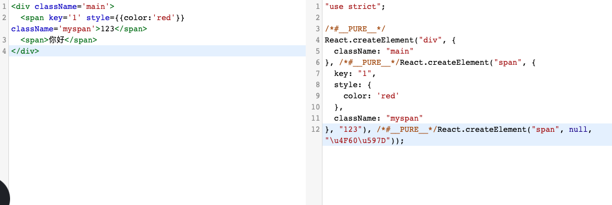

## React16.13.0 结构介绍

- `.prettierrc.js` 代码风格格式化统一
- `.nvmrc` node 版本管理
- `.editorconfig` 对不同的代码编辑器来规范，这个和`.prettierrc.js`重复之后，`.prettierrc.js`的优先级更高
- `dangerfile.js` 测试使用
- `appveyor.yml`和`netlify.toml` CI 工具
- `script` 文件夹下面就是打包配置的一些文件
- `packages` 文件夹主要是放源码

## React.createElement

通常我们用`react`的`jsx`语法写完之后都是经过`babel`转义的成`createElement`对象处理之后渲染到`DOM`元素上的。

<!--  -->


下面是`react`源码里面的关于生产环境下的`createElement`的代码，我们来看看主要是怎么实现的？

```js
// packages/react/src/ReactElement.js

export function createElement(type, config, children) {
  let propName;

  // Reserved names are extracted
  const props = {};

  let key = null;
  let ref = null;
  let self = null;
  let source = null;

  if (config != null) {
    // ref和key是两个特殊的属性，要单独处理
    if (hasValidRef(config)) {
      ref = config.ref; //得到组件的引用，得到最终的Dom元素

      if (__DEV__) {
        warnIfStringRefCannotBeAutoConverted(config);
      }
    }
    if (hasValidKey(config)) {
      key = '' + config.key;
    }

    self = config.__self === undefined ? null : config.__self;
    source = config.__source === undefined ? null : config.__source;
    // Remaining properties are added to a new props object
    // 遍历config得到props 如果对象本身存在该属性就复制
    for (propName in config) {
      if (
        hasOwnProperty.call(config, propName) &&
        !RESERVED_PROPS.hasOwnProperty(propName)
      ) {
        props[propName] = config[propName];
      }
    }
  }

  // Children can be more than one argument, and those are transferred onto
  // the newly allocated props object.
  //下面这个地方是处理子元素的
  // createElement可以传递N个参数，N-2就是子元素的个数
  const childrenLength = arguments.length - 2;
  if (childrenLength === 1) {
    props.children = children;
  } else if (childrenLength > 1) {
    const childArray = Array(childrenLength);
    for (let i = 0; i < childrenLength; i++) {
      childArray[i] = arguments[i + 2];
    }
    if (__DEV__) {
      if (Object.freeze) {
        Object.freeze(childArray);
      }
    }
    props.children = childArray;
  }

  // Resolve default props
  // 赋值为default
  if (type && type.defaultProps) {
    const defaultProps = type.defaultProps;
    for (propName in defaultProps) {
      if (props[propName] === undefined) {
        props[propName] = defaultProps[propName];
      }
    }
  }
  if (__DEV__) {
    if (key || ref) {
      const displayName =
        typeof type === 'function'
          ? type.displayName || type.name || 'Unknown'
          : type;
      if (key) {
        defineKeyPropWarningGetter(props, displayName);
      }
      if (ref) {
        defineRefPropWarningGetter(props, displayName);
      }
    }
  }
  // 创建一个ReactElement
  return ReactElement(
    type,
    key,
    ref,
    self,
    source,
    ReactCurrentOwner.current,
    props,
  );
}
```

上面代码可以看出主要是返回了一个`element`对象,`createElement`传入了三个参数：

- `type` 表示你要渲染的 DOM 元素类型
- `config` 创建`React`元素所需要的`props`。包含 `style，className` 等,`ref`和`key`是不会挂载到 DOM 元素上,`ref`可以找 DOM 元素，也可以调用组件的实例,`key`是可以用作`diff`算法判断差异
- `children` 要渲染元素的子元素，这里可以向后传入 n 个参数。参数类型皆为`React.createElement` 返回的`React`元素对象

`ReactElement`只是一个用来承载信息的容器，它会告诉后续的操作这个节点的以下信息：

- `type`类型，用于判断如何创建节点；
- `key`和`ref`这些特殊信息；
- `props`新的属性内容；
- `$$typeof`用于确定是否属于`ReactElement`；

> 在某种情况下可以直接使用`React.createElement()`,例如：批量化生产表单系统，在使用`antd`的`Input`组件的时候,`createElement`有时候还是具有灵活性的

## React.Children.map

一般在`React`里面渲染数组都是通过`map`的方法来实现

```js
render(){
  return <div>
    {
      ['a','b','c'].map((item)=>{
        return <span key={item}>{{item}}</span>
      })
    }
  </div>
}
```

`React.Children` 提供了用于处理 `this.props.children` 不透明数据结构的实用方法。

**为什么要使用 React.Children.map， 而不是直接使用 this.props.children.map?**

- 1. React.Children.map 是一种安全的用法，会默认判断 null,undefined，对象，字符串等情况，即使类型不是 Array，也不会报错
- 2. React.Children.map 会默认展平多维数组
- 3. 迭代器也可以支持输出

**React.Children.map 用法**

```js
//父组件
<Parent>
  <h1>Welcome.</h1>
  <h1>Welcome.</h1>
</Parent>
// Parent.js
render(){
  return <div>
    {
      React.children.map(result,(item)=>{
        return <span key={item}>{{item}}</span>
      })
    }
  </div>
}

//正确写法
render(){
  return <div>
    {React.Children.map(['a'], () => {
        return <p>11</p>
    })}
  </div>
}

//错误写法 会报错
render(){
  return <div>
    {React.Children.map([{a:1}], () => {
        return <p>11</p>
    })}
  </div>
}
```

**React.children.map 源码解析**

`react/src/ReactChildren.js`主要是在这个文件里面

```js
function mapChildren(children, func, context) {
  //如果传入的是null 直接返回null
  if (children == null) {
    return children;
  }
  const result = [];
  //处理数组
  mapIntoWithKeyPrefixInternal(children, result, null, func, context);
  return result;
}

function mapIntoWithKeyPrefixInternal(children, array, prefix, func, context) {
  let escapedPrefix = '';
  if (prefix != null) {
    escapedPrefix = escapeUserProvidedKey(prefix) + '/';
  }
  const traverseContext = getPooledTraverseContext(
    array,
    escapedPrefix,
    func,
    context,
  );
  // 将嵌套的数组展平
  traverseAllChildren(children, mapSingleChildIntoContext, traverseContext);
  releaseTraverseContext(traverseContext);
}
```

## React fiber 的大致思路

**为什么要用 fiber 调度， 它解决了什么问题？**

1. `react16`以前的调度算法, 采用自顶向下递归，更新整个子树，这个过程不可打断，不可取消，如果子树特别大的话，主线程就会一直被占用，会造成页面的掉帧，出现卡顿。

2. `react16`推出的`fiber`调度， 分为两个阶段，一个是`reconciliation`阶段，二是`commit`阶段，在`reconciliation`阶段：fiber 在执行过程中以`fiber`为基本单位，每执行完一个`fiber`，都会有一个询问是否有优先级更高的任务的一个判断，如果有优先级更高的任务进来，就中断当前执行，先执行优先级更高的任务。这个阶段会进行`dom diff`， 生成`workInProgressTree`,并标记好所有的`side effect`。


    - 数值结构变成了链表结构
    - 任务+过期时间/优先级
    - `reconciliation`可以被打断，不会渲染到页面上的；`commit`阶段，一次执行完。side effect

3. commit 阶段，处理所有的 side effect ， 执行更新操作。此阶段不可中断

## ReactDom.render 分析

1.  创建 Root， ReactRoot, FiberRoot , FiberNode,他们之间的属性是：

```js
  Root: {
    _reactRootContainer: RootType
  }

  RootType: {
    _internalRoot: FiberRoot
  }

  FiberRoot: {
      // 当前应用对应的Fiber对象
    current: uninitializedFiber, FiberNode
    // root节点
    containerInfo: containerInfo,
    // 指向当前已经完成准备工作的Fiber Tree Root， 在commit阶段处理
    finishedWork: null, // Fiber, 链表结构
    // 过期时间
    expirationTime: NoWork,
  }

  FiberNode : {
    // FiberNode的类型
    this.tag = tag;
    this.key = key;
    this.elementType = null;
    // Function|String|Symbol|Number|Object
    this.type = null;
    this.stateNode = null;
    // 深度优先遍历的
    // Fiber  表示父级 FiberNode
    this.return = null;
    // 表示第一个子 FiberNode
    this.child = null;
    // 表示紧紧相邻的下一个兄弟 FiberNode
    this.sibling = null;
    this.index = 0;
    // 拿到真实的dom实例
    this.ref = null;
    // 表示新的props
    this.pendingProps = pendingProps;
    // 当前fiber的旧props
    this.memoizedProps = null;
    // 更新队列，队列内放着即将要发生的变更状态
    this.updateQueue = null; // 最终会遍历这个update链表
    // 表示经过所有流程处理后的当前的state
    this.memoizedState = null;
    this.contextDependencies = null;

    this.mode = mode;

    // effectTag 更新类型，例如， replace， delete， update
    this.effectTag = NoEffect;
    // 下一个将要处理的副作用F
    this.nextEffect = null;
    // 第一个需要处理的副作用
    this.firstEffect = null;
    // 最后一个将要处理的副作用F
    this.lastEffect = null;
    // 过期时间是和优先级有关
    this.expirationTime = NoWork;
    // 子fiber中优先级最高的filber
    this.childExpirationTime = NoWork;
    // 连接上一个状态的fiber，储存了之前的镜像
    this.alternate = null; // 上一次更新时的旧Fiber = WorkInProgress.alternate
  }
```

2. 封装了`callBack`函数
3. 执行了`unbatchedUpdates`， 调用`updateContainer`（以非批处理的形式运行）
4. `updateContainer`

   1.

   2. 设置`expirationTime`
   3. 封装`callback`
   4. 新建一个`update`，添加到`fiber`的`updateQuene`里

   ```js
   {
     expirationTime: expirationTime,
     tag: UpdateState,
     payload: null,   // element
     callback: null,  // callback

     next: null,  // 下一个update
     nextEffect: null,  // 下一个副作用
   }
   ```

### scheduleWork(调度流程)

调用 `scheduleWork` (只要涉及到更新，都会从这里开始走, `this.setState`)

1. 找到`FiberRoot`

2. 判断是否有高优先级任务打断当前正在执行的任务
3. 如果有最高优先级而且处于`unbatchUpdate`下执行`performSyncWorkOnRoot`
4. 其它调用`ensureRootIsScheduled`进入异步调度流程

### ensureRootIsScheduled

此处会判断是否有优先级更高的任务进来，如果有，会中断现在的任务，如果没有，就继续执行

### unstable_scheduleCallback

- 区分延时任务(`timeQuene`)和及时任务(`taskQuene`)，创建任务
- 存在及时任务，调用`requestHostCallback`

### requestHostCallback

1. 创建 `MessageChannel`

2. 调用`port.postMessage`,根据 `MessageChannel`的特性，调用`port.postMessage`后，会在宏任务里执行`performWorkUntileDeadLine`
3. 在`performWorkUntileDeadLine`会逐步根据当前时间吧延时任务添加到及时任务
4. 在宏任务中执行`callback`,也就是`performSyncWorkOnRoot`
5. 如果存在子任务，则递归执行`performWorkUntileDeadLine`

### performSyncWorkOnRoot

#### workLoopSync

此处只要执行力三个操作：

- 标记上下文为`RenderContext`
- 执行`workLoopSync`递归创建`fiber tree`标记副作用，`render`以及之前的生命周期都将在此阶段执行
- 调用`finishSyncRender`,渲染页面，执行剩下的生命周期

调用`beginWork`，在`beginWork`创建`Fiber`节点，如果`Next`节点不为空，继续处理`next`节点，直到`next`为 null 说明已经创建完整个`Fiber tree`了，之后调用`completeUnitOfWork`，创建 Dom 对象等。注意： `completeUnitOfWork`阶段虽然创建了 dom 对象，但是还不会渲染到页面上，只是保存着。

**beginWork**

- 初次则创建`fiber`节点
- 非初次则进行`diff`,打上`Effect`更新标记
- 执行`render`之前的生命周期，以及执行`render`生命周期，获得子节点，继续循环执行`beginWork`
- 链接上父级节点，形成`FiBer tree`

**参考资料**

[react 官网](https://zh-hans.reactjs.org/docs/concurrent-mode-adoption.html#why-so-many-modes)
