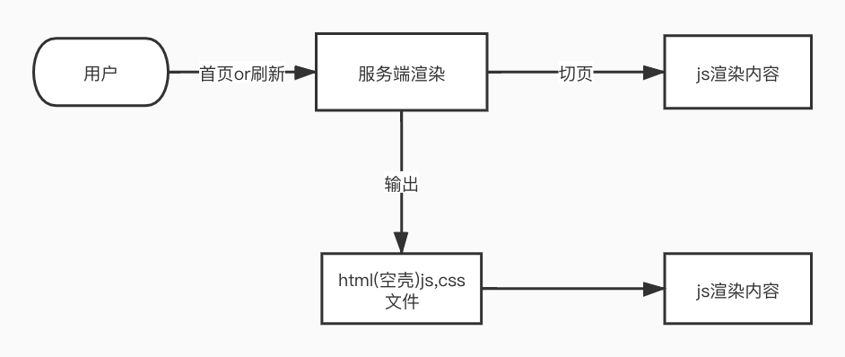
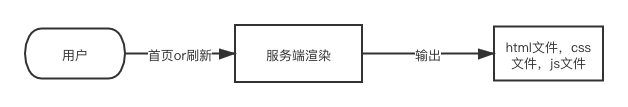
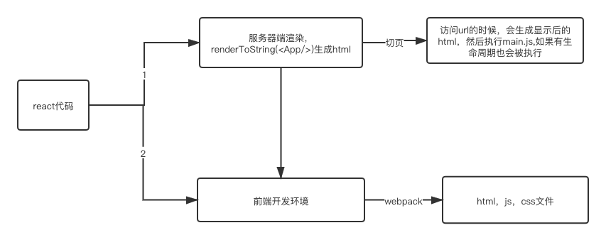

## 客户端渲染介绍

下面的这段代码就是客户端渲染出来的

```html
<!DOCTYPE html>
<html lang="en">
  <head>
    <meta charset="utf-8" />
    <link rel="icon" href="/favicon.ico" />
    <meta name="viewport" content="width=device-width, initial-scale=1" />
    <meta name="theme-color" content="#000000" />
    <meta
      name="description"
      content="Web site created using create-react-app"
    />
    <link rel="apple-touch-icon" href="/logo192.png" />
    <link rel="manifest" href="/manifest.json" />
    <title>React App</title>
  </head>
  <body>
    <noscript>You need to enable JavaScript to run this app.</noscript>
    <div id="root"></div>
    <script src="/static/js/bundle.js"></script>
    <script src="/static/js/0.chunk.js"></script>
    <script src="/static/js/main.chunk.js"></script>
  </body>
</html>
```

真正页面的内容是在 js 里面执行的，所以叫客户端渲染，

1. 如果 main.js 加载比较慢，就会出现白屏现象
2. 传统的搜索引擎爬虫因为不能抓取 js 生成后的内容，遇到单页 web 项目就是什么都抓取不到，在 SEO 上不友好

**客户端渲染流程**

<!--  -->


### 客户端渲染的优缺点

- 优点
  - 可见既可操作，例如 js 加载好之后，页面的跳转点击都会很自然
  - 页面操作流程自然
- 缺点
  - 白屏时间长
  - SEO 不友好

## 服务端渲染

server side render：就是服务端渲染，不同于 jsp,php 等传统服务端渲染,

页面上任何的一个文案在源代码里面都是能找到的，服务器端渲染的页面就是返回一个 html 片段，客户端不需要请求 js 就能访问

目前的 ssr 是基于 react vue 等前端框架的同构渲染（即一份代码，同时运行在 server 和 client 端）

**服务端渲染流程**

<!--  -->


### 服务端渲染的优缺点

- 优点
  - SEO 友好
  - 首屏加载快
- 缺点
  - 页面体验不好
  - 可见不一定可操作
  - 服务器压力过大

## React SSR

React SSR 正好解决客户端 SEO 不友好和 js 太大加载很慢导致的页面白屏问题

### React SSR 流程图

<!--   -->

上图就是ssr的流程，服务端只是生成了html代码，实际上是前端生成一个main.js，提供给服务端的html使用

### React SSR 优缺点

- 优点
  - SEO 友好
  - 首屏时间快
  - 页面切换自然
- 缺点
  - 配置复杂
  - 服务器压力大，但是比传统的服务器端小
  - 部分开发受限制 ComponentDidMount

## 下面开始搭建一个 ssr 小 demo

首先是创建一个 react-ssr 的文件夹，里面的目录如下：

<!--  -->


### 首先是服务端

我们使用的是 koa 启动一个服务，代码如下:

```js
const Koa = require('koa');
const Router = require('koa-router');
const serve = require('koa-static');

const app = new Koa();
const router = new Router();

router.get('/', (ctx, next) => {
  ctx.body = `<!DOCTYPE html>
  <html lang="en">
  <head>
    <meta charset="UTF-8">
    <meta name="viewport" content="width=device-width, initial-scale=1.0">
    <title>Document</title>
  </head>
  <body>
    <div id='root'></div>
    <script src="bundle.js"></script>
  </body>
  </html>`;
});

app.use(serve('dist'));

app.use(router.routes()).use(router.allowedMethods());

app.listen(8088, () => {
  console.log('服务启动成功');
});
```

该服务主要是在根目录下面返回一个 html 页面，里面引用的`bundle.js`是通过 react 打包出来的一个前端页面的 js 文件，所以需要在静态 html 里面引入`bundle.js`

使用的插件如下：
@types 是 typescript 下面的插件，如果是使用 ts 的话需要安装

```bash
# yarn add koa @types/koa
# yarn add koa-router @types/koa-router
# yarn add koa-static
```

执行 `node src/server/app.js`,显示服务启动成功就是本地服务已经启动好

### 下面是客户端

首先是在`shared/App.tsx`文件里面写入需要渲染的 react 代码

```js
import React from 'react';

const App = () => {
  return <h1>hello world</h1>;
};

export default App;
```

接下来是`client/index.tsx`里面导出组件到页面的`root`根元素里面

```js
import React from 'react';
import ReactDOM from 'react-dom';
import App from '../shared/App';

ReactDOM.render(<App />, document.getElementById('root'));
```

那既然已经有了`react`代码，那是不是得要一个`webpack`来打包`react`代码呢?

下面就开始写`webpack.client.js`文件

```js
const path = require('path');
module.exports = {
  mode: 'development',
  entry: path.join(__dirname, '../src/client/index.tsx'), //入口文件
  output: {
    //打包出来的文件名和地址
    filename: 'bundle.js',
    path: path.join(__dirname, '../dist'),
  },

  module: {
    //因为webapck本身是不支持ts的，所以需要借助插件来转义
    rules: [
      {
        test: /\.ts(x)?/,
        use: ['babel-loader'], //所以就需要下载babel-loader这个插件,还需要下载@babel/core
      },
    ],
  },
  resolve: {
    //配置如何解析模块
    extensions: ['.ts', '.tsx', '.js', '.json'], //尝试按顺序解决这些扩展名,如果多个文件共享相同的名称，但具有不同的扩展名，则webpack将解析该扩展名在数组中首先列出的文件，并跳过其余文件
  },
};
```

因为`react`代码也是需要用`babel`转换，所以需要`yarn add @babel/preset-react`,然后就是在项目根目录下面新建`.babelrc`文件,配置`babel`

```js
{
  "presets":["@babel/preset-react"]
}
```

效果如图所示：


<!--  -->

查看源代码：

```html
<!DOCTYPE html>
<html lang="en">
  <head>
    <meta charset="UTF-8" />
    <meta name="viewport" content="width=device-width, initial-scale=1.0" />
    <title>Document</title>
  </head>
  <body>
    <div id="root"></div>
    <script src="bundle.js"></script>
  </body>
</html>
```

上述代码中查看不到`Hello World`的字样，但是在 bundle 中是可以查看的，所以这个是一个典型的客户端渲染例子。我们慢慢一步一步把这个客户端渲染的例子改成 SSR

接下来是打包 node,新建一个`webpack.server.js`,node 作为后端打包的时候一般不希望把 node 的依赖项打进去，所以需要安装一个插件`yarn add webpack-node-externals -D`,

```js
const path = require('path');
var nodeExternals = require('webpack-node-externals');

module.exports = {
  mode: 'development',
  target: 'node', //表示打包的是node环境
  externals: [nodeExternals()], //避免把node_modules打包进去
  entry: path.join(__dirname, '../src/server/app.tsx'),
  output: {
    filename: 'app.js',
    path: path.join(__dirname, '../dist'),
  },

  module: {
    rules: [
      {
        test: /\.ts(x)?/,
        use: ['babel-loader'],
      },
    ],
  },
  resolve: {
    extensions: ['.ts', '.tsx', '.js', '.json'],
  },
};
```

然后在`package.json`里面编写服务端的打包命令

```js
"scripts": {
  "build:client": "webpack --config build/webpack.client.js",
  "build:server": "webpack --config build/webpack.server.js"
},
```

先执行`npm run build:client`,在执行`npm run build:server`,用`cd dist && node app.js`,就可以访问了

因为每次修改都要执行打包命令有点麻烦，所以我们可以使用`nodemon`来启动服务，因为每次都要打包客户端和服务端的代码，所以我们可以使用`npm-run-all`来批量打包

```js
"scripts": {
  "start": "cd dist && nodemon app.js",
  "build": "npm-run-all --parallel build:*",
  "build:client": "webpack --config build/webpack.client.js",
  "build:server": "webpack --config build/webpack.server.js"
},
```

如果有修改只需要重新执行`npm run build`然后刷新页面就会看到更新

上述步骤这么多，但是还是只是一个客户端渲染，大家不要着急，其实[react 官网](https://zh-hans.reactjs.org/docs/react-dom-server.html#rendertostring)里面有介绍，主要是使用`renderToString()`这个 api

```js
import Koa from 'koa';
import Router from '@koa/router';
import serve from 'koa-static';
import React from 'react'; //新增
import { renderToString } from 'react-dom/server'; //新增
import App from '../shared/App'; //新增

const app = new Koa();
const router = new Router();

router.get('/', (ctx, next) => {
  const html = renderToString(<App />); //新增
  ctx.body = `<!DOCTYPE html>
  <html lang="en">
  <head>
    <meta charset="UTF-8">
    <meta name="viewport" content="width=device-width, initial-scale=1.0">
    <title>Document</title>
  </head>
  <body>
    <div id='root'>${html}</div> 
    <script src="bundle.js"></script>
  </body>
  </html>`;
});

app.use(serve('public'));

app.use(router.routes()).use(router.allowedMethods());

app.listen(8088, () => {
  console.log('服务启动成功');
});
```

启动成功，查看源代码：

```js
<!DOCTYPE html>
  <html lang="en">
  <head>
    <meta charset="UTF-8">
    <meta name="viewport" content="width=device-width, initial-scale=1.0">
    <title>Document</title>
  </head>
  <body>
    <div id='root'><h1 data-reactroot="">hello world</h1></div>
    <script src="bundle.js"></script>
  </body>
  </html>
```

可以在上面看到`Hello World`,说明一个简单的 ssr 渲染已经完成了
