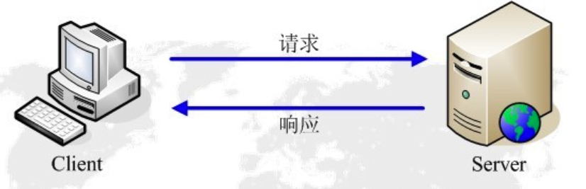
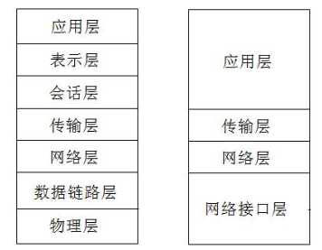

## http 请求模型

<!--  -->

## 在浏览器输入 url 之后发生了什么？

简单版：

1. 输入网址并且回车
2. 解析域名
3. 浏览器发送 http 请求
4. 服务器处理请求
5. 服务器返回 html 响应
6. 浏览器处理 html 页面
7. 继续请求其他资源

## 什么是 http 协议？

HTTP 是超文本传输协议，从 www 浏览器传输到本地浏览器的一种传输协 议，网站是基于 HTTP 协议的，例如网站的图片、CSS、JS 等都是基于 HTTP 协议进行传输的

HTTP 协议是由从客户机到服务器的请求(Request)和从服务器到客户机 的响应(response)进行约束和规范

## 了解 TCP/IP 协议

1. 应用层：

&nbsp;&nbsp;&nbsp;&nbsp;&nbsp;为用户提供所需要的各种服务，例如:HTTP、FTP、DNS、SMTP 等.

2. 传输层：

&nbsp;&nbsp;&nbsp;&nbsp;&nbsp;为应用层实体提供端到端的通信功能，保证数据包的顺序传送及数 据的完整性。
该层定义了两个主要的协议:传输控制协议(TCP)和用户数据报协 议(UDP).

3. 网络层：

&nbsp;&nbsp;&nbsp;&nbsp;&nbsp;主要解决主机到主机的通信问题。IP 协议是网际互联层最重要的协 议。

4. 网络接口层：

&nbsp;&nbsp;&nbsp;&nbsp;&nbsp;负责监视数据在主机和网络之间的交换。

<!--  -->

目前普遍应用版本还是 http1.1,http 默认端口是 90，https 默认端口是 443

## http 工作过程

一次 HTTP 操作称为一个事务，其工作过程可分为四步:

1. 首先客户机与服务器需要建立连接。只要单击某个超级链接，HTTP 的工作开始。（建立 tcp 链接）
2. 建立连接后，客户机发送一个请求给服务器，请求方式的格式为:统一资源标识符(URL)、协议版本号， 后边是 MIME 信息包括请求修饰符、客户机信息和可能的内容。
3. 服务器接到请求后，给予相应的响应信息，其格式为一个状态行，包括信息的协议版本号、一个成功 或错误的代码，后边是 MIME 信息包括服务器信息、实体信息和可能的内容。
4. 客户端接收服务器所返回的信息通过浏览器显示在用户的显示屏上，然后客户机与服务器断开连接。
   如果在以上过程中的某一步出现错误，那么产生错误的信息将返回到客户端，有显示屏输出。对于用户 来说，这些过程是由 HTTP 自己完成的，用户只要用鼠标点击，等待信息显示就可以了。

只要一步失败了，后面的流程就走不下去了，但是可以进行回滚，比如前面有写入数据就会恢复到没有写入之前。
