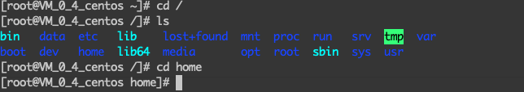
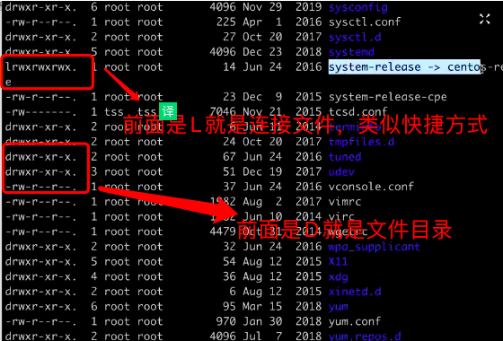
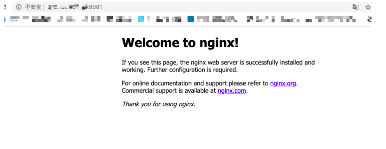

## 主机远程连接服务器

> 服务器用户
> root :当前登录⽤用户

`localhost` :主机名~ 当前⼯工作⽬目录,默认是当前⽤用户的家⽬目录，

root 就是/root,

普通⽤用户是: /home/⽤用户名

提示符: 超级⽤用户是 #,普通⽤用户是\$

连接命令

```bash
ssh 用户名@IP(ip是服务器公网ip)
```

出现`[root@localhost]`就是登录成功

## 创建普通用户

每个用户都有一个 home 目录

1、首先是进入 home

<!--  -->


mnt 接移动硬盘这类 ，srv 是服务程序 ，usr 是用户的命令，boot(不要操作，存放 linux 内核，启动的配置文件)，opt 自己装的软件，var 是经常要用的(logs,系统日志) ,dev 设备文件，sys 系统文件 ,sbin 可执行文件，tmp 临时文件(关闭之后会清空)

2、ect 是配置文件

网络配置文件（/etc/sysconfig/network-scripts）

本地回环地址 ifcfg-lo

<!--  -->


-r 可读 ，-w 可写，-x 可执行

## nginx 安装

参考[菜鸟教程](https://www.runoob.com/linux/nginx-install-setup.html)

配置 nginx.conf，`/usr/local/webserver/nginx/conf/nginx.conf`

```bash
#user  nobody;
worker_processes  1; #工作进程：数目。根据硬件调整，通常等于cpu数量或者2倍cpu数量。

#错误日志存放路径
#error_log  logs/error.log;
#error_log  logs/error.log  notice;
#error_log  logs/error.log  info;

#pid        logs/nginx.pid; # nginx进程pid存放路径


events {
    worker_connections  1024; # 工作进程的最大连接数量
}


http {
    include       mime.types; #指定mime类型，由mime.type来定义
    default_type  application/octet-stream;

    # 日志格式设置
    #log_format  main  '$remote_addr - $remote_user [$time_local] "$request" '
    #                  '$status $body_bytes_sent "$http_referer" '
    #                  '"$http_user_agent" "$http_x_forwarded_for"';

    #access_log  logs/access.log  main; #用log_format指令设置日志格式后，需要用access_log来指定日志文件存放路径

    sendfile        on; #指定nginx是否调用sendfile函数来输出文件，对于普通应用，必须设置on。
      如果用来进行下载等应用磁盘io重负载应用，可设着off，以平衡磁盘与网络io处理速度，降低系统uptime。
    #tcp_nopush     on; #此选项允许或禁止使用socket的TCP_CORK的选项，此选项仅在sendfile的时候使用

    #keepalive_timeout  0;  #keepalive超时时间
    keepalive_timeout  65;

    #gzip  on; #开启gzip压缩服务

    #虚拟主机
    server {
        listen       80;  #配置监听端口号 ，改这个地方可以改端口
        server_name  localhost; #配置访问域名，域名可以有多个，用空格隔开

        #charset koi8-r; #字符集设置

        #access_log  logs/host.access.log  main;

        location / {
            root   html;
            index  index.html index.htm;
        }
        #错误跳转页
        #error_page  404              /404.html;

        # redirect server error pages to the static page /50x.html
        #
        error_page   500 502 503 504  /50x.html;
        location = /50x.html {
            root   html;
        }

        # proxy the PHP scripts to Apache listening on 127.0.0.1:80
        #
        #location ~ \.php$ {
        #    proxy_pass   http://127.0.0.1;
        #}

        # pass the PHP scripts to FastCGI server listening on 127.0.0.1:9000
        #
        #location ~ \.php$ { #请求的url过滤，正则匹配，~为区分大小写，~*为不区分大小写。
        #    root           html; #根目录
        #    fastcgi_pass   127.0.0.1:9000; #请求转向定义的服务器列表
        #    fastcgi_index  index.php; # 如果请求的Fastcgi_index URI是以 / 结束的, 该指令设置的文件会被附加到URI的后面并保存在变量$fastcig_script_name中
        #    fastcgi_param  SCRIPT_FILENAME  /scripts$fastcgi_script_name;
        #    include        fastcgi_params;
        #}

        # deny access to .htaccess files, if Apache's document root
        # concurs with nginx's one
        #
        #location ~ /\.ht {
        #    deny  all;
        #}
    }


    # another virtual host using mix of IP-, name-, and port-based configuration
    #
    #server {
    #    listen       8000;
    #    listen       somename:8080;
    #    server_name  somename  alias  another.alias;

    #    location / {
    #        root   html;
    #        index  index.html index.htm;
    #    }
    #}


    # HTTPS server
    #
    #server {
    #    listen       443 ssl;  #监听端口
    #    server_name  localhost; #域名

    #    ssl_certificate      cert.pem; #证书位置
    #    ssl_certificate_key  cert.key; #私钥位置

    #    ssl_session_cache    shared:SSL:1m;
    #    ssl_session_timeout  5m;

    #    ssl_ciphers  HIGH:!aNULL:!MD5; #密码加密方式
    #    ssl_prefer_server_ciphers  on; # ssl_prefer_server_ciphers  on; #


    #    location / {
    #        root   html;
    #        index  index.html index.htm;
    #    }
    #}

}
```

简单的配置 只需要修改端口和内核位数就行，在浏览器里面运行服务器 IP:端口号，出现下面界面就是配置成功
:tada: :100:

<!--  -->


## nginx 启动停止命令

```bash
/usr/local/webserver/nginx/sbin/nginx                      # 启动
/usr/local/webserver/nginx/sbin/nginx -s reload            # 重新载入配置文件
/usr/local/webserver/nginx/sbin/nginx -s reopen            # 重启 Nginx
/usr/local/webserver/nginx/sbin/nginx -s stop              # 停止 Nginx
```

## 进程、线程、协程

- 进程的目的就是担当分配系统资源（cpu 时间，内存）的实体
- 线程是操作系统能够进行运算调度的最小单位
- 协程是一种用户态的轻量级线程，无法利用多核资源
- IO 密集型应用的发展：多进程->多线程->事件驱动->协程
- cpu 密集型应用的发展：多进程->多线程
- 调度和切换的时间：进程>线程>协程
- 内核是一个特殊的进程，是操作系统被启用的第一个程序

## Liunx 免密登录

### 生成秘钥对

```bash
ssh-keygen -t rsa -C "你的名字" -f "你自己的名字_rsa”（不要输入密码）
```

### 上传配置公钥

上传公钥到服务器对应账号的 home 路径下的.ssh/中
`ssh-copy-id -i "公钥文件名" 用户名@服务器ip或域名 (-i指定秘钥文件，传公钥pub文件)`
上传到服务器的登录用户的 home 目录下面 ,在下面的 .ssh
指定私钥登录

```bash
ssh -i 私钥名称 用户名@Ip
```

### 配置本地秘钥

进入 mac 本地.ssh 文件夹 `cd .ssh`

免密登录模板

```bash
# 多主机配置
Host gateway-produce  //host是服务器别名
HostName IP或绑定的域名
Port 22
Host node-produce
HostName IP或绑定的域名
Port 22
Host java-produce
HostName IP或绑定的域名
Port 22

Host *-produce
User root
IdentityFile ~/.ssh/produce_key_rsa
Protocol 2
Compression yes
ServerAliveInterval 60
ServerAliveCountMax 20
LogLevel INFO

#单主机配置
Host evil-cloud
User root
HostName IP或绑定的域名
IdentityFile ~/.ssh/evilboy_rsa
Protocol 2
Compression yes
ServerAliveInterval 60
ServerAliveCountMax 20
LogLevel INFO

#单主机配置
Host git.yideng.site
User git
IdentityFile ~/.ssh/evilboy_rsa
Protocol 2
Compression yes
ServerAliveInterval 60
ServerAliveCountMax 20
LogLevel INFO
```

### 打开 nginx 具体安装目录 查看配置文件

`/usr/local/var/www` 静态资源文件

### 免密登录功能的本地配置文件

编辑自己 `home` 目录的`cd .ssh/` 路径下的 `config` 文件,没有就新建一个 `config`

## linux 常用命令

```bash
## 解压文件
[root@localhost] # tar 文件名

## 安装软件
[root@localhost] # rpm -ivh
```

## linux 下安装 nginx

[nginx 地址](http://nginx.org/en/download.html)

[菜鸟安装](https://www.runoob.com/linux/nginx-install-setup.html)

## scp 传输方式

```bash
#复制一个文件
scp 本地文件路径  root@IP:/路径

#复制多个文件
scp ./*.zip root@IP:/路径

#从服务器下载文件
scp root@IP:/路径  本地文件路径

#从一个服务器到另一个服务器
scp [[user@]host1:]file1  [[user@]host2:]file2

```

## 本地传输文件到远程服务器

### ftp 传输方式

```bash
# 登录服务器
ftp user@xxx.com port
```

### sftp 传输方式

```bash
#sftp登录
[root@localhost]# sftp 用户名@IP

#将本地的文件上传到服务器
[root@localhost]# put [本地文件的地址] [服务器上文件存储的位置]
例如： [root@localhost]# put /root/java/sonarqube-8.4.0.35506.zip /opt

#将服务器的文件下载到本地
[root@localhost]# get [服务器上文件存储的位置] [本地要存储的位置]

#退出
[root@localhost]# exit或quit
```
