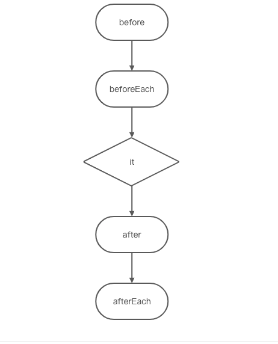
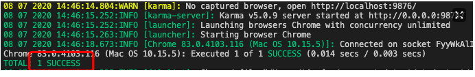
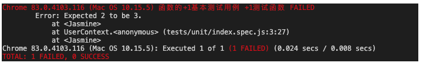

测试主要是保持项目的正确性、自动化、解释性、驱动开发、保证重构。

## 单元测试

单元测试能够让开发者明确知道代码的结果
测试风格：测试驱动开发，TDD 关注所有的功能是否被实现（每一个功能都必须有对应的测试用例）
BDD 关注整体行为是否符合整体预期，编写的每一行代码都有目的的提供一个全面的测试用例集
单元测试运行流程

<!--  -->


建一个 index.spec.js //spec 表示是一个测试文件，单元测试最外层都要包一层 describe,
首先是新建项目，然后 npm init -y 创建 package.json

```js
describe('函数的+1基本测试用例', function() {
  it('+1测试函数', function() {
    expect(window.add(1)).toBe(2);
  });
});
```

安装 karma `yarn add karma karma-jasmine`
package.json 里面新增

```js
"scripts": {
  "init": "karma init"
}
```

执行 `npm run init` 生成 karma.conf.js

```js
// Karma configuration
// Generated on Wed Jul 08 2020 14:41:16 GMT+0800 (GMT+08:00)

module.exports = function(config) {
  config.set({
    // base path that will be used to resolve all patterns (eg. files, exclude)
    basePath: '',

    // frameworks to use
    // available frameworks: https://npmjs.org/browse/keyword/karma-adapter
    frameworks: ['jasmine'],

    // list of files / patterns to load in the browser, 需要执行的测试文件
    files: ['./src/**/*.js', './tests/unit/**/*.spec.js'],

    // list of files / patterns to exclude
    exclude: [],

    // preprocess matching files before serving them to the browser
    // available preprocessors: https://npmjs.org/browse/keyword/karma-preprocessor
    preprocessors: {},

    // test results reporter to use
    // possible values: 'dots', 'progress'
    // available reporters: https://npmjs.org/browse/keyword/karma-reporter
    reporters: ['progress'],

    // web server port
    port: 9876,

    // enable / disable colors in the output (reporters and logs)
    colors: true,

    // level of logging
    // possible values: config.LOG_DISABLE || config.LOG_ERROR || config.LOG_WARN || config.LOG_INFO || config.LOG_DEBUG
    logLevel: config.LOG_INFO,

    // enable / disable watching file and executing tests whenever any file changes
    autoWatch: true,

    // 设置浏览器
    // available browser launchers: https://npmjs.org/browse/keyword/karma-launcher
    browsers: ['Chrome'],

    // Continuous Integration mode
    // if true, Karma captures browsers, runs the tests and exits
    singleRun: true,

    // Concurrency level
    // how many browser should be started simultaneous
    concurrency: Infinity,
  });
};
```

然后执行`npm start` ，就会打开浏览器（因为我选择的是 chrome 浏览器)，如果成功了会出现如下结果

<!--  -->


下面是没通过测试用例返回

<!--  -->


但是这样测试出来的结果可以自己看到，但是如果别人需要看呢，那怎么办，那就需要单元覆盖率了，
就需要用到 `karma-coverage`

下载`karma-coverage`

```js
yarn add karma-coverage
```

```js
karma.conf.js
//新增
reporters: ['progress','coverage'],

preprocessors: {
  // source files, that you wanna generate coverage for
  // do not include tests or libraries
  // (these files will be instrumented by Istanbul)
  'src/**/*.js': ['coverage']
},
coverageReporter: {
  type : 'html',
  dir : 'docs/coverage/'
},
```

## UI 测试

就是前端写出来的页面和设计稿对比。原理是一个像素是由四个点组成（就是 rgba)，一个点一个点的对比位置是否一样

主要就是用`backstopjs`这个库

```js
yarn add backstopjs

//package.json新增
"init2": "backstop init",
"test2": "backstop test"
```

执行 `backstop init2`,生成了`backstop.json`

```js
{
  "id": "backstop_default",
  "viewports": [
    {
      "label": "phone",
      "width": 375,
      "height": 667
    },
    {
      "label": "tablet",
      "width": 1024,
      "height": 768
    }
  ],
  "onBeforeScript": "puppet/onBefore.js",
  "onReadyScript": "puppet/onReady.js",
  "scenarios": [
    {
      "label": "BackstopJS Homepage",
      "cookiePath": "backstop_data/engine_scripts/cookies.json",
      "url": "http://full.ezquant.cn/#/index",//线上对比地址
      "referenceUrl": "",
      "readyEvent": "",
      "readySelector": "",
      "delay": 0,
      "hideSelectors": [],
      "removeSelectors": [],
      "hoverSelector": "",
      "clickSelector": "",
      "postInteractionWait": 0,
      "selectors": [],
      "selectorExpansion": true,
      "expect": 0,
      "misMatchThreshold" : 0.1,
      "requireSameDimensions": true
    }
  ],
  "paths": {
    "bitmaps_reference": "backstop_data/bitmaps_reference", //这个是设计稿的文件夹
    "bitmaps_test": "backstop_data/bitmaps_test",           //这个是需要对比的文件夹
    "engine_scripts": "backstop_data/engine_scripts",
    "html_report": "backstop_data/html_report",
    "ci_report": "backstop_data/ci_report"
  },
  "report": ["browser"],
  "engine": "puppeteer",
  "engineOptions": {
    "args": ["--no-sandbox"]
  },
  "asyncCaptureLimit": 5,
  "asyncCompareLimit": 50,
  "debug": false,
  "debugWindow": false
}

```

## 自动化测试(e2e)

最常用的是 selenium-webdriver，下载 chromedriver 放在项目根目录下面
下载插件 `yarn add selenium-webdriver`

```js
const { Builder, By, Key, until } = require('selenium-webdriver');

(async function example() {
  let driver = await new Builder().forBrowser('chrome').build();
  try {
    await driver.get('http://www.baidu.com');
    await driver
      .findElement(By.name('wd'))
      .sendKeys('怪你过分美丽', Key.RETURN);
    await driver.wait(until.titleIs('怪你过分美丽_百度搜索'), 1000);
  } finally {
    await driver.quit();
  }
})();
```

如果能打开浏览器在输入框输入怪你过分美丽并搜索出结果就是成功

[rise 官网](https://rize.js.org/zh-CN/)

首先下载 `yarn add puppeteer rize -D`

```js
const Rize = require('rize');

const rize = new Rize();
rize
  .goto('https://github.com/')
  .type('input.header-search-input', 'node')
  .press('Enter')
  .waitForNavigation()
  .assertSee('Node.js')
  .end(); // 别忘了调用 `end` 方法来退出浏览器！
```

## 安全测试

## 性能测试
