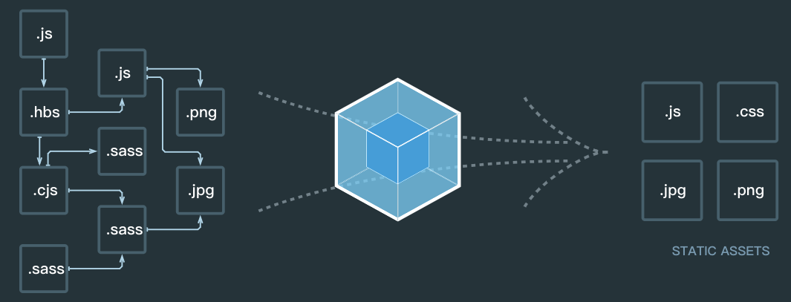

webpack 是前端模块化打包工具，那什么是模块化呢？模块化是一种将系统分离成独立功能部分的方法、严格定义模块化接口、模块间具有透明性。为什么要模块化呢？简单的代码组织方式已经无法满足业务和架构需求，需要通过模块化方式来组织代码。

## 模块化的价值

建立模块化的标准，能都管理模块之间的依赖，从而提升代码的可维护性和可复用性

## **webpack 构建了什么?**

<!--  -->


## webpack 配置项

- entry 配置入口资源

```javascript
entry:__dirname+'/src/scripts/app.js',
```

- output 配置编译后的资源

```bash
output:{
  path:__dirname+'/build/scripts',
  public:'./',
  filename:"[name]-[hash].js"
},
```

- module 资源处理

```javascript
module: {
  rules: [
    {
      test: /\.css$/,
      // loader:'style-loader!css-loader', //webpack1
      use:[   //webpack2
        {

        }
      ]
    }
  ]
},
```

- resolve 配置资源别名/扩展名等

```javascript
resolve: {
  extensions: ['.js','.css'],//引入文件不用加后缀
  alias:{

  }
}
```

- plugins 插件 比 loader 更强大

```javascript
 plugins:[
  new HtmlWebpackPlugin({ //压缩合并  自动插入js,css到首页
    filename:'index.html',
    template:__dirname+'/src/index.html'
  })
],
```

## 常见 loaders 介绍

- 样式 css-loader sass-loader less-loader
- 脚本 babel-loader
- 图片/字体 file-loader url-loader

## webpack 使用优化

1. 使用别名（减少引入文件路径的嵌套）
2. 忽略对已知模块解析

```js
{
  {
    module:{
      noParse:[/moment-with-locals]
    }
  }
}
```

3. 将模块暴露到全局 ,用`expose-loader`暴露到全局，或者使用 ProvidePlugin 暴露到全局

```js
{
  plugins: {
    new webpack.ProvidePlugin({
      $: 'jquery',
      query: 'jquery',
    });
  }
}

//可以直接在项目里面用$符号表示jquery,不用每次都引入一遍
```

4. 提取公共代码

```js
{
  plugins: {
    new webpack.optimize.CommonsChunkPlugin({
      name: 'vendor',
      filename: '[name].[hash:8].js',
      minChunks: 3,
      chunks: ['jquery', 'underscore'],
    });
  }
}
//打包出来的是vendor.xxx.js
```

5. 配置全局开关

```js
{
  plugins: [
    new webpack.DefinePlugin({
      DEBUG: true, //开发true 生产模式false
    }),
  ];
}

const Constant = {
  API_HOST: DEBUG ? '开发url' : '上线url',
};
```

6. 单独打包 css

```js
{
  plugins: [
    new ExtractTextPlugin('[name].[hash:8].css', {
      allChuncks: true,
    }),
  ];
}
```

## extract-text-webpack-plugin 插件的作用

抽取 css 样式，防止将样式打包在 js 中引起页面样式加载错乱的现象

```js
yarn add extract-text-webpack-plugin --save-dev

//webpack.config.js
  module: {
    rules: [
      {
        test: /\.css$/,
        use: ExtractTextPlugin.extract({
          fallback: "style-loader",
          use: "css-loader"
        })
      }
    ]
  },
  plugins: [
    new ExtractTextPlugin("styles/[name].css"),
  ]
```

## treeShaking

通常用于描述移除 JavaScript 上下文中的未引用代码(dead-code)

## webpack4

可以直接用命令行进行编译，只需要在 package.json 里面写命令行就行

```js
"scripts": {
    "test": "echo \"Error: no test specified\" && exit 1",
    "prod":"webpack --mode production", //新增
    "dev":"webpack --mode development" //新增
  },
```

安装`babel-preset-env`

```
yarn add babel-preset-env --save-dev
```

## 其他打包方式

### rollup.js 打包工具

- 支持 es6 原生 js 代码
- 支持生成 AMD,CMD，es2015 代码,
- 比 webpack 打包更干净

具体配置参见[官网](https://www.rollupjs.com/guide/introduction/#%E5%BF%AB%E9%80%9F%E5%85%A5%E9%97%A8%E6%8C%87%E5%8D%97quick-start)

### gulp

基于流式编译，速度很快

[官网](https://www.gulpjs.com.cn/)

### grunt

文件合并，压缩打包，详情见[官网](https://www.gruntjs.net/)

### bower

管理本地的依赖（包管理器）,[官网](https://bower.io/)

```bash
//全局可用
yarn add -g bower

// bower缓存管理
bower cache
// bower命令的帮助信息
bower help
// 通过浏览器打开一个包的github发布地址
bower home
// 查看包的信息
bower info
// 创建bower.json文件
bower init
// 安装包到项目
bower install
// 在本地bower库建立一个项目链接
bower link
// 列出项目已安装的包
bower list
// 根据包名查询包的URL
bower lookup
// 删除项目无关的包
bower prune
// 注册一个包
bower register
// 搜索包
bower search
// 更新项目的包
bower update
// 删除项目的包
bower uninstall
```

### Yeoman

特点

- 快速创建骨架应用程序
- 自动编译
- 自动完善
- 内建的预览服务器
- 非常棒的图像优化
- 生成 AppCache 清单
- 集成的包管理
- 对 ES6 模块语法的支持
- PhantomJS 单元测试
  [官网](https://yeoman.io/)

### Browserify

[官网](http://browserify.org/)

### Parcel

[官网](https://zh.parceljs.org/getting_started.html)

## 总结

不要用 webpack 打包 node,会把 node 里面的 js 打包成一个 js 文件。

1. webpack 是包管理器，核心是 loader
2. gulp(基于文件流)/grunt(基于 IO) ,gulp 更快，可以编译 node
3. yo 主要是发布一些自己的模块
4. bower 主要是安装依赖
5. browserify 能够让本地的 js 应用服务端的能力
